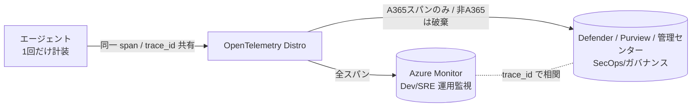

# Agent 365 Observability — 非コードエージェントの包み方・Direct OTel 仕様・テレメトリ格納先

> 調査日: 2026-06-22 ／ 出典はすべて Microsoft Learn（末尾にリンク）。プレビュー機能のため、実装前に最新ドキュメントで再確認すること。

このメモは「**コードを触れない SaaS エージェントをどう可観測化するか**」と「**Direct OTel で送った Telemetry は結局どこに格納されるのか（Azure Monitor か？）**」をまとめたもの。

---

## 0. 結論サマリ

- **テレメトリの格納先は Azure Monitor ではない**。Agent 365 の Observability バックエンド（実体は **Microsoft Defender** の基盤）に入り、**Defender / Microsoft 365 管理センター / Microsoft Purview** の 3 面で見える。
  - Azure Monitor は「**Distro が追加でファンアウトできる別宛先**」であって、A365 標準の格納先ではない。
- A365 は **OTLP/HTTP+JSON の公式イングレス（Direct OTel）** を提供している。よって「Collector → A365 転送」は**設計として成立する**。
- ただし **「URL を向けるだけ・設定だけ」では完結しない**。標準アプリ登録＋トークン配管と、**A365 必須属性へのリマップ**が必要。

---

## 1. 対象エージェント別の「包み方」3 パターン

| 種別 | ① Identity / ガバナンス | ② 深い Observability | 実装パス |
|---|---|---|---|
| **A. 自社コード**（MAF / LangChain 等） | ◯ | ◯ 最高精細 | **in-process の Microsoft OpenTelemetry Distro**（推奨・既定） |
| **B. Microsoft ランタイム上**（Copilot Studio / M365 Copilot / Foundry Agent Service） | ◯ | ◯ **自動** | ランタイムが計装済み。**コード不要**で管理センターに数分で出る |
| **C. サードパーティ SaaS**（コード不可・非 MS ランタイム） | ◯ | △〜✕ | ベンダーが SDK 同梱 / **Direct OTel** / **OTel Collector 中継** |

> ① Identity・ガバナンス（アクセス制御・DLP・ライフサイクル）は**コード非依存で全種別に効く**。コードアクセスに依存するのは **② 深い per-span トレースだけ**。

公式の位置づけ: **「Direct OTel は例外であって既定ではない」**。SDK 非対応言語（Java 等）や既存 OTel パイプラインがある場合のみ使う。

---

## 2. Direct OTel イングレス仕様（③ の正体）

### エンドポイント（2 ルート。自サービスの認証方式で選ぶ）

```
POST https://agent365.svc.cloud.microsoft/observabilityService/tenants/{tenantId}/otlp/agents/{agentId}/traces?api-version=1   # S2S（app-only）
POST https://agent365.svc.cloud.microsoft/observability/tenants/{tenantId}/otlp/agents/{agentId}/traces?api-version=1          # OBO（委任）
```

| 項目 | 値 |
|---|---|
| プロトコル | **OTLP/HTTP + JSON のみ**（gRPC / protobuf 不可） |
| ヘッダー | `Authorization: Bearer <token>`（委任 PFAT は `MSAuth1.0 ...`）, `Content-Type: application/json` |
| `{tenantId}` | 顧客テナント GUID。**サーバ側が正**。span の `microsoft.tenant.id` と食い違うと**拒否** |
| `{agentId}` | 呼び出しアプリの **appId = OAuth client_id**。トークンの `appid`/`azp` と**一致必須**。Blueprint 派生なら **Agent Instance の appId**（Blueprint appId ではない） |
| `api-version=1` | 必須 |
| 認証リソース | `9b975845-388f-4429-889e-eab1ef63949c` |
| S2S スコープ | `9b975845-.../.default`（トークンに `roles`=`Agent365.Observability.OtelWrite`、`scp` は**無いこと**） |
| OBO スコープ | `9b975845-.../Agent365.Observability.OtelWrite`（トークンに `scp`） |
| レスポンス | `200 OK` + `{ "partialSuccess": null }`。一部却下時は `rejectedSpans`。**200 でも全 span サイレント破棄あり**（下記ドロップ条件） |

### 認証レシピ（要点）

- **標準 Entra アプリ + S2S**: `grant_type=client_credentials`、`scope=9b975845-.../.default`。`/observabilityService/...` ルートを使う。
- **Blueprint 派生 + S2S**: agent identity は自前の資格情報を持たない。Blueprint が二段 FIC 交換（`fmi_path={agent-identity-app-id}` で T1 → T1 を OtelWrite リソースへ交換）。URL の `{agentId}` は **agent identity appId**。
- **OBO（委任）**: 受け取ったユーザートークン Tc を `grant_type=jwt-bearer&requested_token_use=on_behalf_of` で交換。`/observability/...` ルート。refresh token をキャッシュ再利用。
- ⚠️ **Agent 365 化（Blueprint）アプリは plain `client_credentials` 不可**（`AADSTS82001`）。Collector で S2S を回すなら**標準（custom-engine）アプリ**を別途登録し、Application ロール `Agent365.Observability.OtelWrite` + 管理者同意。`{agentId}` はそのアプリの clientId に一致させる。

### Body エンコード（OTLP/HTTP+JSON）

`ExportTraceServiceRequest` → `resourceSpans` → `scopeSpans` → `spans`。
- `traceId`(16B)/`spanId`(8B) は**小文字 hex 文字列**
- `startTimeUnixNano`/`endTimeUnixNano` は**文字列**（epoch ナノ秒）
- `kind` / `status.code` は**整数 enum**
- 全 attribute 値は `stringValue`

### 最小リクエスト（疎通テスト）

```bash
curl -i -X POST \
  "https://agent365.svc.cloud.microsoft/observabilityService/tenants/${TENANT_ID}/otlp/agents/${AGENT_ID}/traces?api-version=1" \
  -H "Authorization: Bearer ${TOKEN}" \
  -H "Content-Type: application/json" \
  --data @otlp-request.json
# 期待: 200 OK / { "partialSuccess": null }
```

---

## 3. OTel Collector 中継構成（C の「アプリ無改変」橋渡し）

```yaml
extensions:
  oauth2client:
    client_id: "<標準(custom-engine)アプリの clientId == AGENT_APP_ID>"
    client_secret: "<secret>"            # 本番は KeyVault 参照
    token_url: "https://login.microsoftonline.com/<TENANT_ID>/oauth2/v2.0/token"
    scopes: ["9b975845-388f-4429-889e-eab1ef63949c/.default"]   # S2S は .default

receivers:
  otlp:
    protocols:
      grpc: { endpoint: 0.0.0.0:4317 }   # SaaS はここへ素の OTLP を出す（Step 1）

processors:
  transform:     # ★ SaaS の素 span → A365 必須属性へ写像（gen_ai.operation.name 等）
    # invoke_agent / chat / execute_tool / output_messages へマッピング

exporters:
  otlphttp/a365:
    # ★ 既定の /v1/traces 付与ではなく、フルパス＋クエリを明示
    traces_endpoint: "https://agent365.svc.cloud.microsoft/observabilityService/tenants/<TENANT_ID>/otlp/agents/<AGENT_APP_ID>/traces?api-version=1"
    encoding: json                       # ★ A365 は JSON 必須（既定 protobuf 不可）
    auth:
      authenticator: oauth2client

service:
  extensions: [oauth2client]
  pipelines:
    traces:
      receivers: [otlp]
      processors: [transform]
      exporters: [otlphttp/a365]
```

### Collector 中継の制約（「設定だけ」では足りない理由）

1. **認証の器が要る**: 標準アプリ登録 + Application ロール OtelWrite + 管理者同意。短命トークンは `oauth2client` 拡張が client_credentials で自動更新。
2. **A365 スキーマへの写像が要る**: A365 は span ごとに `gen_ai.operation.name`（`invoke_agent`/`chat`/`execute_tool`/`output_messages`）等を**必須**とし、合わないと per-span フィルタで**却下**。SaaS の素 span は通常この規約を持たないため `transform` で**属性リマップ必須**。
3. **1 ルート = 1 エージェント identity**: URL の `{agentId}` が token `azp` と一致必須。複数 SaaS エージェントを集約するなら `routing` 等で**エージェント単位に endpoint + token を切替**える層が必要。
4. **エンコード/パス注意**: `encoding: json` 必須、`traces_endpoint` でクエリ込みフルパス指定（既定の `/v1/traces` 付与を回避）。

---

## 4. テレメトリの格納先（← 本題）

**Azure Monitor ではない。** 受理されたスパンは Agent 365 Observability バックエンド（Defender 基盤）に格納され、次の 3 面に出る:

| 面 | 何が見えるか | 前提 |
|---|---|---|
| **Microsoft Defender**（security.microsoft.com） | エージェント活動ビュー（`invoke_agent`/`execute_tool`/`chat`）。**Advanced Hunting の `CloudAppEvents` テーブル**を **KQL** で照会 | 活動ビューは**ルートの `invoke_agent` span が必須**。advanced hunting は全 operation 照会可 |
| **Microsoft 365 管理センター**（admin.microsoft.com） | エージェント インベントリ／ガバナンス ビュー | **`invoke_agent` 行のみ取り込み**。無いとインベントリに出ない。活動から数分で反映 |
| **Microsoft Purview** | 監査・コンプライアンス | 組織で**監査(Auditing)を有効化**しておくこと |

### CloudAppEvents へのフィールド対応（一部）

| 顧客可視フィールド | ← span 属性 |
|---|---|
| `ActionType` | operation（`InvokeAgent` / `InferenceCall` / `ExecuteToolBySDK` / `ExecuteToolByGateway` / `ExecuteToolByMCPServer`） |
| `ConversationId` | `gen_ai.conversation.id` |
| `SessionIdentity` | `microsoft.session.id` |
| `AgentId` | `gen_ai.agent.id` |
| `PlatformTargetAgentId` | `microsoft.a365.agent.platform.id` |
| 各 span 詳細 | `RawEventData` 内 |

### 格納リージョンと保持期間（Defender as part of Agent 365）

| テナント プロビジョニング地 | データ格納地 |
|---|---|
| EU または UK | EU |
| その他すべて | US |

- 作成後、格納地は**変更不可**。
- **Observability / セッション データ**（トレース・入出力・ユーザー識別子）: **最大 30 日**（Defender ポータルで閲覧可）。
- **エージェント インベントリ / Defender XDR と共有されるデータ**: 最大 **180 日**。
- 契約終了/失効から 30 日以内に削除。

### Azure Monitor との関係

- A365 標準の格納先は上記 Defender 基盤。**Azure Monitor は標準の格納先ではない**。
- ただし **Microsoft OpenTelemetry Distro はマルチバックエンド**で、**同時に** Azure Monitor / Microsoft Foundry / OTLP 互換（Datadog・Grafana 等）/ Agent 365 へファンアウトできる。
  - つまり「**A365（Defender）= ガバナンス/セキュリティ面の正格納先**」、「**Azure Monitor = 開発者が望めば追加できる運用監視面**」という住み分け。

---

## 4.5 Azure Monitor と Defender の「2 プレーン」整理（E2E 可観測性の考え方）

**Q. OTel で End-to-End 可観測性をやると、Azure Monitor と Defender の 2 系統に分かれてしまわないか？**

**A. 物理的な格納先は 2 系統になる。ただし「二重計装」でも「重複データ」でもなく、設計上の役割分担（2 プレーン）。** End-to-End の連続性は共有 ID で保たれる。

### なぜ 2 系統でも破綻しないか

1. **計装は 1 回だけ（パイプラインは二重化しない）**
   Distro は "one package, one API" で **1 回計装 → 複数バックエンドへ同時ファンアウト**。宛先設定が増えるだけで SDK を 2 つ持つわけではない。

2. **2 つの格納先は“同じデータ”ではない（重複ではない）**
   A365 イングレスは per-span フィルタで**非 A365 スパンを破棄**（`Dropped N non-A365 span(s)`）。

   | 格納先 | 保持されるスパン | 役割・オーナー |
   |---|---|---|
   | **Azure Monitor / App Insights** | **全スパン**（DB/HTTP 依存・インフラ・カスタム含むフルトレース） | 開発・SRE の**運用監視** |
   | **Defender（CloudAppEvents）/ Purview / 管理センター** | **A365 スキーマのエージェント スパンのみ**（`invoke_agent`/`chat`/`execute_tool`/`output_messages`） | SecOps・コンプラの**セキュリティ/ガバナンス** |

   → Defender 側は「**セキュリティ上意味のある部分集合**」、Azure Monitor 側は「**開発者向けフル詳細**」。レンズが違うだけで、同じものを 2 回貯めているわけではない。

3. **End-to-End は共有 ID で連結**
   両者に同じ `trace_id` / `gen_ai.conversation.id` / `microsoft.session.id` が載るため、ストアが分かれても **1 本のラン（会話）として相互突き合わせ可能**。



### 「1 ペイン」にしたい場合の道

1. **役割で割り切る（推奨）**: Dev/SRE は Azure Monitor、SecOps/ガバナンスは Defender。調査時は `trace_id` / `conversation_id` で行き来。Microsoft の想定モデル。
2. **Microsoft Sentinel に集約**: Defender XDR の `CloudAppEvents` と Azure Monitor/Log Analytics を Sentinel（統合 SOC）に寄せて **KQL で join**。セキュリティ観点の E2E 単一ペインを作れる。
3. **第三のバックエンドに集約**: Distro は OTLP 互換（Grafana/Datadog 等）にも同時ファンアウト可。全部をそこに集めれば 1 画面になるが、**系統が減るのではなく増える**ため、ガバナンス正本は Defender に残す前提で。

### 推奨（住み分け）

- **「2 系統＝悪」ではなく「2 プレーン＝設計」**と捉える。
  - Azure Monitor = **運用**（速度・依存・例外・ダッシュボード・アラート）
  - Defender / Purview = **統制**（誰が・何を・脅威・DLP・監査・インベントリ）。かつ**全エージェント横断・テナント全体**。
- 計装は Distro で**一本化**、宛先だけ 2 つ。`trace_id` を相関キーに使う。
- セキュリティ部門が単一ペインを求めるなら **Sentinel 集約**を足す。

> 注意: Defender 側は**非 A365 スパンを落とす**ため「アプリ全トレースを Defender だけで見る」はできない。**フル詳細は Azure Monitor が正本**、**ガバナンス/セキュリティは Defender が正本**、という住み分けが前提。

---

## 5. よくあるドロップ / 失敗

- **200 だが `partialSuccess: null` で出ない** → テナントに **E7 / Agent 365 ライセンスが「割当」されていない**（存在だけでは不可）。少なくとも 1 ユーザーに割り当てる。
- **`rejectedSpans == totalSpans`** → `gen_ai.operation.name` が不正。`invoke_agent` / `execute_tool` / `chat` / `output_messages` のいずれかにする（**`inference` ではなく `chat`**）。
- **run ツリーが壊れる/子が孤立** → `parentSpanId` 欠落、`traceId` 不一致、`gen_ai.conversation.id` 不統一。
- **403** → ライセンス不足 or `Agent365.Observability.OtelWrite` 権限不足。
- **403 Agent ID mismatch** → URL の `{agentId}` と token の `azp` 不一致（**Blueprint client ID と Instance client ID の取り違え**が典型）。
- **401 InvalidAudience（OBO）** → Azure Bot OAuth 接続の Scopes が `api://9b975845-.../Agent365.Observability.OtelWrite` になっていない。

---

## 6. 出典（Microsoft Learn）

- Direct OTel 統合: <https://learn.microsoft.com/microsoft-agent-365/developer/direct-open-telemetry-integration>
- Direct OTel トラブルシュート（取り込み検証）: <https://learn.microsoft.com/microsoft-agent-365/developer/direct-open-telemetry-troubleshooting>
- Observability concepts（データモデル / Where your data shows up / drop 条件）: <https://learn.microsoft.com/microsoft-agent-365/developer/observability-concepts>
- 属性リファレンス: <https://learn.microsoft.com/microsoft-agent-365/developer/observability-attribute-reference>
- 認証セットアップ（S2S / OBO）: <https://learn.microsoft.com/microsoft-agent-365/developer/observability-authentication-setup>
- Microsoft OpenTelemetry Distro（推奨パス）: <https://learn.microsoft.com/microsoft-agent-365/developer/microsoft-opentelemetry>
- Copilot Studio 自動 Observability（B 種別）: <https://learn.microsoft.com/microsoft-agent-365/builder/observability>
- Defender as part of Agent 365 / データ保管・保持: <https://learn.microsoft.com/defender-xdr/security-for-ai/privacy-defender-agent-365>
- Defender で AI エージェント脅威を調査（Advanced Hunting）: <https://learn.microsoft.com/defender-xdr/security-for-ai/ai-agent-detection-protection>
