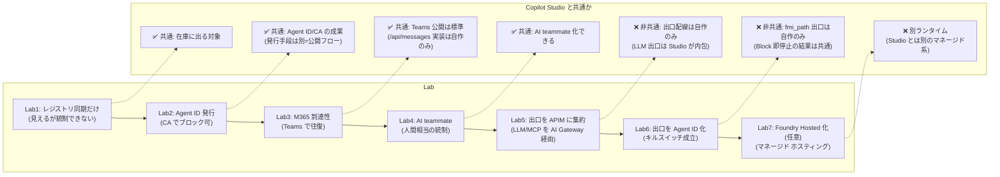

# Agent 365 カスタムエージェント ハンズオン｜全体構成・順番・目次

> 作成日: 2026-06-26
> 目的: `lab/` 配下の検証資産（Lab1 / extLab2 / lab-foundry-hosted-agent）を、**通しで体験できるハンズオン**に再構成する。
> 設計方針: **「ID の強さ」で効くガバナンスが段階的に変わる**ことを、1 つのカスタムエージェントを少しずつ強化しながら体験する。

---

## 0. 前提（ハンズオン開始時点で「すでにあるもの」）

このハンズオンは **ゼロからエージェントを作らない**。以下は構築済みとして開始する。

| 区分 | 既存資産 | 実体 | 備考 |
|---|---|---|---|
| **基本カスタムエージェント** | `custom-maf-agent-a365`（MAF + ACA） | `Microsoft.App/containerApps` | LLM で回答し MCP を呼ぶ素体。ソースは [lab2/agent-custom-MAF-ACA-A365](lab2/agent-custom-MAF-ACA-A365/) |
| **MCP（社内 API の見立て）** | `contoso-policy-mcp`（ACA / japaneast） | `Microsoft.App/containerApps` | 既存のものを使う。ツール: `get_return_policy` / `get_shipping_policy` / `get_payment_policy` / `get_loyalty_points`。**アクセスは APIM 経由が必須**（下記） |
| **推論モデル** | `gpt-5.4`（Foundry `proj-foundryobs-jyenh`） | モデルデプロイ | 新規作成しない。**アクセスは APIM 経由が必須**（Foundry 直結はしない／下記） |
| **AI Gateway** | APIM `apim-aigateway-eastus2` | `Microsoft.ApiManagement/service` | extLab2 以降の出口集約で使用 |
| **CLI / ツール** | `a365` CLI（`%USERPROFILE%\.dotnet\tools\a365.exe`）/ Azure CLI 2.60+ / PowerShell 7+ / azd | — | 参加者端末に導入済み |

> **【重要】MCP と推論モデルは APIM（AI Gateway）経由でアクセスするのが必須**。Foundry / MCP に直結せず、すべて `apim-aigateway-eastus2` を出口に通す（認証・レート制御・コンテンツ安全性・監査を 1 箇所で効かせるため）。

| 出口 | APIM エンドポイント | 補足 |
|---|---|---|
| **推論モデル（LLM）** | `https://apim-aigateway-eastus2.azure-api.net/openai` → `gpt-5.4` | api-version `2024-10-21`。`AzureOpenAIChatCompletionClient` の `azure_endpoint` に指定 |
| **MCP** | `https://apim-aigateway-eastus2.azure-api.net/contoso-policy/mcp` | `contoso-policy-mcp` のツールを APIM 経由で呼ぶ |

主要な環境値（共通）:

| 項目 | 値 |
|---|---|
| テナント ID | `655bd66a-5001-4cb3-9aad-ce54a27d5d95`（`M365CPI65139919.onmicrosoft.com`） |
| サブスクリプション ID | `d1bf4d07-2dac-43a8-9060-4d5274fc7e33` |
| リージョン | `eastus2` |
| リソースグループ | `rg-foundryobs-eastus2` |

> ローカルから素体エージェントを叩いて動作確認する UI として [lab0/local-chat-app](lab0/local-chat-app/) を併用できる（CORS 回避プロキシ付き）。

---

## 1. ハンズオンの背骨：統制レベルを段階的に上げる

カスタムエージェントは「**身分証（Agent ID）の強さ**」で効くガバナンスが変わる。本ハンズオンは弱い段から強い段へ、**同じ素体を強化しながら**登る。

| 段 | 統制の効き方 | ID 実体 |
|---|---|---|
| Lab1 | **可視化のみ**（CA / Purview / Defender は効かない） | Agent ID を持たない（外部基盤からの同期） |
| Lab2 | **主体としてブロック可**（CA / Purview / Defender 自動適用） | Entra Agent ID（SP・`aiTeammate=false`） |
| Lab3 | Lab2 の統制 + **Teams 到達性** | Lab2 と同一の Agent ID + メッセージング エンドポイント |
| Lab4 | **人間社員相当**（メール / Teams 在席 / 上長関係 / DLP） | 専用ユーザー（agentic user・`aiTeammate=true`） |
| Lab5 | 出口（LLM / MCP）に **APIM のガバナンス**（rate limit / content safety / audit） | UAMI を出口に集約 |
| Lab6 | **Agent ID を止めると実トラフィックが止まる**（キルスイッチ） | 出口トークンを Agent ID（fmi_path）に切替 |
| Lab7 | ホスティング・スケール・Playground を Foundry に寄せる | Hosted Agent のマネージド ID |

---

## 2. 目次（モジュール構成と順番）

| # | モジュール | ねらい（一言） | 主担当 lab ドキュメント | 目安 |
|---|---|---|---|---|
| **Lab0** | [オリエン & 環境確認](#lab0オリエン--環境確認) | 全体像・用語・前提リソースの疎通確認 | [Lab1/README](lab0/Lab1_README.md) / [extLab2/README](lab0/extLab2_README.md) | 20 分 |
| **Lab1** | [レジストリ同期だけでは統制できない](#lab1レジストリ同期だけでは統制できない) | 「見えるだけ」の弱い段を体感し、Agent ID の必要性を導く | [Lab1-1](lab1/Lab1-1_レジストリ同期.md) | 30 分 |
| **Lab2** | [Agent ID を発行して統制主体にする](#lab2agent-id-を発行して統制主体にする) | `a365 setup all` で Agent ID を発行し CA でブロック | [Lab1-2](lab2/Lab1-2_AgentID.md) | 50 分 |
| **Lab3** | [Teams から呼べるようにする](#lab3teams-から呼べるようにする) | メッセージング エンドポイント登録で Teams 往復 | [Lab1-3](lab3/Lab1-3_m365.md) / [extLab2-3](lab3/extLab2-3_Teams接続_M365AgentsSDK.md) | 45 分 |
| **Lab4** | [AI teammate にする](#lab4ai-teammate-にする) | 専用ユーザー（agentic user）で人間相当の統制 | [Lab1-4](lab4/Lab1-4_AIteammate.md) | 40 分 |
| **Lab5** | [出口を APIM AI Gateway に集約する](#lab5出口を-apim-ai-gateway-に集約する) | LLM / MCP を APIM に集約し横断統制 | [extLab2-1](lab5/extLab2-1_UAMI出口化.md) / [extLab2-2](lab5/extLab2-2_APIM_AI_Gateway化.md) | 50 分 |
| **Lab6** | [出口を Agent ID 化してキルスイッチを成立させる](#lab6出口を-agent-id-化してキルスイッチを成立させる) | 出口トークンを Agent ID にし、止めると遮断 | [extLab2-4](lab6/extLab2-4_AgentID出口化_配線と検証.md) / [extLab2-5](lab6/extLab2-5_統合ガバナンス検証.md) / [Lab1-5](lab6/Lab1-5_extLab2をA365フル機能化.md) | 50 分 |
| **Lab7**（任意） | [Foundry Hosted Agent に載せ替える](#lab7任意foundry-hosted-agent-に載せ替える) | マネージド ホスティングへ lift、Block 検証 | [lab-foundry-hosted-agent/README](lab7/lab-foundry-hosted-agent/README.md) | 40 分 |

> **コア体験は Lab0→Lab6**。Lab7 は「自前 ACA 運用」と「Foundry マネージド運用」を比較したい場合の発展。
> 時間が限られる場合の短縮版は [§4 タイムテーブル](#4-タイムテーブル時間配分案) を参照。

---

## 3. 各モジュールの詳細

### Lab0｜オリエン & 環境確認

| 項目 | 内容 |
|---|---|
| **ねらい** | Agent 365 が「エージェントを ID を持つ管理対象として扱う」管理面であることを理解し、統制レベルの段階（Lab1→Lab6）を先出しする。前提リソースが動くことを確認する。 |
| **やること** | ・用語マップ（Entra Agent ID / Blueprint→Instance / Registry / メッセージング エンドポイント / AI Gateway）を共有 ・既存リソース（素体エージェント・MCP・Foundry・APIM）の疎通確認 ・[local-chat-app](lab0/local-chat-app/) から素体エージェントに 1 往復して動作確認 |
| **成果物 / 検証** | 素体エージェントが MCP を呼んで回答する（例: 「返品ポリシーを教えて」） |
| **対応 lab** | [Lab1/README](lab0/Lab1_README.md)（統制レベル マスター表） |

### Lab1｜レジストリ同期だけでは統制できない

| 項目 | 内容 |
|---|---|
| **ねらい** | 最弱の段。エージェントが在庫に「見える」だけで、Entra Agent ID を主体に持たないため **CA / Purview / Defender が効かない**ことを体感する。 |
| **やること** | ・(主題) 外部 AI 基盤（例: Databricks Genie）を Registry sync で在庫へ同期し、**Unmanaged agents** として表示されることを確認 ・(負の確認) 素の Entra アプリ登録だけでは **在庫に出ない** → だから次段の Agent ID が必要、という導線を作る |
| **成果物 / 検証** | 管理センターの在庫に Unmanaged として表示／素エントリは未掲載 |
| **対応 lab** | [Lab1-1](lab1/Lab1-1_レジストリ同期.md) |
| **メモ** | Registry sync はポータル操作（Frontier + ライセンス前提）。未契約環境ではスクショ提示でも可。 |

### Lab2｜Agent ID を発行して統制主体にする

| 項目 | 内容 |
|---|---|
| **ねらい** | `a365 setup all` で **Microsoft Entra Agent ID（SP）** を発行し、CA / Purview / Defender が「コード変更なし」で効く中位の統制を成立させる。 |
| **やること** | ・素体エージェントをデプロイ済みの状態で `a365 setup all --agent-name custom-maf-agent-a365` を実行 ・`a365.generated.config.json` で Blueprint / Agent ID / 権限を確認 ・発行された **Agent ID を CA でブロック**し、リソース アクセスが弾かれることを検証 ・（重要な区別）自作の場合 CA で止まるのは「Agent ID としてのアクセス」であり、**実行体プロセスは止まらない**（停止は ACA 操作の役割） |
| **成果物 / 検証** | Agent ID 発行済み／CA ブロックで fmi_path のトークン交換が失敗（サインイン ログに Failure） |
| **対応 lab** | [Lab1-2](lab2/Lab1-2_AgentID.md) |

### Lab3｜Teams から呼べるようにする

| 項目 | 内容 |
|---|---|
| **ねらい** | Lab2 の Agent ID はそのままに、**メッセージング エンドポイント登録**で Teams / Copilot から実メッセージ往復できる「到達性」を足す。**統制レベルは Lab2 のまま変わらない**。 |
| **やること** | ・`/api/messages`（Microsoft 365 Agents SDK）を実装した実行体をデプロイ ・`a365 setup blueprint --endpoint-only --messaging-endpoint <ACA FQDN>/api/messages` で後付け登録 ・Developer Portal 構成 → インスタンス要求/承認 → Teams から 1 往復 |
| **成果物 / 検証** | Teams で素体エージェントと会話し、MCP 由来の回答が返る |
| **対応 lab** | [Lab1-3](lab3/Lab1-3_m365.md) / [extLab2-3](lab3/extLab2-3_Teams接続_M365AgentsSDK.md) |

### Lab4｜AI teammate にする

| 項目 | 内容 |
|---|---|
| **ねらい** | 最強の段。**専用ユーザー アカウント（agentic user・`aiTeammate=true`）** を持たせ、メールボックス / Teams 在席 / ディレクトリ / 上長関係 / ライフサイクル / ユーザーデータ DLP まで人間社員と同等のガバナンスを効かせる。 |
| **やること** | ・`a365.config.json` に `aiTeammate=true` を設定して `a365 setup all --aiteammate ...` ・`a365 publish` → 管理センターで承認 → agentic user 発行 ・Activity ビューでターン単位スパンを可視化 |
| **成果物 / 検証** | agentic user 発行／Teams 在席・ディレクトリ エントリ／Activity ビューでスパン可視化 |
| **対応 lab** | [Lab1-4](lab4/Lab1-4_AIteammate.md) |
| **メモ** | (3) `--aiteammate` は **Frontier プログラム + 対応ライセンス**前提。未契約なら Lab3 までで止め、手順は承認待ちとして提示。 |

### Lab5｜出口を APIM AI Gateway に集約する

| 項目 | 内容 |
|---|---|
| **ねらい** | エージェントの **外向き通信（LLM / MCP）を APIM（`apim-aigateway-eastus2`）に集約**し、認証・レート制御・コンテンツ安全性・監査を 1 箇所で効かせる。まず出口を **UAMI 1 本**に揃える。 |
| **やること** | ・UAMI を作成し ACA に割り当て、`DefaultAzureCredential` 1 本で LLM / MCP / Graph のトークンを取得 ・`setup-apim-aigateway.ps1` で APIM に `azure-openai`（path=openai）と `contoso-policy-mcp`（path=contoso-policy）を登録 ・LLM / MCP が APIM の `validate-azure-ad-token` を通過して動くことを確認 |
| **成果物 / 検証** | LLM / MCP が APIM 経由で 200 応答／APIM の token limit・content safety が効く |
| **対応 lab** | [extLab2-1](lab5/extLab2-1_UAMI出口化.md) / [extLab2-2](lab5/extLab2-2_APIM_AI_Gateway化.md) |

### Lab6｜出口を Agent ID 化してキルスイッチを成立させる

| 項目 | 内容 |
|---|---|
| **ねらい** | 出口トークンを UAMI → **Agent ID（fmi_path 2 ステップ交換）** に切り替え、**Agent ID を止めると LLM / MCP が遮断される**キルスイッチを成立させる。Lab2〜Lab5 の総仕上げ。 |
| **やること** | ・`USE_AGENT_ID_EGRESS=true` で出口を Agent ID に切替（Blueprint シークレットは Key Vault 参照で ACA に供給） ・**(a) Agent ID 停止**（無効化 / CA / 削除）で LLM / MCP が止まることを検証 ・(b) APIM の audience 検証・(c) A365 ネイティブ観測性を補助確認 ・（統合）extLab2 実行体を Lab1-5 の手順でフル機能化（AI teammate まで点灯） |
| **成果物 / 検証** | Agent ID 無効化で実トラフィック（LLM / MCP）が停止する 3 層ガバナンス |
| **対応 lab** | [extLab2-4](lab6/extLab2-4_AgentID出口化_配線と検証.md) / [extLab2-5](lab6/extLab2-5_統合ガバナンス検証.md) / [Lab1-5](lab6/Lab1-5_extLab2をA365フル機能化.md) |

### Lab7（任意）｜Foundry Hosted Agent に載せ替える

| 項目 | 内容 |
|---|---|
| **ねらい** | 自前 ACA 運用の素体を、**Foundry がランタイムをマネージドで実行する Hosted Agent** に lift し、ホスティング・スケール・Playground・トレースを Foundry に寄せる。 |
| **やること** | ・`azd ai agent`（`azure.ai.agents` 拡張）で `responses` プロトコルに載せ替えてデプロイ ・LLM 出口は APIM 経由を維持（`AzureOpenAIChatClient`） ・**Agent 365 の Block / Disable / CA が Hosted Agent にも効く**ことを確認（SP 無効化で出口が止まる） |
| **成果物 / 検証** | Hosted Agent が応答／Block で出口が遮断される |
| **対応 lab** | [lab-foundry-hosted-agent/README](lab7/lab-foundry-hosted-agent/README.md) |
| **メモ** | 自前運用（Lab5/Lab6）とマネージド運用の **トレードオフ比較**として位置づける。 |

---

## 4. タイムテーブル（時間配分案）

### フルコース（1 日・約 5.5h）

| 時間 | モジュール |
|---|---|
| 0:00–0:20 | Lab0 オリエン & 環境確認 |
| 0:20–0:50 | Lab1 レジストリ同期 |
| 0:50–1:40 | Lab2 Agent ID 発行 + CA ブロック |
| （休憩 10 分） | |
| 1:50–2:35 | Lab3 Teams 到達性 |
| 2:35–3:15 | Lab4 AI teammate |
| （昼休み） | |
| 4:00–4:50 | Lab5 APIM 出口集約 |
| 4:50–5:40 | Lab6 Agent ID 出口化（キルスイッチ） |
| （任意） | Lab7 Foundry Hosted 化 |

### 短縮版（半日・約 3h｜統制の本質に集中）

Lab0 → Lab2（Agent ID + CA ブロック）→ Lab3（Teams 往復）→ Lab6（キルスイッチ）。Lab1 は概念説明、Lab4 / Lab5 / Lab7 はデモ提示で代替。

---

## 5. 進め方の原則

- **1 段ずつ確認してから次へ**。各段で「在庫に出るか」「主体としてブロックできるか」「Teams で往復できるか」「ユーザーとして振る舞えるか」「出口を止められるか」を検証する。
- **素体は作り直さない**。Lab2 以降は同じ `custom-maf-agent-a365` を強化していく（Lab3 で `/api/messages` 実装、Lab5 で UAMI/APIM 配線、Lab6 で Agent ID 出口）。
- **Agent ID と実行体は別物**。CA で止まるのは「ID としてのアクセス」、プロセス停止は ACA 操作（自作の場合）。Hosted（Lab7）は ID と実行を一体で統制できる。
- **Frontier 依存の段（Lab1 の Registry sync・Lab4 の AI teammate）** は未契約環境ではデモ提示に切り替える。

---

## 6. 参照（一次情報・関連資料）

| 内容 | 参照 |
|---|---|
| Lab1 統制レベル別 全体まとめ | [lab0/Lab1_README.md](lab0/Lab1_README.md) |
| extLab2 APIM AI Gateway 化 全体 | [lab0/extLab2_README.md](lab0/extLab2_README.md) |
| Foundry Hosted Agent 化 | [lab7/lab-foundry-hosted-agent/README.md](lab7/lab-foundry-hosted-agent/README.md) |
| カスタム→フル機能化の差分 | [_report/extLab2_agent差分_カスタムからフル機能化.md](../extLab2_agent差分_カスタムからフル機能化.md) |
| Observability の格納先 | [Observability_DirectOTel_と格納先.md](Observability_DirectOTel_と格納先.md) |
| Agent 365 SDK 概要 | https://learn.microsoft.com/microsoft-agent-365/developer/agent-365-sdk |
| Get started（types / tiers） | https://learn.microsoft.com/microsoft-agent-365/developer/get-started |
| Registry sync（preview） | https://learn.microsoft.com/microsoft-agent-365/admin/agent-registry |
| AI teammate | https://learn.microsoft.com/microsoft-agent-365/developer/ai-teammate |
