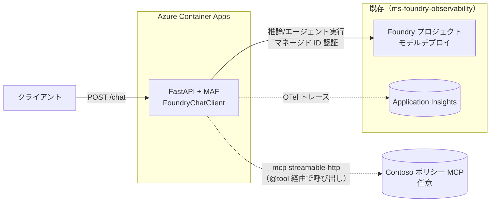

# agent-custom-MAF-ACA — MAF ホスト型エージェント（Azure Container Apps）

[`agent-aif-prompt-agent`](../agent-aif-prompt-agent/) と **同一仕様**（Contoso カスタマーサポート・
同一の指示文・同一の MCP ツール・同一モデル）のエージェントを、**Microsoft Agent Framework (MAF)** の
**ホスト型（カスタム）エージェント**として実装し、**Azure Container Apps (ACA)** にデプロイする
自己完結プロジェクトです。

プロンプトエージェントが Foundry のフルマネージドランタイムで動くのに対し、本プロジェクトは
**自前のコンテナコード**（FastAPI + MAF `FoundryChatClient`）がエージェントループ（モデル呼び出し・
ツール実行・会話管理）を実行します。モデルは既存の Foundry プロジェクト（[`ms-foundry-observability`](../ms-foundry-observability/)）の
デプロイをそのまま利用します。

| 項目 | プロンプトエージェント（agent-aif-prompt-agent） | 本プロジェクト（MAF / ACA） |
| --- | --- | --- |
| 定義 | 指示・モデル・ツール構成 | 同左 + 自前コード（コンテナ） |
| ランタイム | Foundry フルマネージド | 自前コンテナ（ACA） |
| エージェント実装 | `create_version`（PromptAgentDefinition） | MAF `FoundryChatClient.as_agent()` |
| MCP ツール | `MCPTool`（azure-ai-projects） | 素の `mcp`（`streamablehttp_client` + `ClientSession`）を MAF の `@tool` 関数として公開 |
| ホスティング | 不要 | ACA（外部 HTTPS Ingress, port 8000） |
| 認証 | 実行ユーザー / SDK | マネージド ID（→ Foundry に RBAC） |
| 用途 | 迅速な立ち上げ | カスタムオーケストレーション・自前運用 |

> 指示文・MCP ツール（`get_return_policy` / `get_shipping_policy` / `get_payment_policy` /
> `get_loyalty_points`）・モデル・App Insights 連携は**プロンプトエージェントと同一**です。

---

## 構成

```
agent-custom-MAF-ACA/
├── app/
│   ├── __init__.py
│   ├── config.py        # .env / 環境変数の読み込み
│   ├── agent.py         # MAF エージェント定義（指示・モデル・MCP ツール）
│   └── main.py          # FastAPI サーバー（/chat, /healthz）
├── requirements.txt
├── Dockerfile           # ACA 用コンテナ（uvicorn app.main:app）
├── .dockerignore
├── .env.example
├── deploy-aca.ps1       # ACA デプロイ（containerapp up + MI + RBAC）
├── smoke_test.py        # デプロイ後の疎通テスト（標準ライブラリのみ）
└── scripts/
    └── setup-env.ps1 / .sh   # .env 生成（ルートの .env から接続情報を引き継ぎ）
```

### アーキテクチャ



---

## 前提

- [`ms-foundry-observability`](../ms-foundry-observability/) をデプロイ済みで `.env` が生成されている
- Azure CLI（`az`）でログイン済み（共同作成者 + ユーザーアクセス管理者、または Owner 相当 — RBAC 付与のため）
- PowerShell 7+（`deploy-aca.ps1` 用）
- ローカル実行する場合は Python 3.10+

> `az containerapp up --source` を使うため **ローカル Docker は不要**（クラウドでビルドされます）。

---

## セットアップ

```powershell
# 1. .env 生成（ルートの .env から接続情報を引き継ぎ）
./scripts/setup-env.ps1
#   既存 .env の CONTOSO_MCP_URL / CONTOSO_MCP_KEY は維持されます
```

Bash の場合:

```bash
./scripts/setup-env.sh
```

### Contoso ポリシー MCP を使う場合

[`mcp/`](../mcp/) の Contoso ポリシー MCP をデプロイ済みの場合、`.env` に接続情報を設定すると、
エージェントのツールにポリシー MCP（`get_return_policy` / `get_shipping_policy` /
`get_payment_policy` / `get_loyalty_points`）が構成されます。

```dotenv
# Contoso ポリシー MCP のエンドポイント（末尾に /mcp を付ける）
CONTOSO_MCP_URL=https://<your-app>.azurecontainerapps.io/mcp
CONTOSO_MCP_KEY=<KEY>
```

未設定の場合は MCP ツールなし（指示文に基づく一般回答）で動作します。

> **実装メモ:** MAF の `MCPStreamableHTTPTool` は MCP セッションを別タスクで保持し、
> anyio の cancel scope を `AsyncExitStack` 越しに跨ぐため、本構成（Windows + asyncio）では
> 起動時に `Cancelled via cancel scope` で初期化に失敗します。これを回避するため、
> [`app/agent.py`](app/agent.py) では素の `mcp` ライブラリ（`streamablehttp_client` + `ClientSession`）を
> **ツール呼び出しごとに接続→実行→クローズ**する短命セッションとして使い、
> それを MAF の `@tool` 関数（4 つ）として公開しています。サーバーは決定的なので
> 呼び出し都度の接続コストは小さく、構造化並行性も満たせます。

---

## ローカル実行（任意）

```powershell
python -m pip install -r requirements.txt
uvicorn app.main:app --host 0.0.0.0 --port 8000
# 別ターミナルで
python smoke_test.py http://localhost:8000
```

> ローカルでは `az login` の資格情報（`DefaultAzureCredential`）で Foundry に認証します。
> 実行ユーザーに Foundry プロジェクトへのアクセス権が必要です。

---

## ACA へデプロイ

```powershell
./deploy-aca.ps1
```

`deploy-aca.ps1` は次を自動実行します:

1. `.env` の読み込み（接続情報・モデル・MCP・App Insights・Foundry RG）
2. `containerapp` 拡張 / リソースプロバイダーの確認
3. `az containerapp up --source .` でクラウドビルド → ACR + ACA 環境 + Container App 作成
   （外部 HTTPS Ingress, target-port 8000、環境変数として接続情報を設定）
4. システム割り当てマネージド ID を有効化
5. その MI に **Foundry アカウントへの「Azure AI User」** を付与（推論・エージェント実行権限）
6. リビジョン再起動 → 公開 URL を出力

オプション:

| 引数 | 既定 | 説明 |
| --- | --- | --- |
| `-ResourceGroup` | `rg-contoso-agent`（`.env` の `ACA_RESOURCE_GROUP`） | ACA をデプロイする RG |
| `-Location` | `.env` の `AZURE_LOCATION`（既定 `eastus2`） | リージョン |
| `-AppName` | `custom-maf-agent` | Container App 名 |
| `-FoundryResourceGroup` | `.env` の `AZURE_RESOURCE_GROUP` | RBAC スコープ（Foundry が属する RG） |
| `-AiRole` | `Azure AI User` | MI に付与するロール |
| `-SkipRbac` | — | RBAC 付与をスキップ |

> ロール伝播には数分かかる場合があります。初回 `/chat` が 401/403 のときは少し待って再試行してください。

---

## 動作確認（テスト用の質問例）

デプロイ後、出力された公開 URL に対して `/chat` へ問い合わせます。MCP ツール構成時は各質問が
対応するポリシーツールを呼び出し、[`mcp/data/policies.json`](../mcp/data/policies.json) の値に基づく
決定的な回答を返します（プロンプトエージェントと同一の期待値）。

```powershell
python smoke_test.py https://<your-app>.azurecontainerapps.io
```

| カテゴリ | 質問例 | 呼び出されるツール | 期待する回答（具体例） |
| --- | --- | --- | --- |
| 返品 | 「30 日前に買った衣料品（general）を返品できますか？」 | `get_return_policy` | 「返品可能です。購入から 30 日以内なら全額返金、超過後は店舗クレジットになります」 |
| 返品 | 「ダウンロード済みのデジタル商品は返品できますか？」 | `get_return_policy` | 「ダウンロード済みのデジタル商品は返品対象外です」 |
| 配送 | 「8,000 円の注文を国内に送る場合、送料はいくらですか？」 | `get_shipping_policy` | 「5,000 円以上のため送料無料です（標準 2〜4 営業日）」 |
| 支払い | 「クレジットカードで分割払いはできますか？」 | `get_payment_policy` | 「クレジットカードは最大 24 回まで分割可能です」 |
| ポイント | 「顧客ID C-1001 の現在のポイント残高は？」 | `get_loyalty_points` | 「山田 太郎 さん（gold 会員）の残高は 1,250 ポイントです」 |

> 既存の顧客ID は `C-1001`（gold/1,250pt）・`C-1002`（platinum/8,400pt）・`C-1003`（regular/320pt）です。

### API 直接呼び出し

```powershell
curl -X POST https://<your-app>.azurecontainerapps.io/chat `
  -H "Content-Type: application/json" `
  -d '{"message":"クレジットカードで分割払いはできますか？"}'
```

---

## 可観測性（OTel 計装）

エージェントのトレース（モデル呼び出し・MCP ツール呼び出し）を **OpenTelemetry (OTel)** で計装し、
プロンプトエージェントと**同じ Application Insights** に送信します。

### どこに入っているか

計装は [`app/main.py`](app/main.py) の `_configure_observability()` に集約され、FastAPI の `lifespan`
（サーバー起動時）でエージェント構築の直前に **1 回だけ** 実行されます。

```python
def _configure_observability() -> None:
    conn = config.appinsights_connection_string()
    if conn:
        from azure.monitor.opentelemetry import configure_azure_monitor
        configure_azure_monitor(connection_string=conn)   # OTel → Application Insights
    from agent_framework.observability import setup_observability
    setup_observability()                                  # MAF の GenAI セマンティック計装
```

### 2 層構成

| 層 | 役割 | 有効化条件 |
| --- | --- | --- |
| `configure_azure_monitor(...)` | OTel SDK のエクスポーターを App Insights に向ける（トレース／メトリック／ログを送信） | `APPLICATIONINSIGHTS_CONNECTION_STRING` が設定されている場合のみ |
| `setup_observability()`（MAF） | モデル呼び出し・ツール（MCP）呼び出しの GenAI スパンを生成 | 常に試行（バージョン差異による失敗は無視） |

### 設定の流れ

- 接続文字列は [`app/config.py`](app/config.py) の `appinsights_connection_string()` が
  環境変数 `APPLICATIONINSIGHTS_CONNECTION_STRING` から取得します。
- 値の供給元:
  - **ローカル**: `scripts/setup-env.ps1` / `.sh` が リポジトリ ルートの `.env` から引き継ぎ `.env` に書き込み
  - **ACA**: `deploy-aca.ps1` が同値を Container App の環境変数として設定
- 依存パッケージ: [`requirements.txt`](requirements.txt) の `azure-monitor-opentelemetry`

> 接続文字列が未設定の場合、App Insights へのエクスポートは無効化され、エージェントは計装なしで動作します。
> 現状はグローバル計装の有効化のみで、`/chat` ごとのカスタムスパン（質問内容・レイテンシ等の属性付与）は
> 含めていません。リクエスト単位で詳細を記録したい場合は `app/main.py` の `chat()` に手動スパンを追加できます。

### トレースの確認

Application Insights のポータルで **トランザクション検索** / **アプリケーション マップ** から、
モデル呼び出しと MCP ツール呼び出しのスパンを確認できます。Foundry プロジェクトは同じ App Insights に
接続済みのため、評価基盤（[`Batch-eval`](../Batch-eval/)）からトレース評価の対象にもできます。

---

## 後始末

ACA リソース（Container App / 環境 / ACR）を含む RG を削除します。

```powershell
az group delete -n rg-contoso-agent --yes --no-wait
```

> Foundry プロジェクト本体は [`ms-foundry-observability`](../ms-foundry-observability/) 側で管理します。
> MI に付与したロール割り当ては RG 削除時に MI ごと消えます。

---

## トラブルシューティング

| 症状 | 対処 |
| --- | --- |
| 起動時に `agent_framework` の ImportError | `pip install --pre agent-framework agent-framework-foundry mcp`（Dockerfile は `--pre` 済み） |
| `/chat` が 401/403 | ロール伝播待ち。数分後に再試行、または MI へ「Azure AI User」付与を確認 |
| `PROJECT_ENDPOINT 未設定` エラー | `scripts/setup-env.ps1` を再実行、または ACA の環境変数を確認 |
| MCP ツールが呼ばれない | `.env` の `CONTOSO_MCP_URL`（末尾 `/mcp`）/ `CONTOSO_MCP_KEY` を確認 |

> MAF（`agent-framework`）は更新が速いため、クラス名・メソッド名がバージョンで変わる場合があります。
> エラー時は公式サンプル（[microsoft/agent-framework](https://github.com/microsoft/agent-framework)）を参照してください。
