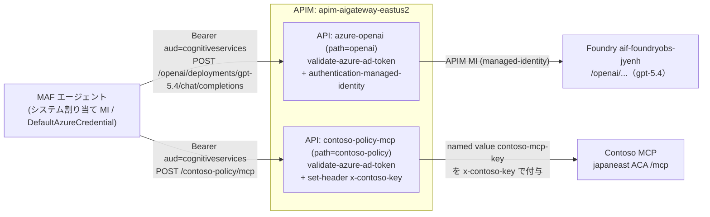

# Lab2-2｜ACA カスタム エージェントのデプロイ

> 親: [lab2-1 全体概要](lab2-1_全体概要.md) ／ 次: [lab2-3 Agent ID 作成](lab2-3_AgentID作成.md)
> 本ファイルは Lab2 の **§3（実行体のビルド & デプロイ）**。Agent ID の発行・統制は [lab2-3](lab2-3_AgentID作成.md)。

## 3. エージェント（実行体）のビルド & デプロイ

> 使用ソース: [agent-custom-MAF-ACA-A365](agent-custom-MAF-ACA-A365/)
> 中身は **Microsoft Agent Framework（MAF）+ FastAPI** Foundry の `gpt-5.4` をモデルに、Contoso ポリシー MCP をツールとして呼ぶ。
> 前提ツール: Azure CLI（`az login` 済み）、PowerShell 7+（`pwsh`）。**ローカル Docker は不要**（`az acr build` のクラウドビルドを使用）。

> **Model と MCP はともに APIM AI Gateway（`apim-aigateway-eastus2`）経由**で出ていく。モデルは `https://apim-aigateway-eastus2.azure-api.net/openai`、MCP は `https://apim-aigateway-eastus2.azure-api.net/contoso-policy` をベース URL とする。MCP の backend は japaneast の稼働中 ACA だが、APIM が中継・キー付与するためアプリ側は APIM の URL だけを参照する。

#### APIM AI Gateway 経由の出口アーキテクチャ

エージェントの **LLM 呼び出し（Foundry）と MCP 呼び出し（Contoso Policy）は、エンタープライズ APIM（`apim-aigateway-eastus2`）の 1 ゲートウェイに集約**されている。これにより認証・レート制御・コンテンツ安全性・監査を APIM 側で横断的に効かせられる。



| API | path | クライアント認証 | バックエンド認証 |
|---|---|---|---|
| `azure-openai` | `openai` | `validate-azure-ad-token`（`aud=https://cognitiveservices.azure.com`） | `authentication-managed-identity`（APIM の SystemAssigned MI） |
| `contoso-policy-mcp` | `contoso-policy` | `validate-azure-ad-token`（同上） | named value `contoso-mcp-key` を `x-contoso-key` で付与、受信 `Authorization` は削除 |

> ⚠️ **コード側は `OpenAIChatCompletionClient`（Chat Completions）を使う**。汎用 `OpenAIChatClient` は Responses API ベースで Azure ルーティング時に `POST /openai/responses` を叩くが、本 APIM には Chat Completions の `POST /openai/deployments/{deployment-id}/chat/completions` operation しか無いため `{"statusCode":404,"message":"Resource not found"}` になる。

### 3.1 設定の確認（`.env`）

[agent-custom-MAF-ACA-A365/.env](agent-custom-MAF-ACA-A365/.env) を開き、以下を確認する（機密値はコミットしない。`.env` は `.gitignore` 済み）。

> **受講者は 12 人（user01〜user12）。Azure リソースは受講者ごとに分離する**ため、自分の識別子 `userNN`（環境変数 `me`）を決め、`.env` の **`ACA_RESOURCE_GROUP` / `ACA_APP_NAME` / `ACA_ENV_NAME` に `-userNN` を付ける**（リソース グループは `rg-userNN`）。これで ACR・Container Apps 環境・Container App が受講者間で衝突しない。`deploy-aca.ps1` は `ACA_RESOURCE_GROUP`（=`rg-userNN`）を**自動作成**する。
> 一方 **Foundry（`PROJECT_ENDPOINT`）・APIM（モデル/MCP）・Application Insights・`AZURE_RESOURCE_GROUP`（`rg-foundryobs-eastus2`：Foundry アカウントが属する共有 RG。ロール付与のスコープに使う）は全受講者で共有**するため変更しない。

> **`.env` は `.gitignore` 済みなので、[new-env.ps1](agent-custom-MAF-ACA-A365/new-env.ps1) で生成する**。共有基盤値はスクリプト内に埋め込み済みで、`-Me` に自分の識別子を渡すだけで ACA 値が `-userNN` 化された `.env` ができる（冪等）。
>
> ```powershell
> cd Handson/lab2/agent-custom-MAF-ACA-A365
> ./new-env.ps1 -Me userNN        # userNN は自分の番号に置き換える（例 user01）。§3 の前に実行
> ```
>
> Agent ID 値（`CLIENTID`/`CLIENTSECRET`/`AGENT_ID`/`AGENT365OBSERVABILITY__*`）は §4.2 の `a365 setup all` で `a365.generated.config.json` が出来てから埋まる。**§4.2 実行後にもう一度** `./new-env.ps1 -Me userNN -Force`（同じ番号）を回すと、生成 config（DPAPI 保護シークレットを含む）から自動補完される。

### 3.2 デプロイ

エージェント フォルダ **の中** から実行する（スクリプトはこのフォルダを基準に動く）。

```powershell
cd _report/Handson/lab2/agent-custom-MAF-ACA-A365
pwsh -NoProfile -File ./deploy-aca.ps1
```

`deploy-aca.ps1` が行うこと:

1. `az acr build` で `Dockerfile`（`python:3.11-slim` + uvicorn）をクラウドビルドし、ACR にイメージを push。
2. リソース グループ `rg-userNN` を作成し、Container Apps 環境（`ACA_ENV_NAME`）と Container App（`ACA_APP_NAME`＝`custom-maf-agent-a365-userNN`）を作成（外部 HTTPS Ingress、ターゲットポート 8000）。
3. **システム割り当てマネージド ID** を有効化。
4. その MI に Foundry アカウントへの **`Azure AI Developer`** ロールを付与（モデル推論用）。
5. リビジョンを再起動し、公開 URL を出力。

完了時に以下が出力される（実測値の例。アプリ名 `custom-maf-agent-a365-userNN`・サブドメイン・principalId は受講者ごとに異なる）:

| 項目 | 値 |
|---|---|
| App URL | `https://custom-maf-agent-a365.proudflower-d41f2cf1.eastus2.azurecontainerapps.io` |
| Chat API | `POST {App URL}/chat`（body `{"message":"..."}`） |
| Health | `GET {App URL}/healthz` → `ok` |
| MI principalId | `18b76884-e692-43e9-9b7b-ebb08c326d2c` |
| 付与ロール | `Azure AI Developer` → Foundry アカウント `aif-foundryobs-jyenh` |

### 3.3 スモークテスト

```powershell
# §3.2 の出力にある自分の App URL（受講者ごとに異なる）を入れる
$app = "https://custom-maf-agent-a365-userNN.<自分のサブドメイン>.eastus2.azurecontainerapps.io"

# ヘルス
curl "$app/healthz"

# チャット（Contoso ポリシー MCP 経由）
curl -X POST "$app/chat" `
  -H "Content-Type: application/json" `
  -d '{"message":"返品ポリシーを教えて"}'
```

期待される応答（抜粋・確認済み）:

```json
{"agent":"custom-maf-agent-a365-user01","reply":"Contoso の一般商品の返品ポリシーは…返品期間: 購入後30日以内…"}
```

- `agent` が自分の `custom-maf-agent-a365-userNN` であること、返品/配送/支払/ロイヤルティ等の回答に MCP の値が反映されることを確認する。
- 初回 `/chat` が 401/403 の場合は **ロール伝播待ち**。数分おいて再試行。
- まとめて 5 問叩く場合: `python smoke_test.py <App URL>`。

> この時点では実行体は **MI（`18b76884…`）** で Foundry を呼んでいる。これは「アプリが動く」ことの確認であり、Agent ID（`9ff24e53…`）とは **別の主体**。Agent ID は §4 のとおり `a365 setup` が既に発行済みで、実行時の Agent ID 認証は Agent 365 SDK + 生成シークレット/MI が担う。

---

次へ: [lab2-3｜Agent ID 作成と統制検証](lab2-3_AgentID作成.md)
