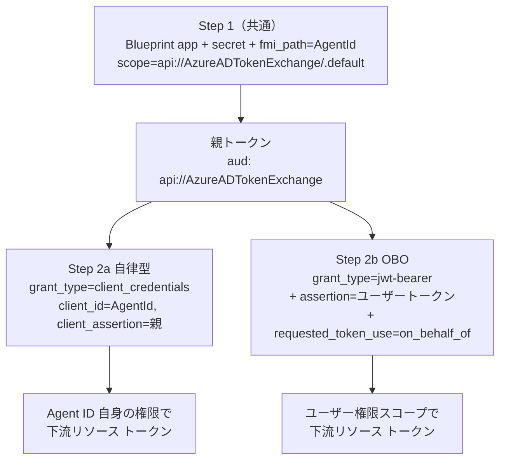

# Lab3 補足｜`agent_id_token.py` 仕様・機能説明書

> 親: [lab3-1｜出口トークンを 1 点に集約し、Agent ID へ差し替える](lab3-1_出口1点集約とAgentID差し替え.md) ／ [Handson README](../README.md)
> 対象ファイル: [agent-custom-MAF-ACA-A365-egress/app/agent_id_token.py](agent-custom-MAF-ACA-A365-egress/app/agent_id_token.py)

## 1. このモジュールの役割

Entra **Agent ID（fmi_path 2 ステップ トークン交換）** を Python ランタイムで実行し、ACA 上のエージェントが **Agent Identity SP として下流（LLM / MCP / Microsoft Graph）を呼ぶための Bearer トークン**を発行する。

lab1-2 の `trigger-agentid-signin.ps1` が手作業で行っていた fmi_path 交換を、ランタイム内のコードに移植したもの。出口トークン取得点（`_egress_token()`）から本モジュールを呼ぶことで、出口を SAMI → Agent ID に差し替えられる（lab3-1 のテーマ）。

> **シークレットを下流に渡さない**: Blueprint シークレットはこのモジュール内（Step 1）でしか使わず、下流には Step 2 で得た短命トークンのみを渡す。

---

## 2. トークン フロー全体像



- **Step 1 は自律型 / OBO で完全共通**。`grant_type` だけが Step 2 で分岐する。
- **CA / Block の遮断点は Step 2**。Block ポリシー有効時は `AADSTS53003`（CA ブロック）、Agent ID 無効化時は `AADSTS7000112`（disabled）で Step 2 が失敗 → 下流呼出が成立しなくなる（＝実トラフィック停止）。

---

## 3. 公開 API（機能一覧）

### 3.1 クラス `AgentIdTokenProvider`

ACA のライフサイクル全体で **1 インスタンスを共有**して使う（自律型 LLM/MCP 出口と OBO ツールが同じインスタンスを共有）。

#### コンストラクタ

```python
AgentIdTokenProvider(
    *,
    tenant_id: str,
    blueprint_app_id: str,
    blueprint_client_secret: str,
    agent_identity_app_id: str,
    http_timeout: float = 30.0,
)
```

| 引数 | 説明 |
|---|---|
| `tenant_id` | テナント ID |
| `blueprint_app_id` | Blueprint アプリの appId（Step 1 の `client_id`） |
| `blueprint_client_secret` | Blueprint のシークレット（Step 1 のみで使用） |
| `agent_identity_app_id` | Agent Identity の appId（Step 1 の `fmi_path` / Step 2 の `client_id`） |
| `http_timeout` | HTTP タイムアウト秒（既定 30.0） |

#### メソッド

| メソッド | シグネチャ | 用途 | 戻り値 |
|---|---|---|---|
| **`get_autonomous_token`** | `async (scope: str) -> str` | 自律型（Step 2a）。Agent ID 自身の権限で `scope` のリソース トークンを取得 | Bearer トークン文字列 |
| **`get_obo_token`** | `async (*, user_assertion: str, scope: str) -> str` | OBO（Step 2b）。`user_assertion` を委任し、**サインインしたユーザーの権限**で `scope` を取得 | Bearer トークン文字列 |

> `get_obo_token` の `user_assertion` は **`aud = api://{blueprint_app_id}`（identifierUri）** かつ **`scp` に `access_as_user` を含む** ユーザー トークンである必要がある。

### 3.2 例外 `AgentIdTokenError(RuntimeError)`

| 属性 | 内容 |
|---|---|
| `message` | エラー文（例: `Step2b (OBO) failed: HTTP 400`） |
| `status` | HTTP ステータス コード（`int | None`） |
| `body` | 応答ボディ（`AADSTS53003` / `AADSTS7000112` 等の判別に使う） |

各 Step で HTTP 200 以外を受けると送出される。

---

## 4. 内部実装（private）

| メソッド | 対応 | リクエスト body の要点 |
|---|---|---|
| `_step1_parent_token` | Step 1（共通） | `grant_type=client_credentials`, `client_id=<blueprint>`, `client_secret`, `scope=api://AzureADTokenExchange/.default`, **`fmi_path=<agent_identity>`** → 親トークン |
| `_step2a_autonomous` | Step 2a | `grant_type=client_credentials`, `client_id=<agent_identity>`, `client_assertion_type=jwt-bearer`, `client_assertion=<親>`, `scope` |
| `_step2b_obo` | Step 2b | `grant_type=jwt-bearer`, `client_id=<agent_identity>`, `client_assertion=<親>`, **`assertion=<user_token>`**, **`requested_token_use=on_behalf_of`**, `scope` |
| `_url`（property） | — | テナントを埋めたトークン エンドポイント URL |

### 定数

| 定数 | 値 |
|---|---|
| `_TOKEN_ENDPOINT` | `https://login.microsoftonline.com/{tenant}/oauth2/v2.0/token` |
| `_PARENT_SCOPE` | `api://AzureADTokenExchange/.default` |
| `_JWT_BEARER` | `urn:ietf:params:oauth:client-assertion-type:jwt-bearer`（`client_assertion_type`） |
| `_OBO_GRANT` | `urn:ietf:params:oauth:grant-type:jwt-bearer`（OBO の `grant_type`） |
| `_SAFETY_SKEW` | `60`（秒。期限 60 秒前にリフレッシュ） |

---

## 5. キャッシュ仕様

| キャッシュ | キー | 値 | 排他 |
|---|---|---|---|
| `_autonomous_cache` | `scope` | `(token, expires_at)` | `asyncio.Lock` + 二重チェック ロック |
| `_obo_cache` | `(scope, hash(user_assertion))` | `(token, expires_at)` | ロックなし（ユーザー × scope 単位） |

- 残存期間が `_SAFETY_SKEW`（60 秒）より大きければキャッシュ ヒットとして再利用。
- **キャッシュ TTL が満了するまではプロセス内トークンが生き続ける**。CA ブロックや Agent ID 無効化を即時反映させたいときは **ACA リビジョン restart** でキャッシュを破棄する（lab4 のキルスイッチ検証で実演）。

---

## 6. 観測性（`auth_meta` 連携）

各 Step の完了時に [`auth_meta.record(...)`](agent-custom-MAF-ACA-A365-egress/app/auth_meta.py) を呼び、トークン交換イベントをメモリ（直近 50 件）に記録する。`main.py` の `GET /debug/auth` で確認できる。

- 記録されるのは **署名検証なしでデコードした JWT の非機微クレームのみ**（`appid` / `azp` / `aud` / `iss` / `oid` / `tid` / `roles` / `scp` / `exp`）。シークレットや生トークンは保持しない。
- `phase` 値で各ステップを識別:

| `phase` | 意味 |
|---|---|
| `step1_parent_token` | Step 1 完了（親トークン） |
| `step2a_autonomous_token` | Step 2a 完了（自律型）。`idtyp=app` 相当 |
| `step2b_obo_token` | Step 2b 完了（OBO）。`idtyp=user` 相当 |

---

## 7. 呼び出し側との関係

| 呼び出し元 | 使うメソッド | 備考 |
|---|---|---|
| lab3 / lab4（自律型ホスト） | `get_autonomous_token` のみ | LLM / MCP の出口トークン（`_egress_token()` 経由） |
| **lab5（OBO ホスト）** | `get_autonomous_token` ＋ **`get_obo_token`** | `/obo-chat` のツール `get_my_profile` が `get_obo_token` を呼ぶ |

> `get_obo_token` / `_step2b_obo`（OBO）は **lab3 の時点で既に実装済み**だが、lab3/lab4 の自律型ホストからは呼ばれていない。lab5 がこれを `/obo-chat` から起動して OBO を有効化する。詳細は [lab5-1](../lab5/lab5-1_OBOユーザー委任とAgentID二重統制.md) を参照。

---

## 8. エラー時の主なステータス（切り分け）

| 失敗コード | 発生条件 | どの Step |
|---|---|---|
| `AADSTS53003` | CA ポリシーでブロック（Agent ID または OBO のユーザー） | Step 2 |
| `AADSTS7000112` | Agent ID（SP）が `accountEnabled=false`（Block / Disable） | Step 1 / Step 2（STS 伝播後） |
| `401 Authorization_IdentityDisabled` | 無効化直後（STS 未伝播・トークンは発行できるが下流が拒否） | 下流呼出時 |
| OBO 入口 `401` | `user_assertion` の `aud` / `scp`（`access_as_user`）不一致 | OBO 呼出前の検証（lab5 の `obo_validator`） |

> Block / Disable は **新規トークン発行のみ**止め、既発行トークンは TTL 満了まで有効。観測は2段階（直後＝発行成功＋下流 401 → 数分後＝発行自体が `AADSTS7000112`）。詳細は lab4 のキルスイッチ検証を参照。
