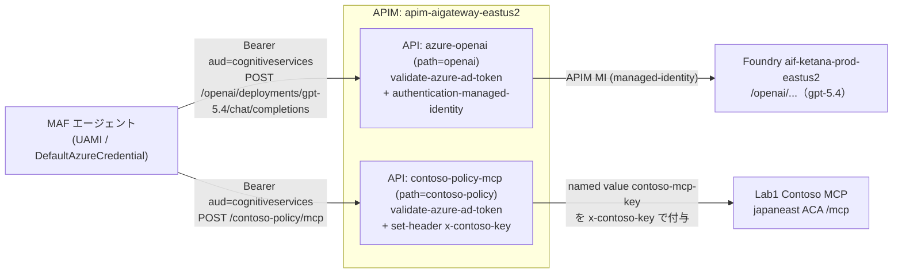

# extLab2-2: LLM と MCP を APIM AI Gateway に集約する

> 親: [extLab2 README](README.md) ／ 前: [extLab2-1 UAMI出口化](extLab2-1_UAMI出口化.md) ／ 次: [extLab2-3 Teams接続](extLab2-3_Teams接続_M365AgentsSDK.md)

## このステップの狙い

エージェントの **LLM 呼び出し（Foundry）と MCP 呼び出し（Contoso Policy）を、エンタープライズ APIM（`apim-aigateway-eastus2`）の 1 ゲートウェイに集約**する。これにより認証・レート制御・コンテンツ安全性・監査を APIM 側で横断的に効かせられる。



| API | path | クライアント認証 | バックエンド認証 |
|---|---|---|---|
| `azure-openai` | `openai` | `validate-azure-ad-token`（`aud=https://cognitiveservices.azure.com`） | `authentication-managed-identity`（APIM の SystemAssigned MI） |
| `contoso-policy-mcp` | `contoso-policy` | `validate-azure-ad-token`（同上） | named value `contoso-mcp-key` を `x-contoso-key` で付与、受信 `Authorization` は削除 |

---

## コード側の接続点

### LLM（`agent.py` / `config.py`）

`OpenAIChatCompletionClient`（agent-framework-openai）に Azure ルーティング入力を渡し、APIM の `openai` パスへ向ける。クライアントは標準の Azure OpenAI 互換パス `/openai/deployments/{deployment}/chat/completions` を叩く。

```python
# agent.py build_agent()（抜粋）
from agent_framework.openai import OpenAIChatCompletionClient

endpoint = config.apim_aoai_endpoint().rstrip("/")   # https://apim-aigateway-eastus2.azure-api.net/openai
if endpoint.lower().endswith("/openai"):              # azure_endpoint はリソース ルートを期待するため /openai を除く
    endpoint = endpoint[: -len("/openai")]
client = OpenAIChatCompletionClient(
    azure_endpoint=endpoint,                         # https://apim-aigateway-eastus2.azure-api.net
    model=config.apim_aoai_deployment(),             # gpt-5.4
    api_version=config.apim_aoai_api_version(),      # 2024-10-21
    credential=credential,                           # UAMI（aud=cognitiveservices）
)
```

> ⚠️ **Responses API クライアントは使わない**。汎用 `OpenAIChatClient` は Responses API ベースで Azure ルーティング時に `POST /openai/responses` を叩くが、本 APIM には Chat Completions の `POST /openai/deployments/{deployment-id}/chat/completions` operation しか無いため `{"statusCode":404,"message":"Resource not found"}` になる。**Chat Completions を叩く `OpenAIChatCompletionClient` を使う**こと。

`config.py` のアクセサ:

| アクセサ | 環境変数 | 既定 |
|---|---|---|
| `apim_aoai_endpoint()` | `APIM_AOAI_ENDPOINT`（必須） | — |
| `apim_aoai_deployment()` | `AGENT_MODEL_DEPLOYMENT_NAME` or `APIM_AOAI_DEPLOYMENT` | — |
| `apim_aoai_api_version()` | `APIM_AOAI_API_VERSION` | `2024-10-21` |
| `apim_scope()` | `APIM_SCOPE` | `https://cognitiveservices.azure.com/.default` |

### MCP（`agent.py` / `config.py`）

MCP 呼び出しは `streamablehttp_client(CONTOSO_MCP_URL, headers=Bearer)` で APIM の `contoso-policy/mcp` を叩く。`_mcp_uses_bearer()` が真（`apim_scope()` が値を持つ）なら `Authorization: Bearer <uami token>` を付ける。

```python
# _mcp_headers()（抜粋・実装イメージ）
if _mcp_uses_bearer():
    token = await _msi_token(config.mcp_scope())   # 既定で apim_scope() に連鎖
    return {"Authorization": f"Bearer {token}"}
return {"x-contoso-key": config.mcp_api_key_legacy()}  # レガシー直結時のみ
```

| アクセサ | 環境変数 | 備考 |
|---|---|---|
| `mcp_url()` | `CONTOSO_MCP_URL` | APIM の `.../contoso-policy/mcp` |
| `mcp_scope()` | `MCP_SCOPE` → `api://{MCP_RESOURCE_APP_ID}/.default` → `apim_scope()` | APIM 集約時は空で OK（`apim_scope()` に連鎖） |
| `mcp_api_key_legacy()` | `CONTOSO_MCP_KEY` | APIM 集約時は不要（APIM が付与） |

> APIM がバックエンド MCP に `x-contoso-key` を付与するため、**エージェント側は MCP キーを持たない**。キーは APIM の named value `contoso-mcp-key` に 1 箇所だけ保管する。

---

## 手順

### 1. APIM をセットアップする（`setup-apim-aigateway.ps1`）

`agent-extended/scripts/setup-apim-aigateway.ps1` が、APIM に 2 つの API（`azure-openai` / `contoso-policy-mcp`）とバックエンド・ポリシー・named value を一括登録する。**既定は dry-run**。本番反映は `-Apply`。

```powershell
cd lab/extLab2/agent-extended/scripts

# まず dry-run で投入内容を確認
./setup-apim-aigateway.ps1

# 本番反映。MCP キーはスクリプト内で非表示プロンプトされる
./setup-apim-aigateway.ps1 -Apply
```

> MCP キーをコマンドラインに直接書くと履歴に平文で残るため、`-Apply` のみで実行し、プロンプトに入力する。CI など非対話で渡したい場合のみ `-McpApiKey (Read-Host -AsSecureString)` を使う。

スクリプトが行う 6 ステップ:

| # | 内容 |
|---|---|
| 0 | APIM の SystemAssigned MI `principalId` を取得（未有効ならエラー） |
| 1 | APIM MI に Foundry リソースへ `Cognitive Services OpenAI User`（`5e0bd9bd-…`）を付与 |
| 2 | バックエンド `aif-ketana-prod-eastus2-aoai`（URL = `<endpoint>/openai`）を作成 |
| 3 | API `azure-openai`（path=openai）+ operation `POST /deployments/{deployment-id}/chat/completions` + ポリシー（`validate-azure-ad-token` → `set-backend-service` → `authentication-managed-identity resource="https://cognitiveservices.azure.com"`） |
| 4 | named value `contoso-mcp-key`（secret）を作成 |
| 5 | バックエンド `contoso-policy-mcp`（URL は `/mcp` を除いた base） |
| 6 | API `contoso-policy-mcp`（path=contoso-policy）+ `POST/GET/DELETE /mcp` operation + ポリシー（`validate-azure-ad-token` → `set-backend-service` → `set-header x-contoso-key={{contoso-mcp-key}}` → `set-header Authorization=delete`） |

主なパラメーター（既定値あり）:

| パラメーター | 既定 |
|---|---|
| `-ApimName` / `-ApimRg` | `apim-aigateway-eastus2` / `rg-aim-aigateway-eastus2` |
| `-FoundryAoaiEndpoint` | `https://aif-ketana-prod-eastus2.openai.azure.com` |
| `-FoundryResourceId` | `aif-ketana-prod-eastus2` の resourceId |
| `-McpBackendUrl` | Lab1 の Contoso MCP（japaneast ACA）`/mcp` |
| `-ExpectedAudience` | `https://cognitiveservices.azure.com` |
| `-TenantId` | `655bd66a-5001-4cb3-9aad-ce54a27d5d95` |

### 2. APIM の SystemAssigned MI を有効化しておく

ステップ 0 が前提とするため、未有効なら先に有効化:

```powershell
az apim update -g rg-aim-aigateway-eastus2 -n apim-aigateway-eastus2 --set identity.type=SystemAssigned
```

> ステップ 1 で APIM MI に `Cognitive Services OpenAI User` が付くことで、APIM → Foundry が `authentication-managed-identity` で通る。

### 3. エージェントの `.env` を APIM 向けに切り替える

```ini
# --- LLM: APIM の openai パス ---
APIM_AOAI_ENDPOINT=https://apim-aigateway-eastus2.azure-api.net/openai
APIM_AOAI_DEPLOYMENT=gpt-5.4
APIM_AOAI_API_VERSION=2024-10-21
APIM_SCOPE=
AGENT_MODEL_DEPLOYMENT_NAME=gpt-5.4

# --- MCP: APIM の contoso-policy パス ---
CONTOSO_MCP_URL=https://apim-aigateway-eastus2.azure-api.net/contoso-policy/mcp
MCP_RESOURCE_APP_ID=
MCP_SCOPE=
CONTOSO_MCP_KEY=

# 旧 PROJECT_ENDPOINT / MODEL_DEPLOYMENT_NAME（Foundry 直結）はコメントアウト
```

> `APIM_SCOPE` / `MCP_SCOPE` を空にすると、`apim_scope()` の既定 `https://cognitiveservices.azure.com/.default` が使われる。

### 4. 再デプロイ

env だけ更新する場合（再ビルド不要・最速）:

```powershell
az containerapp update -g rg-foundryobs-eastus2 -n custom-maf-agent-a365-ext `
  --set-env-vars `
    APIM_AOAI_ENDPOINT=https://apim-aigateway-eastus2.azure-api.net/openai `
    APIM_AOAI_DEPLOYMENT=gpt-5.4 `
    APIM_AOAI_API_VERSION=2024-10-21 `
    CONTOSO_MCP_URL=https://apim-aigateway-eastus2.azure-api.net/contoso-policy/mcp

# 反映確認
az containerapp show -g rg-foundryobs-eastus2 -n custom-maf-agent-a365-ext `
  --query "properties.template.containers[0].env[?starts_with(name,'APIM') || name=='CONTOSO_MCP_URL'].{name:name,value:value}" -o table
```

コードも変えた場合は再ビルド（`az acr build -r acaagent4y3b81 -t acaagent4y3b81.azurecr.io/custom-maf-agent-a365-ext:latest .` → `az containerapp update --image ...`）。

---

## 確認

### APIM 直叩き（UAMI 相当のトークンで）

ローカルから検証する場合は `az login` ユーザーで `aud=cognitiveservices` のトークンを取得して叩く。

```powershell
$tok = az account get-access-token --resource https://cognitiveservices.azure.com --query accessToken -o tsv

# LLM
curl -s -X POST `
  "https://apim-aigateway-eastus2.azure-api.net/openai/deployments/gpt-5.4/chat/completions?api-version=2024-10-21" `
  -H "Authorization: Bearer $tok" -H "Content-Type: application/json" `
  -d '{"messages":[{"role":"user","content":"ping"}]}'

# MCP（Streamable HTTP の initialize）
curl -s -X POST "https://apim-aigateway-eastus2.azure-api.net/contoso-policy/mcp" `
  -H "Authorization: Bearer $tok" -H "Content-Type: application/json" `
  -H "Accept: application/json, text/event-stream" `
  -d '{"jsonrpc":"2.0","id":1,"method":"initialize","params":{"protocolVersion":"2024-11-05","capabilities":{},"clientInfo":{"name":"curl","version":"0"}}}'
```

| チェック | 期待 |
|---|---|
| LLM POST | 200 + completion（401 なら audience / token 不一致） |
| MCP POST | 200 / SSE（`x-contoso-key` は APIM が付与するのでクライアントは不要） |
| `Authorization` なし | 401（`validate-azure-ad-token` が拒否） |

---

## トラブルシュート

| 症状 | 原因 | 対処 |
|---|---|---|
| LLM が `{"statusCode":404,"message":"Resource not found"}`（APIM 由来） | コードが Responses API ベースの `OpenAIChatClient` を使い `POST /openai/responses` を叩いている（APIM には Chat Completions operation しか無い） | `OpenAIChatCompletionClient` に置換して `/openai/deployments/{deployment}/chat/completions` を叩く（再ビルド要） |
| LLM が 401 | トークンの `aud` が `cognitiveservices` でない | `--resource https://cognitiveservices.azure.com` で取得 / `APIM_SCOPE` 既定を確認 |
| LLM が 500（APIM → Foundry） | APIM MI に Foundry の OpenAI User 未付与 | `setup-apim-aigateway.ps1` ステップ 1 を再実行 |
| MCP が `{"error":"unauthorized"}`（backend 由来） | named value `contoso-mcp-key` が空/不一致、または **APIM backend URL が古い MCP を向いている** | named value `contoso-mcp-key` を backend ACA の `CONTOSO_MCP_KEY` と一致させる。backend `contoso-policy-mcp` の URL が現行 ACA（`az containerapp show -n contoso-policy-mcp --query properties.configuration.ingress.fqdn`）と一致するか確認 |
| MCP が二重認証で弾かれる | 受信 `Authorization` がバックエンドへ漏れる | MCP ポリシーの `set-header Authorization=delete` を確認 |
| ポリシー反映直後に旧挙動 | PUT 反映に数秒ラグ | 数秒待ってから再試行 |

---

完了したら **[extLab2-3: Teams から呼べるようにする（M365 Agents SDK）](extLab2-3_Teams接続_M365AgentsSDK.md)** に進む。
