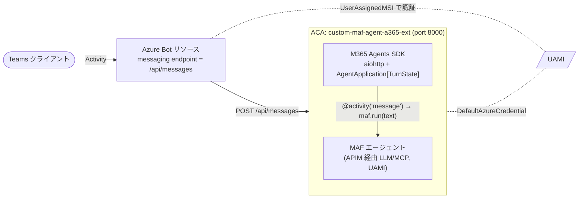

# extLab2-3: Teams から呼べるようにする（M365 Agents SDK）

> 親: [extLab2 README](README.md) ／ 前: [extLab2-2 APIM AI Gateway化](extLab2-2_APIM_AI_Gateway化.md) ／ 次: [extLab2-4 Agent ID 出口化（配線と検証）](extLab2-4_AgentID出口化_配線と検証.md)

## このステップの狙い

エージェントを **Microsoft 365 Agents SDK**（Bot Framework SDK の正式後継）で実装し、`/api/messages` を公開する。Azure Bot リソース経由で **Teams から会話**できるようにする。Bot 認証は extLab2-1 の UAMI（`UserAssignedMSI`）を使う。



---

## 実装の実体（コード）

### ホスト（`agent-extended/app/main.py`）

- aiohttp で `web.Application(middlewares=[jwt_authorization_middleware])` を構築。
- `AgentApplication[TurnState]` を `MsalConnectionManager` + `CloudAdapter` で初期化（`load_configuration_from_env` が `CONNECTIONS__SERVICE_CONNECTION__SETTINGS__*` を読む）。
- ルート:

  | メソッド / パス | 役割 |
  |---|---|
  | `POST /api/messages` | `start_agent_process(req, agent_app, adapter)` に委譲（Teams 互換） |
  | `GET /api/messages` | 200 `ok`（ヘルスチェック） |
  | `GET /` / `GET /healthz` | 200 `ok` |

- デコレーター ハンドラ:

  ```python
  @agent_app.conversation_update("membersAdded")
  async def _on_members_added(context, _state):
      # ウェルカム メッセージを送信

  @agent_app.activity("message")
  async def _on_message(context, _state):
      text = (context.activity.text or "").strip()
      sender = context.activity.from_property
      SENDER_OID_CV.set(getattr(sender, "aad_object_id", None))   # Teams ユーザーの oid
      SENDER_NAME_CV.set(getattr(sender, "name", None))
      result = await maf_agent.run(text)                          # MAF へ委譲
      await context.send_activity(getattr(result, "text", None) or str(result))
  ```

- MAF エージェントは aiohttp の lifecycle（`on_startup`）で `build_agent(stack)` により構築。`on_cleanup` で `AsyncExitStack` を閉じる。
- 起動: `PORT`（既定 8000）で `web.run_app(host="0.0.0.0")`。

### ユーザー文脈（`get_my_profile`）

Teams の `activity.from_property.aad_object_id` を `SENDER_OID_CV` に格納し、`agent.py` の `get_my_profile` ツールが **Graph アプリ権限 `User.Read.All`** で本人プロフィールを取得する（UAMI 直結。APIM は介さない）。

> 旧設計の OBO（ユーザー委任）は使わず、Teams が渡す `oid` + アプリ権限の組み合わせで本人特定する。これにより専用ログイン UI 不要で Teams 体験に統合できる。

### 旧環境変数の互換

`_bridge_legacy_env()` が `MICROSOFT_APP_*` → `CONNECTIONS__SERVICE_CONNECTION__SETTINGS__*` を自動コピーする。新規構成では新キーを直接指定すればよい。

---

## 手順

### 1. Azure Bot リソースを UserAssignedMSI で作成する

```powershell
$RG       = 'rg-foundryobs-eastus2'
$BOT      = 'bot-contoso-agent-ext'
$APP_NAME = 'custom-maf-agent-a365-ext'
$TENANT   = '655bd66a-5001-4cb3-9aad-ce54a27d5d95'

# extLab2-1 で作った UAMI の clientId（= Bot の App ID として使う）
$uamiClientId = az identity show -g $RG -n uami-contoso-agent-ext --query clientId -o tsv

# ACA の FQDN（messaging endpoint に使う）
$fqdn = az containerapp show -g $RG -n $APP_NAME --query "properties.configuration.ingress.fqdn" -o tsv

az bot create -g $RG -n $BOT `
  --app-type UserAssignedMSI `
  --appid $uamiClientId `
  --tenant-id $TENANT `
  --msi-resource-id (az identity show -g $RG -n uami-contoso-agent-ext --query id -o tsv) `
  --endpoint "https://$fqdn/api/messages"
```

> `--app-type UserAssignedMSI` にすることで、Bot 認証も extLab2-1 の UAMI 1 本に集約される（シークレット不要）。

### 2. ACA の Bot 関連 env を設定する

```powershell
az containerapp update -g $RG -n $APP_NAME --set-env-vars `
  "CONNECTIONS__SERVICE_CONNECTION__SETTINGS__AUTHTYPE=UserManagedIdentity" `
  "CONNECTIONS__SERVICE_CONNECTION__SETTINGS__CLIENTID=$uamiClientId" `
  "CONNECTIONS__SERVICE_CONNECTION__SETTINGS__TENANTID=$TENANT"
```

| キー | 値 |
|---|---|
| `...__AUTHTYPE` | `UserManagedIdentity` |
| `...__CLIENTID` | UAMI の clientId（= Bot App ID） |
| `...__TENANTID` | テナント ID |

> ⚠️ **`AUTHTYPE` の値に注意**: Azure Bot 側の `az bot create --app-type` は **`UserAssignedMSI`** だが、M365 Agents SDK の env `...__AUTHTYPE` は **`UserManagedIdentity`**（SDK の `AuthTypes` enum 値）。ここを `UserAssignedMSI` にすると `/api/messages` で `NotImplementedError: Authentication type not supported`（Error Code -60016）になりエージェントが無応答になる。
> `UserManagedIdentity` ではクライアント シークレット（`...__CLIENTSECRET`）は不要。

### 3. Teams チャネルを有効化しマニフェストを配布する

```powershell
az bot msteams create -g $RG -n $BOT
```

Teams アプリ マニフェスト（`manifest.json`）の `bots[].botId` に UAMI clientId を設定し、Teams 管理センター or Developer Portal でサイドロード／公開する。

### 4. Teams に読み込ませる（サイドロード）

**前提**: テナント `655bd66a-…`（Bot と同じ）の Teams にサインインし、カスタムアプリのアップロードが許可されていること。

配布用の zip（`manifest.json` + アイコン）を用意し、以下のいずれかで読み込む。

#### 方法A: Teams クライアントから直接（最速）

1. Teams を開く → 左下 **アプリ** → **アプリを管理** → **アプリをアップロード**（または「カスタム アプリをアップロード」）
2. `teamsapp-ext.zip` を選択
3. **追加** → 「Contoso Support (ext)」とのチャットが開く

> アップロード項目が出ない場合は、Teams 管理センター → セットアップ ポリシー で「カスタムアプリのアップロード」を有効化（テナント管理者操作）。

#### 方法B: Developer Portal（管理者が配布する場合）

1. `https://dev.teams.microsoft.com` → **Apps** → **Import app** → zip を読み込み
2. **Publish → Publish to your org**（組織内公開）

### 5. テスト（2 つの質問）

チャットが開いたら、そのまま入力する。

1. **「返品ポリシーは？」**
   → エージェントが MCP ツール `get_return_policy`（APIM AI Gateway 経由）を呼び、Contoso の返品ポリシー本文を返す。
2. **「私のプロフィールは？」**
   → Teams が渡すあなたの `oid` を使い `get_my_profile`（Microsoft Graph、UAMI のアプリ権限 `User.Read.All`）が**あなた本人**の表示名・メール等を返す。

### 6. 反映（再ビルドは不要）

このフェーズではアプリのコード（イメージ）は変更しておらず、追加したのは Bot 接続用の env（`CONNECTIONS__*`）だけ。手順2の `az containerapp update --set-env-vars` で既に新リビジョンが作成・反映されているため、**再ビルドは不要**。env を後から追加・修正する場合も同じく env だけ更新すれば最速で反映される。

```powershell
# env だけ更新（再ビルド不要・最速）
az containerapp update -g $RG -n $APP_NAME --set-env-vars `
  "CONNECTIONS__SERVICE_CONNECTION__SETTINGS__AUTHTYPE=UserManagedIdentity" `
  "CONNECTIONS__SERVICE_CONNECTION__SETTINGS__CLIENTID=$uamiClientId" `
  "CONNECTIONS__SERVICE_CONNECTION__SETTINGS__TENANTID=$TENANT"

# 反映確認（新リビジョンが Running になっていれば OK）
az containerapp revision list -g $RG -n $APP_NAME --query "[].{name:name,active:properties.active,state:properties.runningState}" -o table
```

> アプリ コード（`app/*.py` など）を変更したときだけ `agent-extended/deploy-aca.ps1`（`az acr build` → `az containerapp update --image`）で再ビルドが必要。`Dockerfile` は `EXPOSE 8000` / `ENV PORT=8000` / `CMD ["python","-m","app.main"]`、ACA ingress の target-port は **8000**。

---

## 確認

```powershell
# ヘルスチェック
$fqdn = az containerapp show -g $RG -n $APP_NAME --query "properties.configuration.ingress.fqdn" -o tsv
curl -s "https://$fqdn/api/messages"   # → ok

# Bot のメッセージング エンドポイント
az bot show -g $RG -n $BOT --query "properties.endpoint" -o tsv
```

| チェック | 期待 |
|---|---|
| `GET /api/messages` | 200 `ok` |
| Bot endpoint | `https://<fqdn>/api/messages` |
| Teams から「返品ポリシーは？」 | MCP `get_return_policy` の結果が返る |
| Teams から「私のプロフィールは？」 | `get_my_profile`（Graph）が本人情報を返す |

---

## トラブルシュート

| 症状 | 原因 | 対処 |
|---|---|---|
| Teams で無応答 | messaging endpoint 誤り / ingress 非公開 | Bot endpoint と ACA ingress（external, port 8000）を確認 |
| `NotImplementedError: Authentication type not supported`（-60016）で無応答 | env `...__AUTHTYPE` に Bot の `--app-type` 値 `UserAssignedMSI` を入れてしまった | SDK の env は **`UserManagedIdentity`** に修正（`az bot create --app-type` の `UserAssignedMSI` とは別物） |
| 401 at `/api/messages` | Bot App 認証不一致 | `...__CLIENTID` が UAMI clientId、`...__AUTHTYPE=UserManagedIdentity` か確認 |
| `get_my_profile` が空 | `aad_object_id` が取れない | Teams 経由のアクティビティか確認（テストツールでは null になる） |
| 起動はするが応答が遅い | MAF が `on_startup` で初期化中 | 初回数秒待つ。`maf_agent is None` の間は案内文を返す設計 |

---

完了したら **[extLab2-4: Agent ID を「実出口」に配線する（配線設定と検証）](extLab2-4_AgentID出口化_配線と検証.md)** に進む。
