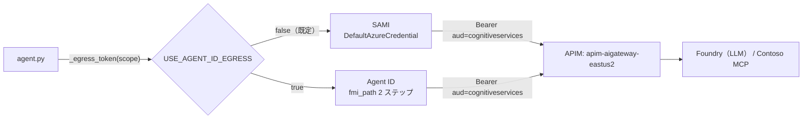

# Lab3-1｜出口トークンを 1 点に集約し、Agent ID へ差し替え可能にする

> 親: [Handson README](../README.md) ／ 前: [lab2-3｜Agent ID 作成と統制検証](../lab2/lab2-3_AgentID作成.md)

## このステップの狙い

Lab2 の時点で、エージェントの外向き通信（LLM / MCP、いずれも APIM 経由）は **ACA のシステム割り当て MI（SAMI）** が出口だった。本ステップでは、この **SAMI を既定の出口に保ったまま**、出口トークンの取得を **コード上の 1 点（`_egress_token()`）に集約**し、環境変数フラグ `USE_AGENT_ID_EGRESS` を立てるだけで、出口を [lab2-3](../lab2/lab2-3_AgentID作成.md) で発行した **Agent ID（fmi_path 2 ステップ交換）に差し替えられる**状態にする。

> **このステップはここまで（差し替えの“単一点”を用意する配線だけ）**。既定（フラグ未設定）では出口は SAMI のまま。実際にフラグを立てて出口を Agent ID にする操作と、Agent ID を止めて LLM/MCP を遮断するキルスイッチの検証は **後続ステップ（Lab4）** で行う。

| 項目 | Lab2 | lab3-1 |
|---|---|---|
| 既定の出口 ID | SAMI（`DefaultAzureCredential`） | **SAMI のまま**（変更なし） |
| 出口トークンの取得箇所 | LLM / MCP で個別に取得 | **`_egress_token()` の 1 点に集約** |
| Agent ID への差し替え | 不可 | **`USE_AGENT_ID_EGRESS=true` で可**（既定は `false`） |

---

## 差し替えの単一点（コードの実体）

本ラボの実行体は egress 版（[`agent-custom-MAF-ACA-A365-egress`](agent-custom-MAF-ACA-A365-egress/)）。Lab2 のエージェントと **同一指示・同一 MCP ツール・同一モデル・APIM 経由**で、差分は **出口トークンの取得を `_egress_token()` に集約した点だけ**。

```python
# app/config.py
def use_agent_id_egress() -> bool:
    return os.environ.get("USE_AGENT_ID_EGRESS", "false").lower() in ("1", "true", "yes")

# app/agent.py — 出口トークンの取得はここ 1 点だけ
async def _egress_token(scope: str) -> str:
    if config.use_agent_id_egress():
        return await _get_agent_id_provider().get_autonomous_token(scope)  # Agent ID (fmi_path)
    return await _msi_token(scope)                                          # SAMI (DefaultAzureCredential)
```

- **LLM**: フラグが立つと `OpenAIChatCompletionClient(credential=...)` に渡す資格情報を `DefaultAzureCredential` から `AgentIdCredential`（`get_token` で Agent ID リソーストークンを返す async 資格情報）に切り替える。
- **MCP**: `_mcp_headers()` の Bearer を `_egress_token(config.mcp_scope())` から取る。



> APIM の `validate-azure-ad-token` は **audience と発行元のみ**検証し appid を見ないため、SAMI でも Agent ID でも `aud=https://cognitiveservices.azure.com` のトークンなら同じ API を通過する。**出口を差し替えても APIM 側の設定変更は不要**。

---

## 前提

| 項目 | 内容 |
|---|---|
| Lab2 完了 | egress 版が叩く APIM エンドポイント（LLM / MCP）は [lab2-2](../lab2/lab2-2_ACAカスタムエージェントデプロイ.md) と同じ。`.env` の `APIM_*` / `CONTOSO_MCP_URL` はそこから流用 |
| Agent ID 発行済み | [lab2-3](../lab2/lab2-3_AgentID作成.md) の `a365 setup all` で Blueprint / Agent Identity を発行済みであること。**本ラボでは再発行しない**（重複登録の事故になる） |
| Blueprint app ID | `BLUEPRINT_APP_ID`（lab2-3 の `a365.generated.config.json` の Blueprint appId） |
| Agent Identity app ID | `AGENT_IDENTITY_APP_ID`（同 Agent Identity appId）→ fmi_path に使う |
| Blueprint シークレット | `BLUEPRINT_CLIENT_SECRET`（lab2-3 の `agentBlueprintClientSecret` を DPAPI 復号した値）。ACA シークレット経由で注入 |

---

## 手順

### 1. `.env` を用意する

`agent-custom-MAF-ACA-A365-egress/.env.example` をコピーして `.env` を作る。

```powershell
cd C:\GitHub\Agent365-Onboarding\Handson\lab3\agent-custom-MAF-ACA-A365-egress
Copy-Item .env.example .env
```

主に埋める値:

```ini
AZURE_TENANT_ID=<tenant>
AZURE_RESOURCE_GROUP=<Foundry の RG>

# LLM / MCP は Lab2 と同じ APIM エンドポイント
APIM_AOAI_ENDPOINT=https://apim-aigateway-eastus2.azure-api.net/openai
APIM_AOAI_DEPLOYMENT=gpt-5.4
CONTOSO_MCP_URL=https://apim-aigateway-eastus2.azure-api.net/contoso-policy/mcp

# --- 差し替えの単一点：既定は SAMI（false）。配線だけ仕込んでおく ---
USE_AGENT_ID_EGRESS=false
BLUEPRINT_APP_ID=<lab2-3 の Blueprint appId>
AGENT_IDENTITY_APP_ID=<lab2-3 の Agent Identity appId>
BLUEPRINT_CLIENT_SECRET=<DPAPI 復号した Blueprint シークレット>
```

Blueprint シークレットの復号（lab2-3 を実行したのと同一 Windows ユーザーで）:

```powershell
$s = (Get-Content ..\..\lab2\agent-custom-MAF-ACA-A365\a365.generated.config.json | ConvertFrom-Json).agentBlueprintClientSecret
[Text.Encoding]::UTF8.GetString([Security.Cryptography.ProtectedData]::Unprotect([Convert]::FromBase64String($s), $null, 'CurrentUser'))
```

> `USE_AGENT_ID_EGRESS=false` のままにしておく。Agent ID 用の 3 値は **配線（フラグを立てれば即切替できる状態）** のために入れておくだけで、既定では使われない。

### 2. egress 版エージェントをデプロイする（SAMI 出口）

```powershell
pwsh .\deploy-aca.ps1
```

`deploy-aca.ps1` は次を行う:

1. `az acr build` で Dockerfile からイメージをビルド（ローカル Docker 不要）
2. 既存の ACA 環境（`aca-contoso-agent`、Lab2 と共用）に Container App `custom-maf-agent-a365-egress` を作成（外部 HTTPS, port 8000）
3. **システム割り当て MI（SAMI）を有効化**し、Foundry へ `Azure AI Developer` を付与（＝既定の出口 ID）
4. Blueprint シークレットを ACA シークレット（`blueprint-secret`）として登録し、`BLUEPRINT_CLIENT_SECRET=secretref:blueprint-secret` で注入

> UAMI の作成・割り当て・Graph 同意は **不要**。既定の出口は Lab2 と同じ SAMI で、Agent ID 側は fmi_path（Blueprint シークレット）が担うため。

### 3. 既定（SAMI 出口）で動くことを確認する

```powershell
python smoke_test.py https://<your-app-fqdn>
```

- `POST /chat` … `{"message":"返品ポリシーを教えて"}` → MCP ツールを呼んでポリシーに沿った回答が返る
- `GET /debug/auth` … `use_agent_id_egress=false`、SAMI 出口で動作（`step2a_autonomous_token` は記録されない）

---

## 確認

| チェック | 期待 |
|---|---|
| ACA の identity | system-assigned が有効、UAMI は割り当てなし |
| `USE_AGENT_ID_EGRESS` | `false`（既定。実フリップは Lab4 で） |
| Agent ID 用 env | `BLUEPRINT_APP_ID` / `AGENT_IDENTITY_APP_ID` / `BLUEPRINT_CLIENT_SECRET`（secretref）が投入済み |
| `/chat` | SAMI 出口で APIM 経由の LLM / MCP が動く |

---

## トラブルシュート

| 症状 | 原因 | 対処 |
|---|---|---|
| LLM が 404（Resource not found） | コードが Responses API を叩いている | `OpenAIChatCompletionClient`（Chat Completions）を使う。汎用 `OpenAIChatClient` は不可（[lab2-2](../lab2/lab2-2_ACAカスタムエージェントデプロイ.md) 参照） |
| デプロイ時に Agent ID 値の不足エラー | `USE_AGENT_ID_EGRESS=true` なのに 3 値が未設定 | 本ラボでは既定 `false` のまま。値だけ `.env` に入れておく |
| `/chat` が 401 / 403 | SAMI に Foundry ロール未付与 | `deploy-aca.ps1` の RBAC ステップ（`Azure AI Developer`）が成功したか確認 |

---

完了したら、出口を実際に Agent ID へ切り替える操作と、Agent ID を止めて LLM / MCP を遮断するキルスイッチの検証（後続ステップ）に進む。
