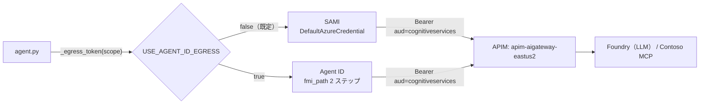

# Lab3-1｜出口トークンを 1 点に集約し、Agent ID へ差し替える

> 親: [Handson README](../README.md) ／ 前: [lab2-3｜Agent ID 作成と統制検証](../lab2/lab2-3_AgentID作成.md)

## このステップの狙い

Lab2 の時点で、エージェントの外向き通信（LLM / MCP、いずれも APIM 経由）は **ACA のシステム割り当て MI（SAMI）** が出口だった。本ステップでは、出口トークンの取得を **コード上の 1 点（`_egress_token()`）に集約**したうえで、環境変数フラグ `USE_AGENT_ID_EGRESS=true` を立てて、出口を [lab2-3](../lab2/lab2-3_AgentID作成.md) で発行した **Agent ID（fmi_path 2 ステップ交換）に実際に差し替える**。

> **このステップで出口は SAMI → Agent ID に切り替わる**（`_egress_token()` を 1 点に集約しておくことで、フラグ 1 つの切替で済む）。Agent ID を止めて LLM/MCP を遮断するキルスイッチの検証は **後続ステップ（Lab4）** で行う。

| 項目 | Lab2 | lab3-1 |
|---|---|---|
| 出口 ID | SAMI（`DefaultAzureCredential`） | **Agent ID（fmi_path 2 ステップ交換）** |
| 出口トークンの取得箇所 | LLM / MCP で個別に取得 | **`_egress_token()` の 1 点に集約** |
| Agent ID への差し替え | 不可 | **`USE_AGENT_ID_EGRESS=true` で実施済み** |

---

## 差し替えの単一点（コードの実体）

本ラボの実行体は egress 版（[`agent-custom-MAF-ACA-A365-egress`](agent-custom-MAF-ACA-A365-egress/)）。Lab2 のエージェントと **同一指示・同一 MCP ツール・同一モデル・APIM 経由**。差分は、出口トークンの取得を **`_egress_token()` に一点集約**し、`USE_AGENT_ID_EGRESS` フラグで **マネージド ID ↔ Agent ID（fmi_path 2 ステップ交換）** を切り替えられるようにした点。この切り替えのため egress 版には Lab2 版に無い実装が追加されている（fmi_path 本体 [`app/agent_id_token.py`（仕様説明書）](agent_id_token_仕様説明書.md)、その設定 getter を持つ `app/config.py`、`agent.py` の `USE_AGENT_ID_EGRESS` 分岐 + `AgentIdCredential` 差し替え）。

```python
# app/config.py
def use_agent_id_egress() -> bool:
    return os.environ.get("USE_AGENT_ID_EGRESS", "false").lower() in ("1", "true", "yes")

# app/agent.py — 出口トークンの取得はここ 1 点だけ
async def _egress_token(scope: str) -> str:
    if config.use_agent_id_egress():
        return await _get_agent_id_provider().get_autonomous_token(scope)  # Agent ID (fmi_path)
    return await _msi_token(scope)                                          # SAMI (DefaultAzureCredential)
```

- **LLM**: フラグが立つと `OpenAIChatCompletionClient(credential=...)` に渡す資格情報を `DefaultAzureCredential` から `AgentIdCredential`（`get_token` で Agent ID リソーストークンを返す async 資格情報）に切り替える。
- **MCP**: `_mcp_headers()` の Bearer を `_egress_token(config.mcp_scope())` から取る。



> APIM の `validate-azure-ad-token` は **audience と発行元のみ**検証し appid を見ないため、SAMI でも Agent ID でも `aud=https://cognitiveservices.azure.com` のトークンなら同じ API を通過する。**出口を差し替えても APIM 側の設定変更は不要**。

> **補足: APIM 側で「Agent ID かどうか」を検証して弾くこともできる。**
> Entra Agent ID のアクセストークンには通常のトークンには無い専用クレームが付与される。判定の要は **`xms_act_fct`（Actor facets）に `11`（= AgentIdentity）が含まれるか**。この `11` は OBO（ユーザー代理）・自律動作（app-only）・エージェント用ユーザーアカウントの **3 シナリオすべてで付与**されるため、「そもそも Agent ID か」を最も確実に判定できる。
>
> | クレーム | 値 | 意味 |
> |---|---|---|
> | `xms_act_fct`（アクター） | `11` | **AgentIdentity（全エージェントシナリオで付与）** |
> | `xms_sub_fct`（サブジェクト） | `11` | AgentIdentity（自律動作時） |
> | `xms_sub_fct` | `13` | AgentIDUser（エージェント専用ユーザーアカウント） |
>
> **ハマりどころ:**
> 1. **`idtyp` だけでは判定できない** — `idtyp` は `user` / `app` の 2 値のみで、通常のユーザー/アプリとエージェントを区別できない。必ず `xms_act_fct` / `xms_sub_fct` を併用する。
> 2. **「11」は複数クレームに登場し意味が違う** — 別の `xms_idrel` では `11 = GDAP user`（エージェントとは無関係）。**必ずクレーム名とセットで**判定する。
> 3. **複数値・スペース区切りの文字列**（例 `"xms_act_fct": "3 9 11"`）— 完全一致では判定できない。`validate-azure-ad-token` / `validate-jwt` の `<required-claims>` はクレーム値の**完全一致マッチ**なのでスペース区切りの複合値には使えない。`.AsJwt()` で取り出して `Split(' ').Contains("11")` で判定する。
>
> ```xml
> <inbound>
>   <!-- 1. まず通常の検証（署名 / iss / aud） -->
>   <validate-jwt header-name="Authorization" failed-validation-httpcode="401">
>     <openid-config url="https://login.microsoftonline.com/{{tenant-id}}/v2.0/.well-known/openid-configuration" />
>     <audiences>
>       <audience>https://cognitiveservices.azure.com</audience>
>     </audiences>
>   </validate-jwt>
>
>   <!-- 2. xms_act_fct に 11（AgentIdentity）が含まれるか判定 -->
>   <set-variable name="isAgent" value="@{
>       var jwt = context.Request.Headers
>                   .GetValueOrDefault("Authorization","")
>                   .Split(' ').Last().AsJwt();
>       if (jwt == null) return false;
>       var actFct = jwt.Claims.GetValueOrDefault("xms_act_fct","");
>       return actFct.Split(' ').Contains("11");   // ← 値「11」= AgentIdentity
>   }" />
>
>   <choose>
>     <when condition="@(!context.Variables.GetValueOrDefault<bool>(&quot;isAgent&quot;))">
>       <return-response>
>         <set-status code="403" reason="Not an agent identity" />
>       </return-response>
>     </when>
>   </choose>
> </inbound>
> ```
>
> **シナリオ別のクレーム:**
> - OBO（ユーザー代理）: `idtyp=user` / `xms_act_fct=11`
> - 自律動作（app-only）: `idtyp=app` / `xms_act_fct=11` / `xms_sub_fct=11`
> - エージェント用ユーザーアカウント: `idtyp=user` / `xms_act_fct=11` / **`xms_sub_fct=13`**
>
> **さらに「特定のエージェントだけ」を許可**したい場合は、上記の Agent 判定に加えて `azp` / `appid`（＝ Agent Identity の appId＝`AGENT_IDENTITY_APP_ID`）も併用する。appid は単一値なので `<required-claims>` の完全一致マッチで検証できる。
>
> つまり **「差し替えても通る（既定）」＝ aud/iss のみの緩い検証**、**「Agent ID 以外は弾く」＝ `xms_act_fct=11` を判定**、**「この特定エージェントのみ」＝ さらに `appid` を検証**、の 3 段階を APIM 側で選べる。本ラボは最初の緩い検証のまま（出口差し替えの体験が目的なので APIM は変更しない）。
>
> 出典: Microsoft Learn「[Token claims reference for agent IDs - Microsoft Entra Agent ID](https://learn.microsoft.com/en-us/entra/agent-id/agent-token-claims)」（最終更新 2026-06-11）。

---

## 前提

| 項目 | 内容 |
|---|---|
| Lab2 完了 | egress 版が叩く APIM エンドポイント（LLM / MCP）は [lab2-2](../lab2/lab2-2_ACAカスタムエージェントデプロイ.md) と同じ。`.env` の `APIM_*` / `CONTOSO_MCP_URL` はそこから流用 |
| Agent ID 発行済み | [lab2-3](../lab2/lab2-3_AgentID作成.md) の `a365 setup all` で Blueprint / Agent Identity を発行済みであること。**本ラボでは再発行しない**（重複登録の事故になる） |
| Blueprint app ID | `BLUEPRINT_APP_ID`（lab2-3 の `a365.generated.config.json` の Blueprint appId） |
| Agent Identity app ID | `AGENT_IDENTITY_APP_ID`（同 Agent Identity appId）→ fmi_path に使う |
| Blueprint シークレット | `BLUEPRINT_CLIENT_SECRET`（lab2-3 の `agentBlueprintClientSecret` を DPAPI 復号した値）。ACA シークレット経由で注入 |

---

## 手順

### 1. `.env` を用意する

`prepare-env.ps1` が `.env.example` をベースに、lab2-3 の `a365.generated.config.json` から **Agent ID 値（`BLUEPRINT_APP_ID` / `AGENT_IDENTITY_APP_ID` / DPAPI 復号した `BLUEPRINT_CLIENT_SECRET`）** と、`az` から **テナント / サブスクリプション** を自動補完して `.env` を生成する（`USE_AGENT_ID_EGRESS=true` 固定＝出口を Agent ID に切り替える）。

> **受講者は 12 人（user01～user12）。Azure リソースは受講者ごとに分離する**ため、`-Me userNN` で自分の識別子を渡す。`prepare-env.ps1` が ACA 名を `-userNN` 化した `.env` を生成する（`ACA_RESOURCE_GROUP=rg-userNN` / `ACA_APP_NAME=custom-maf-a365-egress-userNN` / `ACA_ENV_NAME=aca-contoso-agent-userNN`）。app 名は ACA の 32 文字制限に収めるため `agent` を省いている。`rg-userNN` ・ `aca-contoso-agent-userNN` は Lab2 と同じものを再利用し、egress 版は app 名で区別されるので受講者間で衝突しない。

```powershell
cd C:\Agent365-Onboarding\Handson\lab3\agent-custom-MAF-ACA-A365-egress
pwsh .\prepare-env.ps1 -Me userNN   # userNN は自分の番号に置き換える（例 user01）
# 既存 .env を上書きする場合は -Force
```

<details>
<summary>参考情報（クリックして開く）｜手動作成・確認用の値と復号ワンライナー</summary>

> Blueprint シークレットの復号は **lab2-3 で `a365 setup all` を実行したのと同一 Windows ユーザー**でのみ成功する。別ユーザー/別マシンでは `BLUEPRINT_CLIENT_SECRET` が空になるので、その値だけ手で補う。

> LLM / MCP は APIM 経由（`APIM_AOAI_ENDPOINT` / `CONTOSO_MCP_URL`、`.env.example` の既定値）で呼ぶため、`PROJECT_ENDPOINT` / `MODEL_DEPLOYMENT_NAME` は空のままで構わない（切り戻し用に残しているだけで lab3 の実行時には未使用）。

```ini
# prepare-env.ps1 が自動で入れる値（確認用）
AZURE_TENANT_ID=<az から>
AZURE_SUBSCRIPTION_ID=<az から>

# LLM / MCP は Lab2 と同じ APIM エンドポイント（.env.example の既定）
APIM_AOAI_ENDPOINT=https://apim-aigateway-eastus2.azure-api.net/openai
APIM_AOAI_DEPLOYMENT=gpt-5.4
CONTOSO_MCP_URL=https://apim-aigateway-eastus2.azure-api.net/contoso-policy/mcp

# --- 差し替えの単一点：出口を Agent ID に切り替える（true） ---
USE_AGENT_ID_EGRESS=true
BLUEPRINT_APP_ID=<lab2-3 の Blueprint appId>
AGENT_IDENTITY_APP_ID=<lab2-3 の Agent Identity appId>
BLUEPRINT_CLIENT_SECRET=<DPAPI 復号した Blueprint シークレット>
```

> 手で作る場合は `.env.example` をコピーして上記の値を埋めてもよい。
>
> Blueprint シークレットを単体で復号するワンライナー（同一 Windows ユーザー）:
>
> ```powershell
> $s = (Get-Content ..\..\lab2\a365.generated.config.json | ConvertFrom-Json).agentBlueprintClientSecret
> [Text.Encoding]::UTF8.GetString([Security.Cryptography.ProtectedData]::Unprotect([Convert]::FromBase64String($s), $null, 'CurrentUser'))
> ```

> `USE_AGENT_ID_EGRESS=true` で出口が Agent ID に切り替わる。Agent ID 用の 3 値（`BLUEPRINT_APP_ID` / `AGENT_IDENTITY_APP_ID` / `BLUEPRINT_CLIENT_SECRET`）は **fmi_path 2 ステップ交換に必須**なので、未設定だとデプロイ時にエラーになる。別ユーザー/別マシンで `BLUEPRINT_CLIENT_SECRET` が空のときは手で復号して補う。

</details>

### 2. egress 版エージェントをデプロイする（Agent ID 出口）

```powershell
pwsh .\deploy-aca.ps1
```

`deploy-aca.ps1` は次を行う:

1. `az acr build` で Dockerfile からイメージをビルド（ローカル Docker 不要）
2. 既存の ACA 環境（`aca-contoso-agent`、Lab2 と共用）に Container App `custom-maf-a365-egress` を作成（外部 HTTPS, port 8000）
3. Blueprint シークレットを ACA シークレット（`blueprint-secret`）として登録し、`BLUEPRINT_CLIENT_SECRET=secretref:blueprint-secret` で注入（Agent ID の fmi_path 交換に使う）

> Lab2 との違いはこの 3 番だけ。出口は Agent ID（fmi_path / Blueprint シークレット）が担う。

### 3. Agent ID 出口で動くことを確認する

FQDN は受講者ごと・デプロイごとに変わるため手打ちしない。`smoke.ps1` が `.env`（`ACA_APP_NAME` / `ACA_RESOURCE_GROUP`）から `az` で URL を自動解決してスモークテストを実行する。

```powershell
pwsh .\smoke.ps1
# .env と別アプリを叩く場合のみ明示指定:
# pwsh .\smoke.ps1 -AppName custom-maf-a365-egress-userNN -ResourceGroup rg-userNN
```

<details>
<summary>参考情報（クリックして開く）｜URL を手打ちして直接叩く場合</summary>

```powershell
python smoke_test.py https://<your-app-fqdn>
```

</details>

- `POST /chat` … `{"message":"返品ポリシーを教えて"}` → MCP ツールを呼んでポリシーに沿った回答が返る
- `GET /debug/auth` … `use_agent_id_egress=true`、Agent ID 出口で動作（`step2a_autonomous_token`＝fmi_path 2 ステップ目の交換が記録される）

---

## 補足｜原型（B）との差分は実質「credential 1 行」

**Lab2 の原型（B）と本ステップの egress 版（C）の差は、モデル（LLM）と MCP を認証する出口 ID を入れ替えるだけ**。

- **Lab2（原型 B）** … ACA の **SAMI**（DefaultAzureCredential）でモデルと MCP を認証する
- **egress 版（C）** … **Agent ID**（fmi_path）でモデルと MCP を認証する

コードで言えば、`build_agent` の中で出口 credential を 1 個だけ作るとき「何を代入するか」の 1 行が変わるだけで、LLM・MCP のどちらも下流では同じ `egress_credential` をそのまま使う。

```python
# 原型 B（UAMI のみ）
egress_credential = credential                          # DefaultAzureCredential（SAMI）

# egress 版 C（Agent ID 固定にするなら）
egress_credential = AgentIdCredential(_get_agent_id_provider())
```

---

## 補足｜この方式は言語・プラットフォームに依存するか

### 言語・プラットフォームに依存しない（原理は HTTP のトークン交換）

Agent ID 出口化の正体は、**出口で添える Bearer トークンを「SAMI のトークン」から「Agent ID（fmi_path 2 段階交換）のトークン」に差し替える**だけ。これは特定 SDK や言語の機能ではなく、**OAuth2 のトークン交換（client credentials ＋ JWT bearer assertion）という HTTP レベルの手続き**なので、原理的にはどの言語・プラットフォームでも同じことが言える。成立条件は次の 3 つだけ。

| 条件 | 内容 |
|---|---|
| ① トークン交換ができる | Blueprint appId＋secret → `fmi_path` で親トークン → Agent Identity appId で子トークン。`curl` / `HttpClient` / `requests` 等、HTTP を叩ければよい（Python / .NET / Java / Node / Go すべて可） |
| ② 出口で `Authorization: Bearer` を差し込める | LLM クライアントと MCP クライアントが「トークン取得関数（credential）」を**外から注入できる**設計であること |
| ③ 受け側がトークンを受理する | APIM / Foundry が audience・issuer を検証して通すこと（appid を個別検証していなければ SAMI と同様に通る） |

逆に言うと、**SDK が「自前で勝手にトークンを取りに行き、credential を差し替えられない」造りだと難しい**。今回の MAF が楽なのは `credential=` を外から渡せる＝② を満たしているから。**言語の問題ではなく「出口のトークン取得を差し替え可能に設計してあるか」が分かれ目**。

### モデル・MCP を APIM に集約しているのでより簡単になる

APIM 集約は Agent ID 化を実質的にかなり簡単にしている。

1. **出口が物理的に 1〜2 本に絞られる** … モデルも MCP も宛先が APIM の 1 ホストに集まるので、「どのトークンをどの宛先に添えるか」の配線が `_egress_token(scope)` の 1 点だけで済む。直叩き構成だと宛先ごとに認証方式がバラけ、差し替え箇所が分散する。
2. **検証ポリシーを APIM 側に寄せられる** … `validate-azure-ad-token` が **audience（`cognitiveservices.azure.com`）と issuer しか見ない**ため、トークンの持ち主が SAMI でも Agent ID でも同じポリシーで通る。**出口を Agent ID に替えても APIM 側は無改修**。これが「簡単」の最大要因。
3. **観測・ガバナンスが 1 箇所に集まる** … 誰が（どの Agent ID で）モデル / MCP を叩いたかが APIM のログに集約され、レート制限・遮断・監査も APIM 1 箇所で打てる。

注意点：

- APIM が **appid（呼び出し元アプリの id）まで厳密検証**するポリシーに変えると、SAMI → Agent ID の差し替えで弾かれるので、その場合は APIM 側も許可リストの更新が必要。
- 「簡単」なのは**出口の付け替え**の話であって、**Agent ID の発行・Blueprint・管理者承認**（`a365 setup`）の手間は別途必要。そこは APIM 集約とは無関係に発生する。

---

## キルスイッチ検証｜Agent ID を Block すると出口が止まる

出口を Agent ID に差し替えたことで、**M365 管理センター（admin.microsoft.com）> Agents > 対象エージェント > Block**（または Entra 管理センター > Agent identities > Disable）を押すだけで、このエージェントの LLM / MCP 出口を一括で遮断できる。Block すると Agent Identity の SP が `accountEnabled=false` になり、fmi_path のトークン交換が成立しなくなる。

Block 後に改めて確認用の smoke test を実行すると、LLM / MCP がどちらも止まり `500` になる:

```text
PS> python smoke_test.py https://custom-maf-a365-egress-user99.salmonmeadow-9e9460b3.eastus2.azurecontainerapps.io
BASE: https://custom-maf-a365-egress-user99.salmonmeadow-9e9460b3.eastus2.azurecontainerapps.io
HEALTH: ok

== Q: 30 日前に買った衣料品（general）を返品できますか？
A: [HTTPError 500] Internal Server Error
...（以降の質問も全て 500）

== /debug/auth use_agent_id_egress=True
   - step1_parent_token aud=fb60f99c-7a34-4190-8149-302f77469936 appid=None
```

> `HEALTH: ok`（アプリ自体は生きている）なのに `/chat` が全て 500 ＝ 出口（Agent ID）が遮断された状態。`/debug/auth` を見ると fmi_path のトークン交換が成立しなくなっている。

### Block しても「即座」には止まらない（トークン TTL のため）

Block は **新規のトークン発行を止めるだけ**で、すでに発行済みの Agent ID トークン（aud=cognitiveservices, TTL ≈ 3599 秒）は**プロセス内にキャッシュされている間は有効**。さらに `accountEnabled=false` が STS（トークン発行基盤）へ伝播するまで**数分**かかる。このため Block 直後はしばらく `/chat` が成功し続けることがある。

挙動は2段階で観測される:

1. **Block 直後** … 既存キャッシュ＋STS 未伝播のため、トークン発行が成功してしまい `/chat` も通る（または Graph 側だけ `401 Authorization_IdentityDisabled`）。
2. **数分後** … STS 伝播が完了し、fmi_path のトークン発行自体が `AADSTS7000112: Application is disabled` で失敗 → 上記のように全て `500` になる。

**即時に遮断を実証したいとき（対策）**: ACA のリビジョンを再起動してプロセス内のトークン キャッシュを捨てる。

```powershell
# 最新リビジョンを再起動してキャッシュをクリア
az containerapp revision restart `
  -g rg-userNN -n custom-maf-a365-egress-userNN `
  --revision $(az containerapp revision list -g rg-userNN -n custom-maf-a365-egress-userNN --query "[0].name" -o tsv)
```
