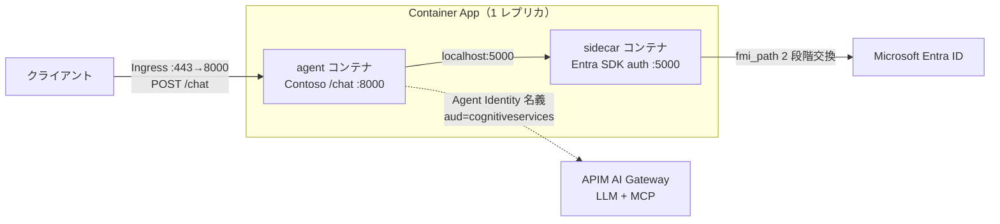

# Entra Agent ID サイドカー併走を Azure Container Apps にデプロイする手順書

**対象ラボ**: [`lab/extLab2/agent-custom-MAF-ACA-A365-sidecar`](.)（Entra Agent ID 実装方式② サイドカー併走 / B の出口版）
**ねらい**: **B = `agent-custom-MAF-ACA-A365` と同一の Contoso サポート MAF エージェント（`/chat`）** と
**Microsoft Entra SDK for AgentID サイドカー** を Azure Container Apps（ACA）の **同一レプリカ内 2 コンテナ**として
併走デプロイし、LLM / MCP の出口トークンを **Agent Identity 名義**（aud=cognitiveservices）で取得して
APIM AI Gateway 経由で動くまでを通しで確認します。
**最終更新**: 2026-06-25

> **この手順書の位置づけ**
> ローカル（Docker Compose）での検証手順は [`README.md`](README.md) にあります。
> 本書はそれを **ACA に載せる**ための手順です。エージェント コードには認証情報（client secret / fmi_path）が
> 一切現れず、サイドカーが Blueprint 資格情報を握ってトークン交換を肩代わりする、という方式の利点を
> クラウド上でそのまま体験できます。

---

## 0. 全体像

ACA は**同一レプリカ内の複数コンテナで localhost を共有**します。これを使い、エージェント
コンテナとサイドカー コンテナを 1 つの Container App に同居させます。



| 要素 | 役割 | 公開範囲 |
|---|---|---|
| **agent コンテナ** | [`app/main.py`](app/main.py)（FastAPI）。`/healthz` `/chat` `/debug/auth` を公開 | Ingress（外部 443→8000） |
| **sidecar コンテナ** | Entra SDK for AgentID。`127.0.0.1:5000` で待受、fmi_path 交換を肩代わり | レプリカ内のみ（外部非公開） |

---

## 1. 前提

| 項目 | 内容 |
|---|---|
| OS / シェル | Windows + PowerShell 7（pwsh） |
| CLI | Azure CLI（`az`）。`az login` 済み。`containerapp` 拡張は自動導入される |
| 既存セットアップ | [`../agent-custom-MAF-ACA-A365`](../agent-custom-MAF-ACA-A365) で `a365 setup all` 実行済み（Blueprint / Agent Identity 発行済み、`.env` に APIM/MCP 接続情報あり。Agent Identity が APIM AI Gateway へアクセス可能 = C で配線済みの想定） |
| DPAPI 制約（dev のみ） | Blueprint シークレットは DPAPI(CurrentUser) 暗号化保存。`a365 setup` を実行したのと**同じ Windows ユーザー**で `prepare-env.ps1` を実行すること |
| サブスクリプション | Container Apps / ACR を作成できる権限 |

> ローカルに Docker / Python は**不要**です（イメージ ビルドは `az acr build` がクラウド側で実行）。

---

## 2. dev モード（client secret）でデプロイ

手早く動作確認したい場合のルートです。Blueprint シークレットを **ACA シークレット**として
格納します。

### 2-1. `.env` を生成（DPAPI 復号）

```pwsh
cd lab/extLab2/agent-custom-MAF-ACA-A365-sidecar
./scripts/prepare-env.ps1
```

`.env` に以下の値が書き出されます（`.gitignore` 済み。コミット禁止）。

| キー | 内容 |
|---|---|
| `TENANT_ID` | テナント ID |
| `BLUEPRINT_APP_ID` | Blueprint（アプリ）の appId |
| `BLUEPRINT_CLIENT_SECRET` | Blueprint のクライアント シークレット（DPAPI 復号済み） |
| `AGENT_CLIENT_ID` | Agent Identity の appId（autonomous 対象） |
| `APIM_AOAI_ENDPOINT` / `APIM_AOAI_DEPLOYMENT` / `APIM_AOAI_API_VERSION` | LLM（APIM 経由）。B の `.env` から引き継ぐ |
| `CONTOSO_MCP_URL` | MCP（APIM 経由 / Bearer）。B の `.env` から引き継ぐ |
| `USE_SIDECAR_EGRESS` / `SIDECAR_DOWNSTREAM` | 出口モード（既定 true / `Apim`） |

### 2-2. デプロイ

```pwsh
./aca/deploy-aca.ps1 -ResourceGroup rg-sidecar-lab -Location eastus2
```

スクリプトが実施する処理:

1. リソース プロバイダー登録（`Microsoft.App` / `OperationalInsights` / `ContainerRegistry`）
2. リソース グループ作成
3. ACR 作成 → `az acr build` で agent イメージをビルド（lab ルートの `Dockerfile` + `app/`）
4. Container Apps 環境作成
5. **agent + sidecar の 2 コンテナ**を定義した YAML を生成（[`aca/aca-app.generated.yaml`](aca)）し、`az containerapp update --yaml` でデプロイ（sidecar には `Apim` ダウンストリームを設定）

完了すると FQDN が出力されます。

```
== デプロイ完了 ==
FQDN     : https://sidecar-verify.blueforest-f8b1f359.eastus2.azurecontainerapps.io
ヘルス   : https://sidecar-verify.blueforest-f8b1f359.eastus2.azurecontainerapps.io/healthz
チャット : POST https://sidecar-verify.blueforest-f8b1f359.eastus2.azurecontainerapps.io/chat
出口記録 : GET  https://sidecar-verify.blueforest-f8b1f359.eastus2.azurecontainerapps.io/debug/auth
```

### 2-3. 検証

```pwsh
$fqdn = "sidecar-verify.blueforest-f8b1f359.eastus2.azurecontainerapps.io"
Invoke-RestMethod -Method Post "https://$fqdn/chat" `
  -ContentType application/json -Body '{"message":"Contoso の返品ポリシーを教えてください。"}'
Invoke-RestMethod "https://$fqdn/debug/auth" | ConvertTo-Json -Depth 6
```

- `/chat` が応答を返せば、サイドカーが fmi_path 交換に成功して LLM/MCP の出口トークン（aud=cognitiveservices）を取得し、APIM 経由で動いたことを意味します（= **Agent Identity の SP サインインが Entra に記録**）。
- `/debug/auth` の `events` に `appid`（Agent Identity）/ `aud=...cognitiveservices` の発行記録が現れます。

---

## 3. 本番モード（パスワードレス / Managed Identity）

client secret を**一切持たず**、Container App のユーザー割り当てマネージド ID（UAMI）で
Blueprint トークン交換を行うルートです（運用推奨）。

### 3-1. UAMI を作成

```pwsh
$uami = az identity create -g rg-sidecar-lab -n uami-sidecar --query id -o tsv
```

### 3-2. デプロイ（UAMI 割り当て）

```pwsh
./aca/deploy-aca.ps1 -CredentialMode ManagedIdentity -UamiResourceId $uami
```

サイドカーの資格情報が `SignedAssertionFromManagedIdentity` になり、UAMI のトークンを
client_assertion として使うよう構成されます。完了時に **FIC 追加コマンド**（principalId 付き）が
案内されます。

### 3-3. Blueprint に FIC を追加（信頼設定）

UAMI のトークンを Entra が信頼するよう、Blueprint アプリに
「発行者=テナント v2.0 / サブジェクト=UAMI の principalId / 対象=`api://AzureADTokenExchange`」の
フェデレーション資格情報（FIC）を登録します。

```pwsh
./aca/add-blueprint-fic.ps1 -UamiPrincipalId <principalId> -TenantId <tenantId>
```

### 3-4. 反映待ち → 検証

FIC の伝播に数十秒かかる場合があります。少し待ってから再度:

```pwsh
Invoke-RestMethod -Method Post "https://$fqdn/chat" `
  -ContentType application/json -Body '{"message":"Contoso の返品ポリシーは？"}'
```

---

## 4. ガバナンス遮断デモ（条件付きアクセス / Block）

`/chat` が正常に応答を返す状態で、Agent Identity を無効化すると、サイドカーの
fmi_path 交換が失敗するようになります。`/chat` は **try/except を持たない（fail-closed）**ため、
出口トークン取得失敗はそのまま **HTTP 500** として表面化し、「キルスイッチ」が実機で効くことを示せます。

1. **Entra 管理センター** → Entra ID → Agents → Agent identities → 対象 → **Disable**
   （または **M365 管理センター** → Agents → Registry → 対象 → **Block**、あるいは CA ポリシーで Block）
2. ACA レプリカのトークン キャッシュ（TTL≈3599s）を確実にクリアするため、リビジョンを再起動:

   ```pwsh
   az containerapp revision restart -g rg-sidecar-lab -n sidecar-verify `
     --revision (az containerapp show -g rg-sidecar-lab -n sidecar-verify --query "properties.latestRevisionName" -o tsv)
   ```

3. 再度 `/chat` を叩く。**出口トークンの取得が止まり、`/chat` が HTTP 500 になる**（sidecar ログに `AADSTS7000112`（Application is disabled）等が出る。CA ポリシー遮断なら `AADSTS53003`）。
4. Entra のサービス プリンシパル サインイン ログで当該 appId の Failure を確認。
5. **Unblock / Enable** で復帰（こちらもリビジョン再起動でキャッシュをクリア）。

> Disable / Block（`accountEnabled=false`）は STS 伝播に数分かかることがあります。またサイドカーは
> 取得済みトークンを TTL（約 3599 秒）までプロセス内キャッシュします。即時遮断にはリビジョン再起動が必要です。
> これは C（方式③）の CA ブロック実証と等価で、**方式②（サイドカー）でも同じ統制が効く**ことの確認です。

---

## 5. トラブルシューティング

| 症状 | 原因 / 対処 |
|---|---|
| `prepare-env.ps1` が復号に失敗 | `a365 setup` を実行したのと別ユーザー / 別マシン。DPAPI(CurrentUser) は同一ユーザーのみ復号可 |
| `/chat` が 500（sidecar 起動待ち） | サイドカー未起動。`az containerapp logs show -g rg-sidecar-lab -n sidecar-verify --container sidecar --follow` で確認 |
| `/chat` が 500（`AADSTS7000112`） | Disable/Block で SP 無効化（STS 伝播後）。`AADSTS53003` なら CA ポリシー遮断。サイドカー ログで `AADSTS` コードを確認 |
| `/chat` が 404（`Resource not found`） | APIM の operation 不一致。LLM クライアントは `OpenAIChatCompletionClient`（Responses でなく Chat Completions）を使用し、`APIM_AOAI_ENDPOINT` 末尾の `/openai` を除く |
| `/chat` が 401 | APIM `validate-azure-ad-token` がトークンを拒否。`SIDECAR_DOWNSTREAM=Apim` の Scope が `cognitiveservices` か、RequestAppToken=true か確認 |
| パスワードレスで 500（`AADSTS7000215` 等） | FIC 未設定 / subject 不一致。`add-blueprint-fic.ps1` の principalId を確認し、伝播を待つ |
| `MethodNotAllowed` / ingress 関連 | YAML の `targetPort: 8000`（agent のみ Ingress）を確認。sidecar に Ingress を付けない |

ログ確認の基本:

```pwsh
# agent コンテナ
az containerapp logs show -g rg-sidecar-lab -n sidecar-verify --container agent --follow
# sidecar コンテナ
az containerapp logs show -g rg-sidecar-lab -n sidecar-verify --container sidecar --follow
```

---

## 6. 後片付け

```pwsh
az group delete -n rg-sidecar-lab --yes --no-wait
```

パスワードレスを試した場合は Blueprint に追加した FIC も削除しておくと安全です
（Entra 管理センター → アプリ登録 → 対象 Blueprint → 証明書とシークレット → フェデレーション資格情報）。

---

## 7. 関連ファイル

| ファイル | 役割 |
|---|---|
| [`app/`](app) | B と同一の Contoso `/chat` MAF エージェント（`/healthz` `/chat` `/debug/auth`） |
| [`Dockerfile`](Dockerfile) | エージェント本体（B 同等）のコンテナ化 |
| [`aca/deploy-aca.ps1`](aca/deploy-aca.ps1) | agent + sidecar を ACA の 2 コンテナでデプロイ |
| [`aca/add-blueprint-fic.ps1`](aca/add-blueprint-fic.ps1) | パスワードレス用に Blueprint へ UAMI 信頼の FIC を追加 |
| [`scripts/prepare-env.ps1`](scripts/prepare-env.ps1) | B の config/.env から `.env` を生成（DPAPI 復号 + APIM 引継ぎ） |
| [`README.md`](README.md) | ローカル（Docker Compose）検証手順 |

## 8. 参考

- [Microsoft Entra SDK for AgentID — Overview](https://learn.microsoft.com/en-us/entra/msidweb/agent-id-sdk/overview)
- [同 — Endpoints](https://learn.microsoft.com/en-us/entra/msidweb/agent-id-sdk/endpoints)
- [同 — Configuration](https://learn.microsoft.com/en-us/entra/msidweb/agent-id-sdk/configuration)
- [Azure Container Apps — コンテナーとサイドカー](https://learn.microsoft.com/ja-jp/azure/container-apps/containers)
- [マネージド ID をフェデレーション資格情報として使う](https://learn.microsoft.com/en-us/entra/workload-id/workload-identity-federation-config-app-trust-managed-identity)
- [microsoft-identity-web Releases（サイドカー イメージ タグ）](https://github.com/AzureAD/microsoft-identity-web/releases)
