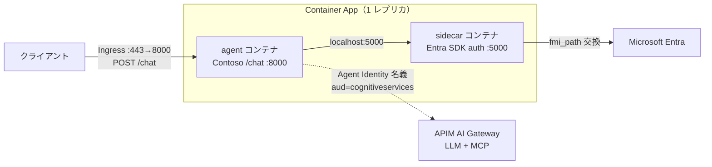

# agent-custom-MAF-ACA-A365-sidecar — B（Contoso /chat エージェント）のサイドカー出口版

`A365_Host_Agent_Eval.md` の **Entra Agent ID** 行にある実装方式②
**「サイドカー併走（Microsoft Entra SDK for AgentID コンテナ、任意言語）」** を、
**B = [`../agent-custom-MAF-ACA-A365`](../agent-custom-MAF-ACA-A365) と同一の
Contoso サポート MAF エージェント（FastAPI `/chat`）**にそのまま適用したラボです。

B 本体（マネージド ID 出口）と機能は同じですが、**LLM と MCP の出口トークンを
B のマネージド ID ではなく Entra SDK for AgentID サイドカー（Agent Identity）から取得**します。

## 何を検証するか

[A365_Host_Agent_Eval.md](../../../A365_Host_Agent_Eval.md) では Entra Agent ID の認証フロー組込みを 3 通りに整理しています。

| # | 方式 | このラボでの扱い |
|---|------|------------------|
| ① | .NET ネイティブ SDK 組込み（`Microsoft.Identity.Web.AgentIdentities`） | 対象外（.NET 限定） |
| ② | **サイドカー併走（Entra SDK for AgentID コンテナ、任意言語）** | **★ 本ラボで検証** |
| ③ | fmi_path トークン交換を自前実装 | C = [`../agent-custom-MAF-ACA-A365-egress`](../agent-custom-MAF-ACA-A365-egress) が実装済み |

C（方式③）は B のエージェントに **自前の fmi_path 2 段階交換**を組み込んで Agent Identity 出口化したものです。
本ラボは **同じ B エージェント・同じ Agent Identity** を、今度は **サイドカー コンテナに肩代わりさせて**
出口トークンを取得します。C のサイドカー等価版という位置づけです。

```
Contoso /chat エージェント（B 本体 / MAF）
   │  GET /AuthorizationHeaderUnauthenticated/Apim?AgentIdentity=<agent appId>
   ▼
Entra SDK for AgentID サイドカー（localhost:5000）
   │  内部で fmi_path 2 段階交換（Blueprint 資格情報 → Agent Identity トークン）
   │  RequestAppToken=true / scope=cognitiveservices → autonomous アプリトークン
   ▼
Microsoft Entra ID  ──→  Agent Identity の SP サインインが記録される
   │  { authorizationHeader: "Bearer eyJ...（aud=cognitiveservices, TTL≈3599s）" }
   ▼
エージェント → APIM AI Gateway 経由で LLM（/openai）と MCP（/contoso-policy/mcp）を呼ぶ
```

エージェント コード側には **fmi_path も client_secret も一切現れません**。
サイドカーが Blueprint 資格情報を握り、トークン交換を完結させるのがこの方式の要点です。

### 設計のポイント — ダウンストリームは 1 つ（`Apim`）

B の出口は LLM・MCP とも **APIM AI Gateway 経由**で、audience は両方 `cognitiveservices` です。
そのためサイドカーには `Apim` という 1 つのダウンストリームだけ定義し
（`Scopes__0=https://cognitiveservices.azure.com/.default` + `RequestAppToken=true`）、
LLM と MCP で**共有**します。APIM 側の `validate-azure-ad-token` が `aud=cognitiveservices` を受理します。

## 前提

- Docker Desktop（サイドカー＋エージェントのコンテナ実行用）
- 既存の Agent 365 セットアップ済みエージェント
  [`../agent-custom-MAF-ACA-A365`](../agent-custom-MAF-ACA-A365)
  （`a365 setup all` 実行済み。Blueprint / Agent Identity 発行済み。`.env` に APIM/MCP 接続情報あり）
- Agent Identity が APIM AI Gateway へアクセスできること（C で配線済みの想定）
- Blueprint シークレットは DPAPI(CurrentUser) 暗号化保存のため、
  **`a365 setup` を実行したのと同じ Windows ユーザー**で `prepare-env.ps1` を実行すること

> このラボは **既存の Agent Identity を再利用**します（新規発行はしません）。

## 使い方（最短）

```powershell
cd lab/extLab2/agent-custom-MAF-ACA-A365-sidecar

# 1) B の config / .env からこのラボ用 .env を生成
#    （Blueprint シークレットを DPAPI 復号 + APIM/MCP 設定を B から引き継ぐ）
./scripts/prepare-env.ps1

# 2) サイドカー + B エージェントを起動し、/chat スモークテスト
./scripts/run-verify.ps1
```

`run-verify.ps1` は次を自動で行います。

1. `docker compose up -d --build`（sidecar = Entra SDK for AgentID, agent = B の `/chat`）
2. サイドカー `/healthz` とエージェント `/healthz` を待機
3. `POST /chat` に質問を投げて応答を表示
4. `GET /debug/auth` で出口トークン（aud=cognitiveservices）の発行記録を表示

## 手動で動かす場合

```powershell
docker compose up -d --build
# エージェント
curl http://localhost:8000/healthz
Invoke-RestMethod -Method Post http://localhost:8000/chat `
  -ContentType application/json -Body '{"message":"Contoso の返品ポリシーを教えてください。"}'
# 出口トークンの発行記録（aud/appid/exp などのメタのみ。トークン本体は保存しない）
Invoke-RestMethod http://localhost:8000/debug/auth | ConvertTo-Json -Depth 6
# サイドカーをホストからデバッグ（任意 / localhost:5001 に公開済み）
curl http://localhost:5001/healthz
```

## マネージド ID 出口への切り戻し

`.env` の `USE_SIDECAR_EGRESS=false` にすると、サイドカーを使わず
**B と同じ DefaultAzureCredential（UAMI）出口**で動きます（A/B と同じ挙動）。
サイドカー有無で挙動が変わることの対比に使えます。

## CA ブロック / Disable の実証（任意）

サイドカーは C の自前実装と **同じ fmi_path 交換**を行うため、Entra の条件付きアクセス
（Agent ID 向け）でブロック、または Entra/M365 管理センターで Agent Identity を Disable/Block すると、
サイドカーのトークン取得が失敗します。`/chat` は **try/except を持たない（fail-closed）**ため、
出口トークン取得失敗はそのまま **HTTP 500** として表面化します。

1. 平常時に `run-verify.ps1` → `/chat` 成功（ベースライン、サインイン ログ Success）
2. CA ポリシー有効化 or Agent Identity を Disable/Block
3. ACA リビジョン再起動（プロセス内トークン キャッシュ TTL≈3599s をクリア）
4. 再実行 → `/chat` が 500（`docker compose logs sidecar` に `AADSTS53003`/`AADSTS7000112` 等）
5. Entra のサービス プリンシパル サインイン ログで当該 appId の Failure を確認

これは C（方式③）の CA ブロック実証と等価で、**方式②（サイドカー）でも同じ統制が効く**ことの確認です。

## セキュリティ上の注意

- サイドカーの HTTP API は **絶対に外部公開しない**（pod ローカル / 同一 Docker ネットワークのみ）。
  本ラボはローカル検証のため `5001:5000` を **localhost にのみ** 公開しています。
- 本ラボの `.env` は **dev 専用の client secret** を使います。
  本番（AKS）は Workload Identity（`SignedAssertionFilePath`）、
  本番（VM / App Service / ACA）は Managed Identity（`SignedAssertionFromManagedIdentity`）に切り替えてください。
- `.env` と復号済みシークレットは `.gitignore` 済み。コミットしないこと。
- `/debug/auth` はトークン本体を保存せず、`appid/aud/iss/exp` などの安全なクレームのみ記録します。

## ファイル構成

| ファイル | 役割 |
|----------|------|
| [app/](app/) | B と同一の Contoso `/chat` MAF エージェント（サイドカー出口対応） |
| [app/sidecar_token.py](app/sidecar_token.py) | サイドカーから認可ヘッダーを取得（キャッシュ + メタ記録） |
| [app/agent.py](app/agent.py) | LLM/MCP 出口を `SidecarCredential` / UAMI で切替（`USE_SIDECAR_EGRESS`） |
| [app/main.py](app/main.py) | FastAPI `/chat` `/healthz` `/debug/auth` |
| [Dockerfile](Dockerfile) | エージェント本体（B 同等）のコンテナ化 |
| [requirements.txt](requirements.txt) | エージェントの依存（B + `httpx`） |
| [docker-compose.yml](docker-compose.yml) | sidecar + agent（`Apim` ダウンストリーム共有） |
| [scripts/prepare-env.ps1](scripts/prepare-env.ps1) | B の config/.env から `.env` を生成（DPAPI 復号 + APIM 引継ぎ） |
| [scripts/run-verify.ps1](scripts/run-verify.ps1) | sidecar+agent 起動 → `/chat` スモークテスト |
| [aca/deploy-aca.ps1](aca/deploy-aca.ps1) | エージェント＋サイドカーを ACA の 2 コンテナとしてデプロイ |
| [aca/add-blueprint-fic.ps1](aca/add-blueprint-fic.ps1) | パスワードレス用に Blueprint へ UAMI 信頼の FIC を追加 |
| [.env.example](.env.example) | `.env` の雛形 |

## Azure Container Apps へのデプロイ

ACA は**同一レプリカ内の複数コンテナで localhost を共有**するため、サイドカー
パターンをそのまま載せられます。エージェント コンテナとサイドカー コンテナを
1 つの Container App に同居させ、エージェントは `http://localhost:5000` で
サイドカーに接続します（サイドカーは `127.0.0.1:5000` バインドでレプリカ外に
露出しません。Ingress はエージェントの 8000 のみ）。



### dev（client secret）

```pwsh
./scripts/prepare-env.ps1
./aca/deploy-aca.ps1 -ResourceGroup rg-sidecar-lab -Location eastus2
# 検証
Invoke-RestMethod -Method Post https://<fqdn>/chat `
  -ContentType application/json -Body '{"message":"Contoso の返品ポリシーは？"}'
Invoke-RestMethod https://<fqdn>/debug/auth | ConvertTo-Json -Depth 6
```

### 本番（パスワードレス / Managed Identity 推奨）

client secret を持たず、Container App の UAMI で Blueprint トークン交換を行います。

```pwsh
$uami = az identity create -g rg-sidecar-lab -n uami-sidecar --query id -o tsv
./aca/deploy-aca.ps1 -CredentialMode ManagedIdentity -UamiResourceId $uami
./aca/add-blueprint-fic.ps1 -UamiPrincipalId <principalId> -TenantId <tenantId>
```

> サイドカー イメージ タグは [GitHub Releases](https://github.com/AzureAD/microsoft-identity-web/releases) で最新を確認してください（既定は `1.0.0-azurelinux3.0-distroless`）。

## 参考

- [Microsoft Entra SDK for AgentID — Overview](https://learn.microsoft.com/en-us/entra/msidweb/agent-id-sdk/overview)
- [同 — Endpoints](https://learn.microsoft.com/en-us/entra/msidweb/agent-id-sdk/endpoints)
- [同 — Configuration](https://learn.microsoft.com/en-us/entra/msidweb/agent-id-sdk/configuration)
- [Microsoft Entra Agent ID](https://learn.microsoft.com/en-us/entra/agent-id/)
