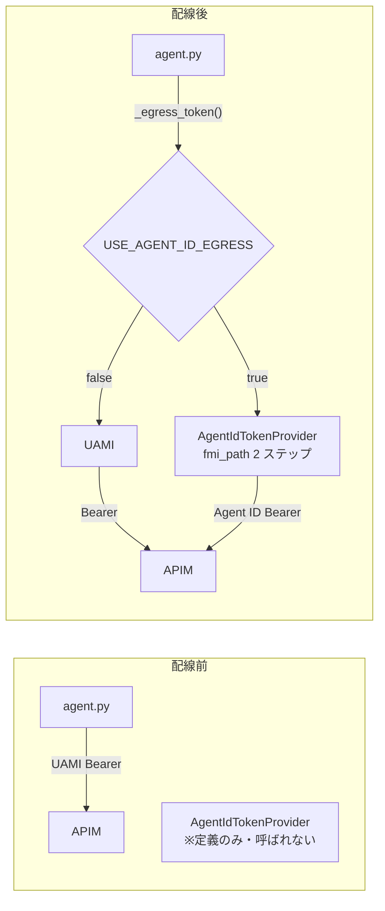

# extLab2-4: Agent ID 出口をコードに配線する（実切替は 2-5）

> 親: [extLab2 README](README.md) ／ 前: [extLab2-3 Teams接続](extLab2-3_Teams接続_M365AgentsSDK.md) ／ 次: [extLab2-5 統合ガバナンス検証](extLab2-5_統合ガバナンス検証.md)

## このステップの狙い

extLab2-1〜3 の時点では、エージェントの外向き通信（LLM / MCP / Graph）は **UAMI 1 本**が出口だった。一方で、Agent ID（fmi_path 2 ステップ交換）でリソースを呼ぶための実装は **すでにコードとして存在する**（[agent_id_token.py](agent-extended/app/agent_id_token.py)）が、`agent.py` の実呼び出しは **まだ UAMI トークンを提示している**＝**未配線**の状態である。

本ステップでは、この未配線部分を**コードとして結線**し、`USE_AGENT_ID_EGRESS` フラグ 1 つで LLM / MCP の出口トークンを UAMI ↔ Agent ID で切り替えられる状態にする。**実際の切り替え（フラグを立てて出口を Agent ID にする）と、Agent ID を止めて LLM / MCP を遮断するキルスイッチの検証は [extLab2-5](extLab2-5_統合ガバナンス検証.md) で行う**。

> このステップは**コード配線まで**。UAMI 構成（extLab2-1〜3）はそのまま土台として残り、デプロイ後も既定（フラグ未設定）では出口は UAMI のまま。2-5 で `USE_AGENT_ID_EGRESS=true` にして初めて出口が Agent ID に切り替わる。

---

## 配線前の現状（ここを直す）

| 経路 | 現状の出口トークン | コード位置 |
|---|---|---|
| LLM（Foundry / APIM 経由） | **UAMI**（`DefaultAzureCredential` → `aud=cognitiveservices`） | [agent.py `build_agent()`](agent-extended/app/agent.py) の `OpenAIChatCompletionClient(credential=credential)` |
| MCP（Contoso Policy / APIM 経由） | **UAMI**（`_msi_token(...)`） | [agent.py `_mcp_headers()`](agent-extended/app/agent.py) |
| Agent ID トークン発行 | コードは**実装済みだが未使用** | [agent_id_token.py `AgentIdTokenProvider`](agent-extended/app/agent_id_token.py) |



---

## 前提

| 項目 | 内容 |
|---|---|
| Agent ID 発行済み | Blueprint + Agent Identity を発行済みであること。未発行なら [Lab1-5](../Lab1/Lab1-5_extLab2をA365フル機能化.md) の Step 2（`a365 setup all`）で発行する |
| Blueprint app ID | `BLUEPRINT_APP_ID`（Blueprint アプリの appId） |
| Agent Identity app ID | `AGENT_IDENTITY_APP_ID`（インスタンスの agenticAppId）→ fmi_path に使う |
| Blueprint シークレット | `BLUEPRINT_CLIENT_SECRET`（Blueprint app のクライアント シークレット）。Key Vault 経由で ACA シークレットに供給するのを推奨 |
| テナント | `AZURE_TENANT_ID` |
| APIM audience | Agent ID も `aud=https://cognitiveservices.azure.com` のトークンを取得して APIM `validate-azure-ad-token` を通過する（APIM はトークンの appid を見ず audience と発行元のみ検証する） |

> `BLUEPRINT_APP_ID` / `AGENT_IDENTITY_APP_ID` / `BLUEPRINT_SECRET_KEY_VAULT_URI` の ACA への投入口は [deploy-aca.ps1](agent-extended/deploy-aca.ps1) に既にある。本ステップは **コード側の結線**と **`USE_AGENT_ID_EGRESS` フラグ投入**が主役。

---

## Step 1: トークン introspection ヘルパ `auth_meta.py` を追加する

[agent_id_token.py](agent-extended/app/agent_id_token.py) は `from . import auth_meta` を import しているが、このモジュールがまだ存在しない（＝現状では import 自体が失敗する＝未配線の証拠）。検証用に、直近のトークン交換イベントをメモリ保持する最小モジュールを追加する。

`lab/extLab2/agent-extended/app/auth_meta.py`:

```python
"""トークン交換 introspection ヘルパ（検証用）。

agent_id_token.py が各ステップで record() を呼び、最新イベントを
メモリに保持する。/debug/auth (main.py) で内容を確認できる。
シークレットは保持しない（JWT のクレームのみ・unverified デコード）。
"""
from __future__ import annotations

import base64
import json
import threading
import time
from typing import Any

_LOCK = threading.Lock()
_EVENTS: list[dict[str, Any]] = []
_MAX = 50

# 露出してよい非機微クレームのみ抽出する
_SAFE_CLAIMS = ("appid", "azp", "aud", "iss", "oid", "tid", "roles", "scp", "exp")


def decode_jwt_unverified(token: str) -> dict[str, Any]:
    """署名検証なしで JWT ペイロードの非機微クレームだけを取り出す。"""
    try:
        payload = token.split(".")[1]
        payload += "=" * (-len(payload) % 4)
        claims = json.loads(base64.urlsafe_b64decode(payload))
        return {k: claims.get(k) for k in _SAFE_CLAIMS if k in claims}
    except Exception:  # noqa: BLE001
        return {"_decode_error": True}


def record(event: dict[str, Any]) -> None:
    item = {"ts": time.time(), **event}
    with _LOCK:
        _EVENTS.append(item)
        if len(_EVENTS) > _MAX:
            del _EVENTS[: len(_EVENTS) - _MAX]


def snapshot() -> list[dict[str, Any]]:
    with _LOCK:
        return list(_EVENTS)
```

> ⚠️ `/debug/auth`（Step 4 で追加）は appid / oid 等のクレームを露出する。**検証専用**で、本番では削除すること。

---

## Step 2: `config.py` に Agent ID 用アクセサを追加する

[config.py](agent-extended/app/config.py) の末尾に、Agent ID 出口化の設定アクセサを追加する。

```python
# ---------------------------------------------------------------------------
# Agent ID 出口化（fmi_path 2 ステップ交換）
# ---------------------------------------------------------------------------
def use_agent_id_egress() -> bool:
    """true なら LLM / MCP の出口トークンを UAMI ではなく Agent ID にする。"""
    return os.environ.get("USE_AGENT_ID_EGRESS", "false").lower() in ("1", "true", "yes")


def tenant_id() -> str:
    return require("AZURE_TENANT_ID")


def blueprint_app_id() -> str:
    return require("BLUEPRINT_APP_ID")


def agent_identity_app_id() -> str:
    """インスタンスの agenticAppId。fmi_path に渡す。"""
    return require("AGENT_IDENTITY_APP_ID")


def blueprint_client_secret() -> str:
    """Blueprint app のクライアント シークレット。
    ACA シークレット (Key Vault 参照) 経由で env に届く想定。"""
    return require("BLUEPRINT_CLIENT_SECRET")
```

> シークレットは **ACA シークレット（Key Vault 参照）** で `BLUEPRINT_CLIENT_SECRET` という env 名に展開するのが安全（Step 4）。コードに平文で持たせない。

---

## Step 3: `agent.py` に Agent ID 出口を結線する

[agent.py](agent-extended/app/agent.py) を 3 箇所だけ変更する。

### 3-1. import とプロバイダ生成・出口トークン関数を追加

`_msi_token()` の定義の **直後**に追記する。

```python
import time
from azure.core.credentials import AccessToken

from .agent_id_token import AgentIdTokenProvider
from . import auth_meta

_agent_id_provider: AgentIdTokenProvider | None = None


def _get_agent_id_provider() -> AgentIdTokenProvider:
    global _agent_id_provider
    if _agent_id_provider is None:
        _agent_id_provider = AgentIdTokenProvider(
            tenant_id=config.tenant_id(),
            blueprint_app_id=config.blueprint_app_id(),
            blueprint_client_secret=config.blueprint_client_secret(),
            agent_identity_app_id=config.agent_identity_app_id(),
        )
    return _agent_id_provider


async def _egress_token(scope: str) -> str:
    """出口トークン。USE_AGENT_ID_EGRESS=true なら Agent ID、それ以外は UAMI。"""
    if config.use_agent_id_egress():
        return await _get_agent_id_provider().get_autonomous_token(scope)
    return await _msi_token(scope)


class AgentIdCredential:
    """OpenAIChatCompletionClient に渡す Agent ID 用 TokenCredential アダプタ。

    OpenAIChatCompletionClient は credential.get_token(scope) を呼ぶので、
    その中で fmi_path 2 ステップ交換 (Agent ID) のトークンを返す。
    """

    def __init__(self, provider: AgentIdTokenProvider):
        self._p = provider

    async def get_token(self, *scopes: str, **kwargs: Any) -> AccessToken:
        scope = scopes[0]
        token = await self._p.get_autonomous_token(scope)
        claims = auth_meta.decode_jwt_unverified(token)
        exp = int(claims.get("exp") or (time.time() + 3000))
        return AccessToken(token, exp)

    async def close(self) -> None:  # async credential プロトコル互換
        return None

    async def __aenter__(self) -> "AgentIdCredential":
        return self

    async def __aexit__(self, *exc: Any) -> None:
        return None
```

### 3-2. `_mcp_headers()` を `_egress_token()` に差し替え

```python
async def _mcp_headers() -> dict[str, str]:
    if _mcp_uses_bearer():
        token = await _egress_token(config.mcp_scope())   # ← _msi_token から差し替え
        return {"Authorization": f"Bearer {token}"}
    legacy = config.mcp_api_key_legacy()
    return {"x-contoso-key": legacy} if legacy else {}
```

### 3-3. LLM クライアントの credential を切り替え

`build_agent()` 内、`client = OpenAIChatCompletionClient(...)` の直前で credential を選ぶ。

```python
    if config.use_agent_id_egress():
        llm_credential: Any = AgentIdCredential(_get_agent_id_provider())
        print("[ok] 出口トークン: Agent ID (fmi_path 2 ステップ交換)")
    else:
        llm_credential = credential
        print("[ok] 出口トークン: UAMI (DefaultAzureCredential)")

    client = OpenAIChatCompletionClient(
        azure_endpoint=endpoint,
        model=deployment,
        api_version=api_version,
        credential=llm_credential,   # ← credential から差し替え
    )
```

> `get_autonomous_token` のスコープは LLM / MCP とも既定で `https://cognitiveservices.azure.com/.default`。Agent ID はこの audience のアプリトークンを `client_credentials` で取得でき、APIM の `validate-azure-ad-token`（aud=cognitiveservices）を通過する。

---

## Step 4: 環境変数と ACA シークレットを設定する

### 4-1. ローカル `.env`（配線用・既定は UAMI のまま）

```ini
# 配線段階ではフラグを立てない（出口は UAMI のまま）。2-5 で true にして Agent ID に切替
USE_AGENT_ID_EGRESS=false
AZURE_TENANT_ID=655bd66a-5001-4cb3-9aad-ce54a27d5d95
BLUEPRINT_APP_ID=<Blueprint アプリの appId>
AGENT_IDENTITY_APP_ID=<インスタンスの agenticAppId>
BLUEPRINT_CLIENT_SECRET=<Blueprint シークレット>
```

### 4-2. ACA への投入（シークレット + Agent ID 設定を準備、フラグはまだ立てない）

```powershell
$RG  = 'rg-foundryobs-eastus2'
$APP = 'custom-maf-agent-a365-ext'

# Blueprint シークレットを ACA シークレット (Key Vault 参照) として登録
az containerapp secret set -g $RG -n $APP `
  --secrets "blueprint-secret=keyvaultref:https://<kv-name>.vault.azure.net/secrets/blueprint-client-secret,identityref:<UAMI-resource-id>"

# Agent ID 設定を投入（フラグは false のまま＝出口は UAMI。実切替は 2-5）
az containerapp update -g $RG -n $APP --set-env-vars `
  "USE_AGENT_ID_EGRESS=false" `
  "AZURE_TENANT_ID=655bd66a-5001-4cb3-9aad-ce54a27d5d95" `
  "BLUEPRINT_APP_ID=<blueprint-app-id>" `
  "AGENT_IDENTITY_APP_ID=<agentic-app-id>" `
  "BLUEPRINT_CLIENT_SECRET=secretref:blueprint-secret"
```

> ACA の UAMI が Key Vault の `get` 権限（`Key Vault Secrets User` ロール）を持っていること。fmi_path 交換は Blueprint シークレットを使うが、その**シークレット自体の取得**は UAMI 経由で行う。

### 4-3. `main.py` に検証用 `/debug/auth` を追加（任意）

[main.py](agent-extended/app/main.py) のルート登録部に追記する。

```python
    from . import auth_meta

    _health_get_paths = {"/", "/healthz", "/api/messages", "/debug/auth"}
    # ...（既存の _selective_auth_middleware はそのまま）...

    aio_app.router.add_get(
        "/debug/auth",
        lambda _r: web.json_response(auth_meta.snapshot()),
    )
```

---

## Step 5: 再デプロイ（コードを反映、出口はまだ UAMI）

```powershell
cd lab/extLab2/agent-extended
./deploy-aca.ps1   # イメージを再ビルドして ACA を更新

# 起動ログを確認（この時点では出口は UAMI のまま）
az containerapp logs show -g rg-foundryobs-eastus2 -n custom-maf-agent-a365-ext `
  --revision (az containerapp show -g rg-foundryobs-eastus2 -n custom-maf-agent-a365-ext --query properties.latestRevisionName -o tsv) `
  --tail 40 | Select-String -Pattern "出口トークン"
```

| 出力 | 意味 |
|---|---|
| `[ok] 出口トークン: UAMI (DefaultAzureCredential)` | 配線済み・フラグ未設定（既定）。**正常**。2-5 でフラグを立てて Agent ID に切り替える |
| `[ok] 出口トークン: Agent ID (fmi_path 2 ステップ交換)` | すでにフラグが立っている（2-5 を先行実施した場合） |

---

## 配線の確認（コードレベル）

切り替え自体は 2-5 で行うが、配線が壊れていないことはここで確認できる。

| 確認 | 期待 |
|---|---|
| `import` / 起動 | 例外なく起動（`auth_meta` / `AgentIdTokenProvider` の import エラーが無い） |
| `USE_AGENT_ID_EGRESS` 既定 | 未設定で出口は UAMI（`[ok] 出口トークン: UAMI`） |
| フラグ切替の準備 | `BLUEPRINT_APP_ID` / `AGENT_IDENTITY_APP_ID` / `blueprint-secret`（Key Vault 参照）が ACA に登録済み |

> **実際の切り替え（`USE_AGENT_ID_EGRESS=true`）と、fmi_path 検証・LLM / MCP 通過の確認・Agent ID キルスイッチ（SP 無効化 / CA / 削除）は [extLab2-5](extLab2-5_統合ガバナンス検証.md) の Step 0 と Section B で行う。**

> 本番移行時は `/debug/auth` ルートと `auth_meta` のトークン露出を**削除**すること。

---

これで Agent ID 出口の**コード配線**が完了した。次の **[extLab2-5: 統合ガバナンス検証](extLab2-5_統合ガバナンス検証.md)** で出口を Agent ID に切り替え、Agent ID を止めると LLM / MCP が遮断されることを検証する。
