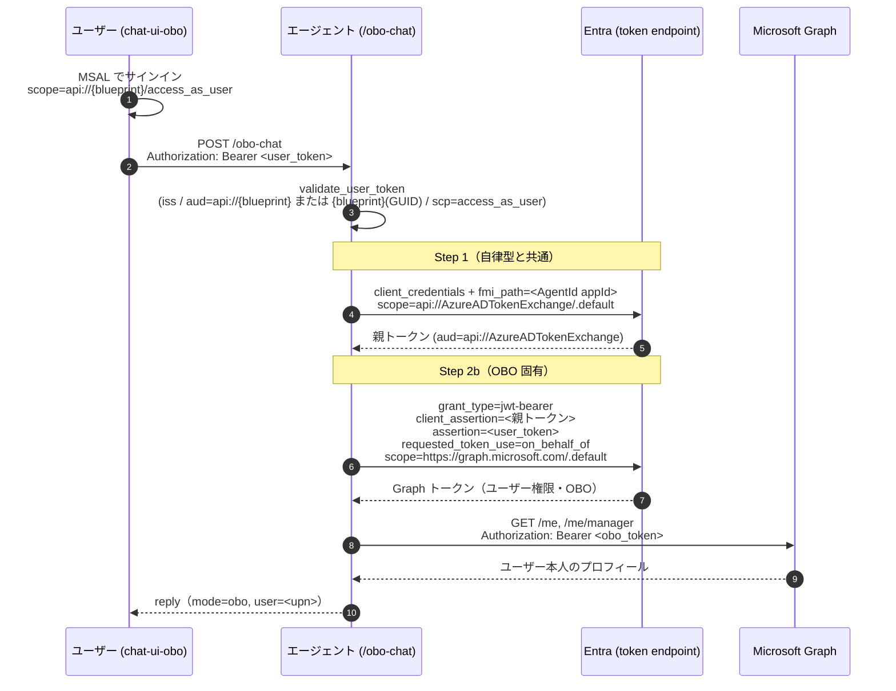

# Lab5-1｜OBO（ユーザー委任）で Agent ID とエンドユーザー権限を二重に効かせる

> 親: [Handson README](../README.md) ／ 前: [lab4｜Agent ID ガバナンス検証（Conditional Access）](../lab4/lab4-1_AgentIDガバナンス検証.md)

## このステップの狙い

lab3 では、エージェントの出口（LLM / MCP）を **Agent ID（fmi_path 2 ステップ交換の Step 2a＝自律型）** に差し替えた。自律型は「エージェント自身の権限」で動くため、**誰が呼んでも同じ権限**になる。

本ステップでは、同じ Agent ID 基盤の上に **OBO（On-Behalf-Of / ユーザー委任型）= fmi_path の Step 2b** を足す。OBO では、エージェントが **サインインしたユーザー本人の権限** で下流（Microsoft Graph）を呼ぶ。これにより統制が **二重** になる:

| 効く統制 | 自律型（lab3・Step 2a） | OBO（lab5・Step 2b） |
|---|---|---|
| Agent ID 側の統制 | ✅ Agent ID の Block / Disable / CA で遮断 | ✅ 同左（Step 1＋Step 2 が前提なので Agent ID を止めれば OBO も止まる） |
| エンドユーザー側の統制 | ❌ ユーザーは関与しない | ✅ **ユーザーの CA / MFA / Risky Sign-in / 無効化 / スコープ同意が再評価される** |
| 下流リソースで見える権限 | エージェントの権限（固定） | **サインインしたユーザーの権限**（ユーザーごとに変わる） |

> **lab5 の新規ポイントは「OBO の配線」だけ**。fmi_path の Step 2b 交換そのもの（`get_obo_token` / `_step2b_obo`）は lab3 のトークンプロバイダ（`agent_id_token.py`）に既に実装済みで、自律型ホストが呼んでいなかっただけ。lab5 はこれを `/obo-chat` から呼び出し、ユーザートークン検証と Graph ツール（`get_my_profile`）を足す。

---

## 自律型（Step 2a）と OBO（Step 2b）の違い（トークン交換の実体）

両者は **Step 1（Blueprint → 親トークン）まで完全に同じ**で、**Step 2 の grant_type だけが違う**。



| 項目 | Step 2a（自律型 / lab3） | Step 2b（OBO / lab5） |
|---|---|---|
| `grant_type` | `client_credentials` | `urn:ietf:params:oauth:grant-type:jwt-bearer` |
| `client_assertion` | 親トークン（Step 1 の結果） | 親トークン（Step 1 の結果） |
| `assertion`（ユーザー） | なし | **`<user_token>`（必須）** |
| `requested_token_use` | なし | **`on_behalf_of`** |
| 下流で見える権限 | エージェントの権限 | **ユーザー本人の権限** |
| CA の再評価対象 | Agent ID のみ | **Agent ID ＋ ユーザー** |

```python
# app/agent_id_token.py — Step 2b（OBO）は lab3 から流用済み
async def get_obo_token(self, *, user_assertion: str, scope: str) -> str:
    parent = await self._step1_parent_token()          # Step 1（自律型と共通）
    return await self._step2b_obo(parent, user_assertion, scope)  # Step 2b（OBO 固有）
```

---

## OBO の配線（lab5 で足した実体）

自律型ホスト（lab3）との差分は **「OBO 経路の 3 点」** だけ。LLM / MCP の自律型出口（Step 2a）はそのまま残っている。

1. **入口でユーザートークンを検証する**（`/obo-chat`）

```python
# app/main.py — /obo-chat
user_token = extract_bearer(authorization)                       # Bearer 取り出し
claims = validate_user_token(user_token, require_scope="access_as_user")  # iss/aud/scp 検証
token_cv = USER_ASSERTION_CV.set(user_token)                     # contextvars に格納
try:
    result = await agent.run(req.message)                       # ツールから参照できる
finally:
    USER_ASSERTION_CV.reset(token_cv)
```

2. **ユーザートークンを OBO で交換して Graph を叩くツール**（`get_my_profile`）

```python
# app/agent.py — get_my_profile（/obo-chat 経由でのみ有効）
user_assertion = USER_ASSERTION_CV.get()
if not user_assertion:
    return "...このツールは /obo-chat 経由でのみ利用可能..."   # /chat（自律型）では無効
token = await _get_agent_id_provider().get_obo_token(
    user_assertion=user_assertion,
    scope=config.graph_scope(),                                 # 既定 https://graph.microsoft.com/.default
)
# Graph /me, /me/manager をユーザー権限で取得
```

> **`get_my_profile` は検証用の最小デモ**。Graph `/me`・`/me/manager` を選んだのは「ユーザーごとに結果が変わる＝ OBO が効いている」ことを最短・低権限（`User.Read` 委任）で可視化するため。**本番アプリでは下流の宛先を差し替えるだけ**で実運用になる — Agent 365 なら **WorkIQ へのユーザー委任アクセス**（本人の職務コンテキスト・関連ドキュメント/人/会議）、ほかにも Graph（自分のメール要約・予定調整・OneDrive/Teams）、SharePoint / Dataverse、`on_behalf_of` 対応の独自 LOB API など。OBO の配線（`assertion` を渡し `(エージェントの委任権限) ∩ (ユーザーの権限)` に絞る）はそのままで、スコープと呼び先を業務リソースへ変えればよい。

3. **Blueprint アプリを OAuth API 化し、ユーザーが `access_as_user` で同意できるようにする**（`scripts/` で設定）

> 自律型の LLM / MCP 出口（`_egress_token()` / `AgentIdCredential`）は lab3 から無改変。OBO は **同一の Agent ID プロバイダ インスタンス** を共有する（`main.py` の lifespan が `set_token_provider()` を `build_agent()` の前に呼ぶ）。

---

## 前提

| 項目 | 内容 |
|---|---|
| lab2 完了 | Agent ID（Blueprint / Agent Identity）を `a365 setup all` で発行済み。**本ラボでは再発行しない**（重複登録の事故になる） |
| lab3 の理解 | 出口の Agent ID 差し替え（Step 2a）を体験済みであること。OBO は同じ基盤の Step 2b |
| Blueprint app ID | `BLUEPRINT_APP_ID`（lab2 の `a365.generated.config.json` の `agentBlueprintId`） |
| Agent Identity app ID | `AGENT_IDENTITY_APP_ID`（同 `agenticAppId`）→ fmi_path に使う |
| Blueprint シークレット | `BLUEPRINT_CLIENT_SECRET`（lab2 の `agentBlueprintClientSecret` を DPAPI 復号した値）。ACA シークレット経由で注入 |
| LLM / MCP | lab3 と同じ APIM 経由（`APIM_AOAI_ENDPOINT` / `CONTOSO_MCP_URL`） |

> OBO 特有の前提として、**Blueprint アプリを OAuth API 化（identifierUri=`api://{blueprint}` ＋ スコープ `access_as_user`）** し、**Agent Identity SP に Graph 委任権限（User.Read 等）を付与** する必要がある。これらは `scripts/01〜03` で設定する。

---

## 手順

### 0. Entra 側の OBO 設定（受講者ごと・各自 1 回）

> **この 0 節は受講者が各自 1 回ずつ実行する。** lab2-3 の `a365 setup all --agent-name custom-maf-agent-a365-userNN` で **Blueprint も Agent Identity も受講者ごとに別物**として発行されるため、それらを操作する `02`（Blueprint の OAuth API 化）と `03`（Agent Identity への Graph 委任）は**自分の Blueprint / Agent Identity に対して**実行する必要がある。`01`（OBO クライアント アプリ）も、その `requiredResourceAccess` は**特定 Blueprint の `access_as_user`** を指すため受講者ごとに必要で、**クライアント アプリ名を `-userNN` で分けて衝突を避ける**。

> `Blueprint` / `Agent Identity` の appId は lab2 の `a365.generated.config.json`（**自分が `a365 setup all` を実行して生成したもの**）から **自動解決**される（`-BlueprintAppId` 等は通常不要）。ただし `02` の **`-ClientAppId` だけは自動解決できない**ため、`01` の出力 appId を手で渡す。各操作には**自分の Blueprint / Agent Identity に対する管理者同意**が必要（同意 URL を Global Administrator に共有する運用は lab2-3 と同じ）。

```powershell
cd C:\Agent365-Onboarding\Handson\lab5\agent-custom-MAF-ACA-A365-obo\scripts
$me = "userNN"   # 自分の番号に置き換える（例 user01）

# 1) OBO チャット UI 用の Public Client アプリを登録（contoso-obo-chat-ui-userNN）
pwsh .\01_register-obo-client-app.ps1 -DisplayName "contoso-obo-chat-ui-$me"
#   → 出力の "Client App ID : <GUID>" を控える（02 / chat-ui-obo / test-obo-end-to-end で使う）

# 2) Blueprint アプリを OAuth API 化（api://{blueprint} / scope=access_as_user / preAuthorize）
#    01 の出力に表示される次コマンドをそのまま実行（-BlueprintAppId と -ClientAppId を渡す）
pwsh .\02_patch-blueprint-as-oauth-api.ps1 -BlueprintAppId <BlueprintのGUID> -ClientAppId <01で控えたGUID>

# 3) 02 で access_as_user スコープが確定したので 01 を再実行し、
#    クライアント側の requiredResourceAccess（access_as_user 要求）を配線する
pwsh .\01_register-obo-client-app.ps1 -DisplayName "contoso-obo-chat-ui-$me"

# 4) Agent Identity SP に Microsoft Graph 委任権限（User.Read / User.ReadBasic.All）を付与
pwsh .\03_grant-agentid-graph-delegated.ps1
```

> **実行順の注意（重要）**: `02` は `preAuthorizedApplications` にクライアント アプリを登録するため、**先に `01` でクライアント アプリ（`contoso-obo-chat-ui-userNN`）を作成して appId を得てから `02` に `-ClientAppId` で渡す**。一方で `01` の `requiredResourceAccess`（Blueprint の `access_as_user` 要求）は `02` がスコープを作って初めて確定するため、**`01` → `02` → `01`（再実行）** の順で流すと両方が配線される。`01` 再実行時も**同じ `-DisplayName contoso-obo-chat-ui-userNN`** を指定して同一アプリを更新すること（名前が変わると別アプリが作られる）。控えた Client App ID は `chat-ui-obo/.env` の `AAD_CLIENT_ID` と `test-obo-end-to-end.ps1` でも使う。

| スクリプト | 役割 | 自動解決 |
|---|---|---|
| `01_register-obo-client-app.ps1` | OBO 用 Public Client（`contoso-obo-chat-ui-userNN`, redirect=`http://localhost`/`:8501`）を登録し `access_as_user` を要求 | `agentBlueprintId` を lab2 から／**`-DisplayName` に `-userNN` を付ける（衝突回避）** |
| `02_patch-blueprint-as-oauth-api.ps1` | Blueprint を OAuth API 化（`identifierUris=[api://{blueprint}]`, `oauth2PermissionScopes=access_as_user`, `preAuthorizedApplications`, `requestedAccessTokenVersion=2`） | `agentBlueprintId` を lab2 から／**`-ClientAppId` は必須（01 の出力を手で渡す）** |
| `03_grant-agentid-graph-delegated.ps1` | Agent Identity SP に Graph 委任 `User.Read` / `User.ReadBasic.All` を付与（`oauth2PermissionGrants`） | `agenticAppId` を lab2 から |

### 1. `.env` を用意する

`prepare-env.ps1` が `.env.example` をベースに、lab2 の `a365.generated.config.json` から **Agent ID 値** と、`az` から **テナント / サブスクリプション** を自動補完して `.env` を生成する（`USE_AGENT_ID_EGRESS=true` 固定）。OBO 用に `BLUEPRINT_API_AUDIENCE=api://{blueprint}` と `GRAPH_SCOPE` も入れる。

> **受講者は 12 人（user01〜user12）**。`-Me userNN` で自分の識別子を渡すと、ACA 名を `-userNN` 化した `.env` を生成する（`ACA_RESOURCE_GROUP=rg-userNN` / `ACA_APP_NAME=custom-maf-a365-obo-userNN` / `ACA_ENV_NAME=aca-contoso-agent-userNN`）。app 名は ACA の 32 文字制限に収めるため `agent` を省いている。`rg-userNN` ・`aca-contoso-agent-userNN` は lab2 と同じものを再利用し、OBO 版は app 名で区別されるので受講者間で衝突しない。

```powershell
cd C:\Agent365-Onboarding\Handson\lab5\agent-custom-MAF-ACA-A365-obo
pwsh .\prepare-env.ps1 -Me userNN   # userNN は自分の番号に置き換える（例 user01）
# 既存 .env を上書きする場合は -Force
```

> Blueprint シークレットの復号は **lab2 で `a365 setup all` を実行したのと同一 Windows ユーザー**でのみ成功する。別ユーザー/別マシンでは `BLUEPRINT_CLIENT_SECRET` が空になるので、その値だけ手で補う。

<details>
<summary>参考：<code>prepare-env.ps1</code> が生成する <code>.env</code> の内容（クリックして開く）</summary>

```ini
# prepare-env.ps1 が自動で入れる値（確認用）
AZURE_TENANT_ID=<az から>
AZURE_SUBSCRIPTION_ID=<az から>

# LLM / MCP は lab3 と同じ APIM エンドポイント（.env.example の既定）
APIM_AOAI_ENDPOINT=https://apim-aigateway-eastus2.azure-api.net/openai
APIM_AOAI_DEPLOYMENT=gpt-5.4
CONTOSO_MCP_URL=https://apim-aigateway-eastus2.azure-api.net/contoso-policy/mcp

# --- 出口は Agent ID（自律型 Step 2a と共用） ---
USE_AGENT_ID_EGRESS=true
BLUEPRINT_APP_ID=<lab2 の Blueprint appId>
AGENT_IDENTITY_APP_ID=<lab2 の Agent Identity appId>
BLUEPRINT_CLIENT_SECRET=<DPAPI 復号した Blueprint シークレット>

# --- OBO 用（lab5 で追加） ---
BLUEPRINT_API_AUDIENCE=api://<lab2 の Blueprint appId>   # ユーザートークンの aud 検証に使う（検証側は api:// 形式と GUID 形式の両方を受理。requestedAccessTokenVersion=2 のため実際の aud は GUID）
GRAPH_SCOPE=https://graph.microsoft.com/.default          # OBO で取る Graph トークンの scope
```

</details>

### 2. OBO 版エージェントをデプロイする

```powershell
pwsh .\deploy-aca.ps1
```

`deploy-aca.ps1` は次を行う（lab3 と同じ流れ ＋ OBO 用環境変数）:

1. `az acr build` で Dockerfile からイメージをビルド（ローカル Docker 不要）
2. 既存の ACA 環境（`aca-contoso-agent-userNN`、lab2 と共用）に Container App `custom-maf-a365-obo-userNN` を作成（外部 HTTPS, port 8000）
3. Blueprint シークレットを ACA シークレット（`blueprint-secret`）として登録し、`BLUEPRINT_CLIENT_SECRET=secretref:blueprint-secret` で注入
4. `BLUEPRINT_API_AUDIENCE` / `GRAPH_SCOPE` を環境変数として注入（OBO の入口検証・出口スコープ）

### 3. 自律型（Step 2a）が動くことを確認する

```powershell
python smoke_test.py https://<your-app-fqdn>
```

- `POST /chat` … `{"message":"返品ポリシーを教えて"}` → MCP ツールを呼んでポリシーに沿った回答（自律型＝Step 2a）
- `GET /debug/auth` … `use_agent_id_egress=true`、`step2a_autonomous_token` が記録される

### 4. OBO（Step 2b）をエンドツーエンドで確認する

#### 方法 A: Streamlit UI（chat-ui-obo）

```powershell
# 1) .env を自動生成（scripts フォルダーで実行）
#    AAD_CLIENT_ID / BLUEPRINT_APP_ID / AGENT_BASE_URL / AZURE_TENANT_ID を自動解決して書き出す
cd Handson\lab5\agent-custom-MAF-ACA-A365-obo\scripts
$me = "userNN"   # 0 節で使ったのと同じ番号（例 user01）
pwsh .\04_generate-chat-ui-env.ps1 -DisplayName "contoso-obo-chat-ui-$me"
#   AGENT_BASE_URL を明示したい場合（ACA が複数 / 未検出のとき）:
#   pwsh .\04_generate-chat-ui-env.ps1 -DisplayName "contoso-obo-chat-ui-$me" -AgentBaseUrl https://custom-maf-a365-obo-userNN.<region>.azurecontainerapps.io

# 2) chat-ui-obo を起動
cd ..\..\chat-ui-obo   # Handson\lab5\chat-ui-obo
python -m venv .venv; .\.venv\Scripts\Activate.ps1
pip install -r requirements.txt
streamlit run app.py
```

ブラウザで「サインイン」→ device code でサインイン → 「あなたから見た私のプロフィールを Graph で教えてください。」を送信。エージェントが OBO（Step 2b）で **あなた本人の** Graph プロフィールを返す（`mode=obo`, `user=<あなたの upn>`）。

#### 方法 B: PowerShell スクリプト（test-obo-end-to-end）

```powershell
cd ..\agent-custom-MAF-ACA-A365-obo\scripts
pwsh .\test-obo-end-to-end.ps1 `
  -BaseUrl https://custom-maf-a365-obo-userNN....azurecontainerapps.io `
  -ClientId <scripts/01 で作った Public Client appId>
# MSAL.PS で対話サインイン → ユーザートークン取得 → POST /obo-chat
```

#### 確認: `/debug/auth` に Step 2b が出る

```powershell
curl https://<your-app-fqdn>/debug/auth
```

OBO 実行後は `events` に **`step2b_obo_token`**（OBO 交換の結果）が記録される。自律型の `step2a_autonomous_token` とは別フェーズとして観測できる。

```jsonc
{
  "use_agent_id_egress": true,
  "events": [
    { "phase": "step1_parent_token",     "aud": "api://AzureADTokenExchange", "...": "..." },
    { "phase": "step2b_obo_token",        "aud": "https://graph.microsoft.com", "idtyp": "user", "...": "..." }
  ]
}
```

> `idtyp=user` が OBO の証跡。自律型（Step 2a）は `idtyp=app`。

##### 出力を見やすくする（PowerShell）

生の JSON は 1 行で読みにくいので、`ConvertFrom-Json | ConvertTo-Json` で整形するか、フェーズだけ表にすると確認しやすい。

```powershell
# 整形して全体を見る
curl https://<your-app-fqdn>/debug/auth | ConvertFrom-Json | ConvertTo-Json -Depth 6

# フェーズ・aud・idtyp・scope だけ表で見る
(curl https://<your-app-fqdn>/debug/auth | ConvertFrom-Json).events |
  Select-Object phase,
    @{n='aud';e={$_.token.aud}},
    @{n='idtyp';e={$_.token.idtyp}},
    @{n='scope';e={$_.scope}} | Format-Table -Auto
```

表の見え方（OBO 実行後の例）:

| phase | aud | idtyp | 意味 |
|---|---|---|---|
| `step1_parent_token` | `fb60f99c-…`(AzureADTokenExchange) | app | Blueprint が fmi_path で Agent Identity の親トークン取得 |
| `step2a_autonomous_token` | `https://cognitiveservices.azure.com` | app | 自律型出口（LLM 用・Agent ID 本人の権限） |
| `step2b_obo_token` | `https://graph.microsoft.com` | **user** | OBO 出口（ユーザー委任・`scp` にユーザースコープ・`oid` が本人） |

> `step2a`（app）と `step2b`（user）が**両方**並ぶのが、自律権限とユーザー委任を二重に統制できている証跡。

---

## ガバナンス試験｜OBO は「二重」に止まる

OBO は **Agent ID 側** と **エンドユーザー側** の両方の統制が効く。どちらか一方を止めても OBO（Step 2b）は失敗する。

| # | 試験 | 操作 | 期待結果 | 失敗コード（目安） |
|---|---|---|---|---|
| 1 | Agent ID を Block | M365 管理センター > Agents > 対象 > Block（または Entra > Agent identities > Disable） | **自律型(/chat)も OBO(/obo-chat)も停止**。Step 1 が成立しなくなる | `AADSTS7000112: Application is disabled`（STS 伝播後） |
| 2 | ユーザーを CA でブロック | 対象ユーザーに「すべてのクラウド アプリをブロック」CA を適用 | **OBO だけ停止**（自律型は影響なし）。Step 2b でユーザー再評価に失敗 | `AADSTS53003`（CA ブロック） |
| 3 | ユーザーに MFA を強制 | 対象ユーザーに MFA 必須 CA を適用 | サインイン時に MFA 要求。未充足だと OBO の前段（UI サインイン）で止まる | MFA 要求（`interaction_required`） |
| 4 | ユーザーを無効化 | 対象ユーザーを `accountEnabled=false` | OBO 停止。ユーザートークン自体が取れない／OBO 交換が失敗 | サインイン不可 / OBO 失敗 |
| 5 | スコープ同意を取り消す | Blueprint API の `access_as_user` 同意（または Agent Identity の Graph 委任）を取り消す | OBO 停止。`/obo-chat` の入口検証 or Graph 呼び出しが 403/401 | `consent_required` / Graph `403` |
| 6 | scp 不一致 | `access_as_user` を含まないトークンで `/obo-chat` を叩く | 入口で 401（`validate_user_token` が `scp` を拒否） | `401`（scp に access_as_user がありません） |

> #1（Agent ID 側）と #2〜#5（ユーザー側）は **独立に効く**。これが「二重統制」の実体。自律型（lab3）は #1 しか効かないが、OBO は #1〜#6 すべてが遮断ポイントになる。

### Block / Disable は「即座」には止まらない（自律型と同じ）

Agent ID の Block は **新規のトークン発行を止めるだけ**で、発行済みトークン（TTL ≈ 3599 秒）はプロセス内キャッシュが生きている間は有効。`accountEnabled=false` の STS 伝播にも数分かかる。即時遮断を実証したいときは ACA リビジョンを再起動してキャッシュを捨てる:

```powershell
az containerapp revision restart `
  -g rg-userNN -n custom-maf-a365-obo-userNN `
  --revision $(az containerapp revision list -g rg-userNN -n custom-maf-a365-obo-userNN --query "[0].name" -o tsv)
```

> 観測は2段階: **直後** = トークン発行成功＋Graph `401 Authorization_IdentityDisabled` → **数分後** = Step 1 の発行自体が `AADSTS7000112` で失敗。詳細は lab3 のキルスイッチ検証と同じ。

---

## 補足｜なぜ OBO で「ユーザーの権限」になるのか

OBO の本質は **「ユーザートークンを `assertion` として渡し、`requested_token_use=on_behalf_of` を付ける」** こと。これにより Entra は「このエージェント（Agent Identity）が、このユーザーの代理として下流を呼ぶ」と解釈し、**発行する Graph トークンの実効権限を `(エージェントに付与された委任権限) ∩ (ユーザーが実際に持つ権限)` に絞り込む**。

- `scripts/03` で Agent Identity に `User.Read`（委任）を付与 → エージェントは「ユーザーの代理で /me を読む」ことが**許可される**。
- 実際に読めるのは **サインインしたユーザー本人の** プロフィールだけ（ユーザーが持たない他人のデータは読めない）。
- だから `get_my_profile` は「呼んだユーザーごとに違う結果」を返す。自律型では固定のエージェント権限になるため、この使い分けはできない。

## 補足｜自律型（Step 2a）と OBO（Step 2b）の使い分け

| 観点 | 自律型（Step 2a / lab3） | OBO（Step 2b / lab5） |
|---|---|---|
| 想定ユース | バックグラウンド処理、全ユーザー共通の参照（ポリシー検索など） | ユーザー個別のデータ取得・操作（自分のメール・予定・プロフィール） |
| 権限の出どころ | エージェント自身 | サインインしたユーザー本人 |
| 統制 | Agent ID のみ | Agent ID ＋ ユーザー（CA/MFA/無効化/同意） |
| 必要なもの | Blueprint secret + Agent Identity | 左 ＋ Blueprint の OAuth API 化 ＋ ユーザー サインイン経路 |

> 同一エージェントが **両方** を持てる（本ラボの実装は `/chat`＝自律型、`/obo-chat`＝OBO を両方公開している）。ツール側で「ユーザー権限が要るもの」だけ OBO 経路に載せ、共通参照は自律型で済ませる、という設計ができる。

---

## 完了条件

- [ ] `scripts/02 → 01 → 03` を実行し、Blueprint の OAuth API 化・Public Client 登録・Agent Identity への Graph 委任付与が完了している
- [ ] `prepare-env.ps1 -Me userNN` で `.env` を生成し、`deploy-aca.ps1` で `custom-maf-a365-obo-userNN` をデプロイできた
- [ ] `smoke_test.py` で自律型（/chat）が動き、`/debug/auth` に `step2a_autonomous_token` が出る
- [ ] chat-ui-obo または `test-obo-end-to-end.ps1` で OBO（/obo-chat）が動き、**自分本人の** Graph プロフィールが返る（`mode=obo`）
- [ ] `/debug/auth` に `step2b_obo_token`（`idtyp=user`）が出る
- [ ] ガバナンス試験で、Agent ID Block（#1）と ユーザー側 CA（#2）が **独立に** OBO を止められることを確認した
