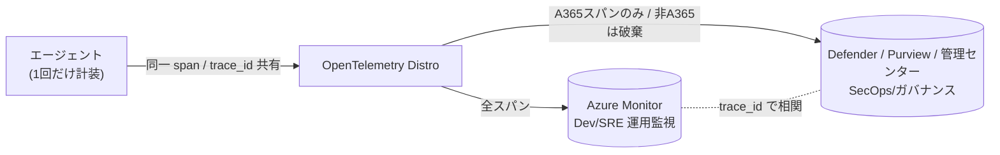

# Lab6-1｜A365 Observability（エージェントの行動を可観測化する）

> 親: [Handson README](../README.md) ／ 前: [lab5-1｜OBO ユーザー委任と Agent ID 二重統制](../lab5/lab5-1_OBOユーザー委任とAgentID二重統制.md) ／ 次: [lab7｜Teams から呼べるようにする](../lab7/Lab1-3_m365.md)
> 一次情報まとめ: [Observability_DirectOTel_と格納先.md](../Observability_DirectOTel_と格納先.md)（このラボの設計根拠・出典リンク集）

## このステップの狙い

Lab2〜Lab5 で、エージェントは **Agent ID を主体に持ち（Lab2）／出口を Agent ID 化し（Lab4）／ユーザー委任で二重統制（Lab5）** まで到達した。本ラボは統制レベルを上げるのではなく、**「そのエージェントが実際に何をしたか」をテナント全体の管理面（Defender / Purview / Microsoft 365 管理センター）で可観測化する**トラックを足す。

| 観点 | これまで（Lab2–5） | 本ラボ（Lab6） |
|---|---|---|
| 効かせるもの | アクセス制御（CA / OBO / キルスイッチ） | **テレメトリ（per-span トレース）** |
| 見える面 | Entra サインイン ログ / ACA ログ | **Defender `CloudAppEvents` / Purview 監査 / 管理センター インベントリ** |
| コード変更 | 出口配線（`_egress_token()` 等） | **起動時の OpenTelemetry Distro 初期化 1 点**（既に素地あり） |

> **重要な区別**: Identity・ガバナンス（アクセス制御・DLP・ライフサイクル）は **コード非依存で全エージェントに効く**。コードアクセスに依存するのは **② 深い per-span トレースだけ**。本ラボはこの「②」を点灯させる。

---

## 0. 前提

| 前提 | 内容 |
|---|---|
| 実行体 | Lab5 までで動く OBO 版（`custom-maf-agent-a365-obo`）または egress 版（`custom-maf-agent-a365-egress`）。**新規には作らない** |
| Agent ID | Lab2 の `a365 setup all` で発行済み（Blueprint / Agent Identity）。スパンの `{agentId}` は **Agent Identity（インスタンス）の appId**（Blueprint appId ではない） |
| ライセンス | テナントに **E7 / Agent 365 ライセンスが「割当済み」**（存在だけでは不可。最低 1 ユーザーに割当） |
| 監査 | Purview で組織の **監査（Auditing）を有効化**済み |

> 既存エージェントの `app/main.py` には `_configure_observability()`（Azure Monitor への OTel 配線）が既にある。本ラボはここに **A365（Defender 基盤）への export** を足し、「2 プレーン（運用 ＝ Azure Monitor／統制 ＝ Defender）」を成立させる。

---

## 1. テレメトリは結局どこに入るのか（格納先の整理）

**Azure Monitor ではない。** 受理されたスパンは **Agent 365 Observability バックエンド（実体は Microsoft Defender の基盤）** に入り、次の 3 面に出る。Azure Monitor は「Distro が追加でファンアウトできる別宛先」であって、A365 標準の格納先ではない。

| 面 | 何が見えるか | 前提 |
|---|---|---|
| **Microsoft Defender**（security.microsoft.com） | エージェント活動（`invoke_agent` / `execute_tool` / `chat`）。**Advanced Hunting の `CloudAppEvents`** を KQL 照会 | 活動ビューは **ルートの `invoke_agent` span が必須** |
| **Microsoft 365 管理センター**（admin.microsoft.com） | エージェント インベントリ / ガバナンス | **`invoke_agent` 行のみ取り込み**。活動から数分で反映 |
| **Microsoft Purview** | 監査・コンプライアンス | 組織で**監査を有効化**しておく |



> **2 系統＝悪ではなく 2 プレーン＝設計**。計装は Distro で 1 回、宛先だけ 2 つ。A365 イングレスは per-span フィルタで **非 A365 スパンを破棄**（`Dropped N non-A365 span(s)`）するため、Defender 側は「セキュリティ上意味のある部分集合」、Azure Monitor 側は「開発者向けフル詳細」になる。両者は `trace_id` / `gen_ai.conversation.id` / `microsoft.session.id` で相関。

---

## 2. 包み方 3 パターン（自分のエージェントはどれか）

| 種別 | ① Identity / ガバナンス | ② 深い Observability | 実装パス |
|---|---|---|---|
| **A. 自社コード**（MAF / LangChain 等） | ◯ | ◯ 最高精細 | **in-process の Microsoft OpenTelemetry Distro**（推奨・既定） |
| **B. Microsoft ランタイム上**（Copilot Studio / Foundry Agent Service） | ◯ | ◯ **自動** | ランタイムが計装済み。**コード不要** |
| **C. サードパーティ SaaS**（コード不可） | ◯ | △〜✕ | ベンダー SDK / **Direct OTel** / **OTel Collector 中継** |

> 本ハンズオンのカスタムエージェントは **A（自社コード）**。よって **Microsoft OpenTelemetry Distro を in-process で初期化**するのが正道。Direct OTel（§5）は「コードを触れない C」向けの例外ルートとして理解だけしておく。

---

## 3. 手順 A｜カスタムエージェントに A365 Observability を点灯する

### 3.1 依存とトークン スコープ

- 依存: `microsoft-opentelemetry` Distro（`requirements.txt`）。既存の `azure-monitor-opentelemetry` と併用できる。
- 認証リソース: `9b975845-388f-4429-889e-eab1ef63949c`
  - S2S（app-only）: スコープ `9b975845-.../.default`（トークンに `roles`=`Agent365.Observability.OtelWrite`）
  - OBO（委任）: スコープ `9b975845-.../Agent365.Observability.OtelWrite`（トークンに `scp`）
- **Blueprint 派生アプリは plain `client_credentials` 不可**（`AADSTS82001`）。Agent Identity は自前資格情報を持たないため、Blueprint が二段 FIC 交換（`fmi_path={agent-identity-app-id}`）で観測トークンを取得する。これは Lab3 の `agent_id_token.py`（fmi_path）と同じ交換系。

### 3.2 起動時に Distro を A365 有効で初期化（コードは 1 点）

`app/main.py` の `_configure_observability()` に、A365 export を足す（Azure Monitor 配線はそのまま残す＝2 プレーン）:

```python
# 既存: Azure Monitor へ（運用プレーン）
#   from azure.monitor.opentelemetry import configure_azure_monitor
#   configure_azure_monitor(connection_string=conn)

# 追加: Agent 365（Defender 基盤）へ（統制プレーン）
if os.getenv("ENABLE_A365_OBSERVABILITY_EXPORTER", "false").lower() == "true":
    from microsoft.opentelemetry import use_microsoft_opentelemetry
    from microsoft_agents_a365.runtime.environment_utils import (
        get_observability_authentication_scope,
    )

    use_microsoft_opentelemetry(
        enable_agent365_exporter=True,
        agent_id=os.environ["AGENT365OBSERVABILITY__AGENTID"],   # ★ インスタンス（Agent Identity）の appId
        tenant_id=os.environ["AGENT365OBSERVABILITY__TENANTID"],
        scopes=get_observability_authentication_scope(),
    )
```

> ⚠️ **`AGENT365OBSERVABILITY__AGENTID` は Agent Identity（インスタンス）の `agenticAppId`**。Blueprint appId を入れるとスパンが **403 Agent ID mismatch**。`a365 setup all` が `a365.generated.config.json` / `.env` に正しい値をスタンプするので **手で書き換えない**。

### 3.3 環境変数を ACA に転記してデプロイ

| 変数 | 値 | 用途 |
|---|---|---|
| `ENABLE_A365_OBSERVABILITY_EXPORTER` | `true` | A365 へ span export を有効化 |
| `AGENT365OBSERVABILITY__AGENTID` | （インスタンス appId） | スパンの `{agentId}`。CLI が自動スタンプ |
| `AGENT365OBSERVABILITY__TENANTID` | `655bd66a-5001-4cb3-9aad-ce54a27d5d95` | 顧客テナント GUID |

```powershell
# .env の AGENT365OBSERVABILITY__* / ENABLE_A365_OBSERVABILITY_EXPORTER を ACA に反映
az containerapp update -g rg-foundryobs-eastus2 -n custom-maf-agent-a365-obo `
  --set-env-vars `
    ENABLE_A365_OBSERVABILITY_EXPORTER=true `
    AGENT365OBSERVABILITY__AGENTID=$env:AGENT365OBSERVABILITY__AGENTID `
    AGENT365OBSERVABILITY__TENANTID=655bd66a-5001-4cb3-9aad-ce54a27d5d95
```

### 3.4 トラフィックを出してスパンを発生させる

Lab0 の [local-chat-app](../lab0/local-chat-app/) もしくは Lab5 の chat-ui-obo から **1〜2 往復**会話する（例:「返品ポリシーを教えて」）。これで以下の span ツリーが出る:

- ルート `invoke_agent`（**これが無いと活動ビュー / インベントリに出ない**）
- 子 `chat`（LLM 推論。`inference` ではなく **`chat`**）
- 子 `execute_tool`（MCP ツール呼び出し）

---

## 4. 検証｜3 面で「コードを足したエージェントの行動」が見えること

### 4.1 Defender（Advanced Hunting / KQL）

[Microsoft Defender ポータル](https://security.microsoft.com) →（プレビュー機能 + AI エージェント セキュリティを有効化のうえ）**高度な追求（Advanced hunting）**:

```kusto
CloudAppEvents
| where Timestamp > ago(1h)
| where AccountObjectId == "<Agent Identity appId>"
| project Timestamp, ActionType, ConversationId = RawEventData.gen_ai_conversation_id, RawEventData
```

| 顧客可視フィールド | ← span 属性 |
|---|---|
| `ActionType` | `InvokeAgent` / `InferenceCall` / `ExecuteToolBy*` |
| `ConversationId` | `gen_ai.conversation.id` |
| `AgentId` | `gen_ai.agent.id` |

> エージェント インベントリは `AgentsInfo` テーブル（`EntraAgentID == "<appId>"` で絞る）。詳細な Purview / Defender 上の自動収録は **Teams 往復（Lab7）後がもっとも分かりやすい**（M365 インタラクションが増えるため）。

### 4.2 Microsoft 365 管理センター

[admin.microsoft.com](https://admin.microsoft.com) → Agents → 当該エージェントの **インベントリ行**に、活動から数分で最新の利用が反映されることを確認（`invoke_agent` 行が取り込まれる）。

### 4.3 Azure Monitor（運用プレーン側・任意）

`configure_azure_monitor` を有効にしている場合、Application Insights の **Transaction search / End-to-end トランザクション**で **同一 `trace_id`** のフルトレース（HTTP / 依存含む）が見える。Defender 側（A365 スパンのみ）と `trace_id` で突き合わせられることを確認 → **2 プレーンが 1 本のランとして相関する**。

---

## 5. 参考｜Direct OTel（コードを触れない C 向けの例外ルート）

自社コードを **触れない** SaaS エージェント（種別 C）には、A365 が **OTLP/HTTP + JSON の公式イングレス（Direct OTel）** を提供する。本ハンズオンのカスタムエージェント（A）では §3 の in-process Distro が正道なので**使わない**が、エンタープライズ設計の引き出しとして要点だけ:

```
POST https://agent365.svc.cloud.microsoft/observabilityService/tenants/{tenantId}/otlp/agents/{agentId}/traces?api-version=1   # S2S
POST https://agent365.svc.cloud.microsoft/observability/tenants/{tenantId}/otlp/agents/{agentId}/traces?api-version=1          # OBO
```

- プロトコルは **OTLP/HTTP + JSON のみ**（gRPC / protobuf 不可）。`encoding: json` 必須。
- 「URL を向けるだけ」では完結しない。**標準（custom-engine）アプリ登録 + Application ロール `Agent365.Observability.OtelWrite` + 管理者同意**と、**A365 必須属性（`gen_ai.operation.name` 等）へのリマップ**が要る。
- OTel Collector 中継なら `oauth2client` 拡張で client_credentials 自動更新 + `transform` プロセッサで属性リマップ + `otlphttp` exporter にフルパス URL を明示。

> 詳細レシピ・Collector の YAML・属性リマップ表は [Observability_DirectOTel_と格納先.md §2–3](../Observability_DirectOTel_と格納先.md) を参照。

---

## 6. よくあるドロップ / 失敗

| 症状 | 原因 | 対処 |
|---|---|---|
| `200 OK` だが `partialSuccess: null` で何も出ない | テナントに **E7 / Agent 365 ライセンスが未割当**（存在だけは不可） | 最低 1 ユーザーに割り当てる |
| `rejectedSpans == totalSpans` | `gen_ai.operation.name` が不正 | `invoke_agent` / `execute_tool` / `chat` / `output_messages` のいずれかに（**`inference` ではなく `chat`**） |
| run ツリーが壊れる / 子が孤立 | `parentSpanId` 欠落・`traceId` 不一致・`gen_ai.conversation.id` 不統一 | 同一会話で ID を統一 |
| **403 Agent ID mismatch** | URL / `AGENTID` の `{agentId}` と token の `azp` 不一致（**Blueprint と Instance の取り違え**） | `AGENT365OBSERVABILITY__AGENTID` を **インスタンス appId** に |
| 403（一般） | ライセンス不足 or `Agent365.Observability.OtelWrite` 権限不足 | スコープ / 管理者同意を確認 |
| 活動ビュー / 管理センターに出ない | ルートの **`invoke_agent` span が無い** | ルート span を必ず出す（Distro の `invoke_agent` 計装を確認） |

---

## 7. このラボの結論

- **計装は 1 点（Distro 初期化）／宛先は 2 つ（Azure Monitor ＝運用、Defender ＝統制）**。重複ではなく役割分担。
- **格納先は Azure Monitor ではなく Defender 基盤**。3 面（Defender / 管理センター / Purview）で、コードを足したエージェントの **per-span な行動**が見える。
- **`{agentId}` はインスタンス（Agent Identity）appId** が唯一の正。Blueprint と取り違えると 403。
- 深い per-span トレースは **②（コードアクセス依存）**。①Identity / ガバナンスは Lab2 以降でコード非依存に効いている。

> 次の [Lab7（Teams 到達性）](../lab7/Lab1-3_m365.md) で **M365 インタラクション**を出すと、Purview / Defender への**自動収録**（§4 の見え方）がさらに分かりやすくなる（[lab7-2 Purview / Defender 自動適用](../lab7/lab7-2_Purview_Defender自動適用.md)）。Foundry Hosted（[Lab9](../lab9/lab-foundry-hosted-agent/README.md)）や AI teammate（[Lab8](../lab8/Lab1-4_AIteammate.md)）では観測トークンを runtime トークン交換で取得する Distro 配線が前提になる。

---

## 8. 出典（Microsoft Learn）

- Direct OTel 統合: <https://learn.microsoft.com/microsoft-agent-365/developer/direct-open-telemetry-integration>
- Observability concepts（データモデル / drop 条件 / Where your data shows up）: <https://learn.microsoft.com/microsoft-agent-365/developer/observability-concepts>
- 属性リファレンス: <https://learn.microsoft.com/microsoft-agent-365/developer/observability-attribute-reference>
- 認証セットアップ（S2S / OBO）: <https://learn.microsoft.com/microsoft-agent-365/developer/observability-authentication-setup>
- Microsoft OpenTelemetry Distro（推奨パス）: <https://learn.microsoft.com/microsoft-agent-365/developer/microsoft-opentelemetry>
- Defender as part of Agent 365 / データ保管・保持: <https://learn.microsoft.com/defender-xdr/security-for-ai/privacy-defender-agent-365>
- このラボの設計根拠まとめ: [Observability_DirectOTel_と格納先.md](../Observability_DirectOTel_と格納先.md)
