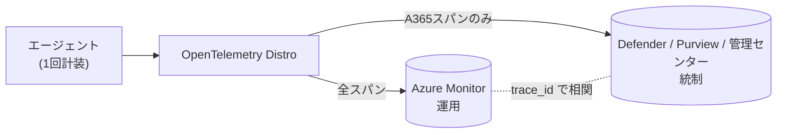
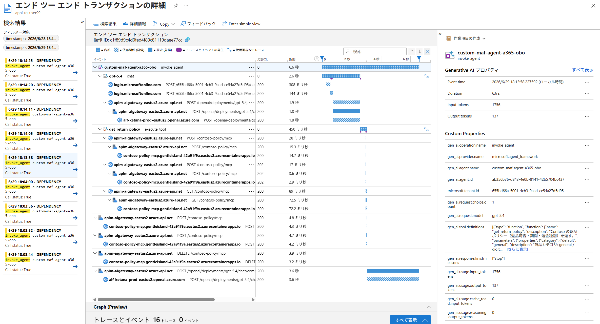

# Lab6-1｜A365 Observability（エージェントの行動を可観測化する）

> 親: [Handson README](../README.md) ／ 前: [lab5-1｜OBO ユーザー委任と Agent ID 二重統制](../lab5/lab5-1_OBOユーザー委任とAgentID二重統制.md) ／ 次: [lab7｜Teams から呼べるようにする](../lab7/Lab1-3_m365.md)
> 一次情報まとめ: [Observability_DirectOTel_と格納先.md](../Observability_DirectOTel_と格納先.md)
> 前提: [lab6-0｜Defender 受け皿の有効化](./lab6-0_前提Defender有効化.md)

## このステップの狙い

**Microsoft OpenTelemetry Distro（Agent 365・Foundry・Azure Monitor 共通の統一 observability SDK）を使って、カスタムエージェントに Agent 365 向けの計装を入れる。** これだけで、そのエージェントの行動（`invoke_agent` / `chat` / `execute_tool`）が **Defender / 管理センター / Purview** の管理面に per-span で見えるようになる。

> **パッケージ移行期の注意**: A365 Observability は、旧来の Agent 365 Python SDK パッケージ群（`microsoft-agents-a365-observability-*` / `microsoft-agents-a365-runtime`）から、単一パッケージ `microsoft-opentelemetry` へのコード移行期にある。旧 `microsoft_agents_a365.observability.*` の import は `microsoft.opentelemetry.a365.*` に、`configure(...)` は `use_microsoft_opentelemetry(enable_a365=True, ...)` に置き換わる（認可スコープも `https://api.powerplatform.com/.default` → `api://9b975845-388f-4429-889e-eab1ef63949c/Agent365.Observability.OtelWrite` に変わる破壊的変更あり）。本ラボは新パッケージ `microsoft-opentelemetry` を前提に進める。移行手順の一次情報: [MIGRATION_A365.md（microsoft/opentelemetry-distro-python）](https://github.com/microsoft/opentelemetry-distro-python/blob/main/MIGRATION_A365.md)

> Distro は A365 専用品ではなく、内部に A365 向けコンポーネント（`microsoft.opentelemetry.a365.*` / `A365SpanProcessor`）を同梱し `enable_a365` で点火する。旧来の単体「Agent 365 Observability SDK」は別経路（現在は非推奨）。新規は Distro が推奨。

Lab2〜Lab5 はアクセス制御（CA / OBO / キルスイッチ）を効かせた。本ラボは統制を上げるのではなく、**「何をしたか」のテレメトリ**を足す。

> **要点**: Identity・ガバナンスは **コード非依存**で全エージェントに効く（Lab2 以降）。**コードに計装が要るのは「深い per-span トレース」だけ**で、本ラボがそれを有効化する。

---

## 0. 前提

| 前提 | 内容 |
|---|---|
| 実行体 | Lab5 までで動く OBO 版（`custom-maf-agent-a365-obo`）。**新規には作らない** |
| Agent ID | Lab2 で発行済み。スパンの `{agentId}` は **Agent Identity（インスタンス）の appId**（Blueprint ではない） |
| ライセンス | テナントに **E7 / Agent 365 が「割当済み」**（最低 1 ユーザー） |
| 監査 | Purview で **監査（Auditing）有効化**済み |

---

## 1. テレメトリの格納先

受理されたスパンは **Agent 365 Observability バックエンド（実体は Microsoft Defender の基盤）** に入り、次の 3 面に出る。Azure Monitor は「Distro が追加でファンアウトする別宛先」であって A365 標準の格納先ではない。

| 面 | 何が見えるか |
|---|---|
| **Microsoft Defender** | エージェント活動。Advanced Hunting の `CloudAppEvents` を KQL 照会 |
| **Microsoft 365 管理センター** | エージェント インベントリ（`invoke_agent` 行を取り込み） |
| **Microsoft Purview** | 監査・コンプライアンス |



> 計装は Distro で 1 回、宛先だけ 2 つ（運用＝Azure Monitor／統制＝Defender）。A365 イングレスは非 A365 スパンを破棄するので、Defender 側は「セキュリティ上意味のある部分集合」になる。

---

## 2. このエージェントは「自社コード（種別 A）」

> 自由度は A 系（自社コード）＞ B（マネージド）＞ C（SaaS）。本ラボは最も手配線が多い「A 自前」を扱う。

| 種別 | ランタイム | 計装 | A365認証/baggage | 例 |
|---|---|---|---|---|
| **A 自前** ← 本ラボ | ランタイム無し(手配線) | 手動(Distro) | **手動(②③)** | 本ラボ MAF+FastAPI |
| A+SDK | Agent 365 SDK ホスト | 手動(Distro) | 自動(SDKランタイム) | MAF + Microsoft 365 Agents SDK（/api/messages ホスト） |
| B | Microsoft マネージド | 自動 | 自動 | Copilot Studio / Foundry Hosted |
| C | コード不可の SaaS | Direct OTel | Direct OTel | 本ラボ対象外 |

- **計装**: OTel スパン生成。B のみ自動、A 系は Distro を自分で初期化。
- **A365認証/baggage**: OtelWrite トークン取得＋`gen_ai.agent.id`/`microsoft.tenant.id` スタンプ。SDK ホストが居れば自動、自前ホストは token resolver(②)＋A365SpanProcessor(③)を手配線。
- **Agent 365 SDK ホスト**: 自社コード（種別 A）を Agent 365 SDK のホスティング ランタイム上で動かす形。FIC 用 env 注入・OtelWrite トークン取得・テナント/AgentID baggage スタンプをランタイムが肩代わりする。
  - ただしこのランタイムに乗せるには既存コードの改修が要る（FastAPI 直叩きをやめ SDK のホスト/サイドカーにエントリポイントを委譲、`requirements.txt` に SDK・観測性パッケージ追加、`a365.config.json` 設定）。手間と引き換えに②③が消える、というトレードオフ。

---

## 3. 手順 A｜A365 Observability を組み込む（Lab5 からの変化点）

> 実装フォルダ: [agent-custom-MAF-ACA-A365-obo-obs](./agent-custom-MAF-ACA-A365-obo-obs/)（Lab5 OBO のコピー）。差分は `# lab6 A365 Observability` コメントで追える。

Lab5 のエージェントは **MAF + 自前 FastAPI ホスト**で動いている。ここに Distro の A365 向け計装を足すための変化点は **4 つ**。**Agent 365 SDK のホスティング ランタイムを使わない**（自前ホスト）ぶん、本来ランタイムが自動でやる 2・3 を手配線し、4 で着弾を可視化する。

### 変化点① Distro を A365 有効で初期化する

`app/main.py` の `_configure_observability()` で、SDK の `use_microsoft_opentelemetry()` を A365 有効で呼ぶ（依存 `microsoft-opentelemetry` を `requirements.txt` に追加）。env による ON/OFF 分岐は設けず **常時計装**する。

```python
from microsoft.opentelemetry import use_microsoft_opentelemetry

use_microsoft_opentelemetry(
    enable_a365=True,                          # A365 export を有効化
    a365_enable_observability_exporter=True,   # A365 exporter を有効化
    a365_token_resolver=_build_a365_token_resolver(),  # ← 変化点②
    enable_azure_monitor=bool(conn),           # App Insights も同じ呼び出しで集約
    azure_monitor_connection_string=conn,
)
```

### 変化点② トークン resolver を渡す

> **なぜ要るのか**: 変化点①の `a365_enable_observability_exporter=True` で「A365 へ span を HTTP 送信する処理」が起動し、その送信に **OtelWrite トークンが必須**になる。本来は Agent 365 SDK のホスティング ランタイムがこのトークン取得を肩代わりするが、本ラボは自前 FastAPI ホストでランタイムが無い。つまり **「exporter=True」＋「ランタイム不在（自前ホスト）」** が同時に成立するときだけ、この手動 resolver が必要になる（`exporter=False` なら送信自体が止まるので resolver は呼ばれない）。

ホスティング ランタイムが無いので FIC 用の env が注入されず、既定の `DefaultAzureCredential`（＝ACA マネージド ID）になり **403**。そこで出口化（Step 2a）と同じ **fmi_path（Blueprint + `fmi_path=AgentIdentity` → `client_credentials`）** を msal で同期実行する `_build_a365_token_resolver()` を `main.py` に実装し、観測リソース `api://9b975845-…/.default`（`Agent365.Observability.OtelWrite` ロール）のトークンを返す。

```python
# 同期 callable (agent_id, tenant_id) -> str | None
a365_token_resolver=_build_a365_token_resolver()
```

### 変化点③ tenant_id / agent_id を静的スタンプ

> **なぜ要るのか**: A365 exporter は span を送る前に各 span の `gen_ai.agent.id` / `microsoft.tenant.id` を確認し、**両方無いと "missing tenant or agent ID" で skip（破棄）** する。本来は Agent 365 SDK のホスティング ランタイムの BaggageMiddleware が baggage 経由で自動付与するが、本ラボは自前 FastAPI ホストでそれが無い。つまり変化点②（トークン）と同じく **「ランタイム不在（自前ホスト）」だから手で肩代わりする** 配線で、②＝認可を通す（無いと 403）、③＝識別子を付けて skip させない、という対の関係。

ホスティング ランタイムの BaggageMiddleware が無いので、スパンに `gen_ai.agent.id` / `microsoft.tenant.id` が付かず exporter が **skip** する。`A365SpanProcessor` で両 ID を全スパンに静的付与する。

```python
from opentelemetry.trace import get_tracer_provider
from microsoft.opentelemetry.a365.core.exporters.span_processor import A365SpanProcessor

get_tracer_provider().add_span_processor(
    A365SpanProcessor(
        tenant_id=config.observability_tenant_id(),
        agent_id=config.observability_agent_id(),  # ★ インスタンス（Agent Identity）の appId
    )
)
```

> ⚠️ `agent_id` は **Agent Identity（インスタンス）の appId**。Blueprint を入れると **403 Agent ID mismatch**。`config.observability_agent_id()` は env `AGENT365OBSERVABILITY__AGENTID`→無ければ出口化と同じインスタンス appId にフォールバックする。

### 変化点④ MAF 計装を発火させる（スパン生成）

①〜③は export 経路を整えるが、その手前で **スパンを生成** するのは agent-framework のインスツルメンテーション。`invoke_agent` / `chat` / `execute_tool` のスパンを生成させる。既定で有効だが、env/disable の状態に依らず確実に有効化するため `enable_instrumentation(force=True)` を明示呼び出しする（Distro が確立済みの TracerProvider をそのまま使うため `set_tracer_provider` は no-op）。

```python
from agent_framework.observability import enable_instrumentation

enable_instrumentation(force=True)
```

> 検証で export の 200/4xx を即時に目視したいときだけ、一時的に `microsoft.opentelemetry` を DEBUG に上げる（**運用では不要**・機微データ漏洩を避けるため戻す）:
> `logging.getLogger("microsoft.opentelemetry").setLevel(logging.DEBUG)`

### デプロイ（Lab5 稼働アプリへの差分更新）

lab6 は **lab5 の変化点**なので、Agent ID 等の発行（`scripts\01〜03`）はやり直さない。ただし **obs フォルダ（`agent-custom-MAF-ACA-A365-obo-obs`）は lab5 とは別フォルダ**で、ここの `.env` は `.gitignore` 済み。新規 clone では存在しないので、**このフォルダ用の `.env` を先に用意する**。lab5 と同じ接続情報・Agent ID・受講者ごとの ACA 命名を共有するので、lab5 の `.env` をコピーするのが最速。

```powershell
# このフォルダ（agent-custom-MAF-ACA-A365-obo-obs）で実行。
cd C:\Agent365-Onboarding\Handson\lab6\agent-custom-MAF-ACA-A365-obo-obs
# (1) lab6 用 .env を自動生成（lab5 の .env をベースに観測ペアを追記）
pwsh .\scripts\00_generate-env.ps1
#     別ペアに OtelWrite を付与した場合のみ:
#     pwsh .\scripts\00_generate-env.ps1 -ObsBlueprintId <id> -ObsAgentId <id> -ObsBlueprintSecret <secret>

# (2) 計装入りイメージを再ビルドして稼働アプリへ差し替える
pwsh .\deploy-aca.ps1
```

`00_generate-env.ps1` は lab5 の `.env` をベースに観測（OTel スパン出口）3 変数を追記して本フォルダの `.env` を作る。`deploy-aca.ps1` は `.env` を読んで、(a) 計装入りの新イメージを `az acr build` で焼き直し、(b) 受講者ごとの `rg-<userNN>` / `custom-maf-a365-obo-<userNN>` / ACR を解決し、(c) 既に在るアプリなら `az containerapp update --image …` で差し替える。観測 3 変数も `.env` から env／ACA シークレット（`obs-blueprint-secret`）として注入する。

> **スパン用 ID は自動生成**。`00_generate-env.ps1` は引数未指定なら egress 用 `BLUEPRINT_APP_ID` / `AGENT_IDENTITY_APP_ID` / `BLUEPRINT_CLIENT_SECRET` を観測ペアに流用する（OtelWrite を同ペアに付与済みの想定）。OtelWrite を **別ペア**に付与した場合だけ `-ObsBlueprintId/-ObsAgentId/-ObsBlueprintSecret` で上書きする。

その後、[chat-ui-obo](../lab5/chat-ui-obo/README.md)（lab5 と同じ OBO 用 UI）で **1〜2 往復**会話し、`invoke_agent`（ルート）/ `chat` / `execute_tool` のスパン ツリーを発生させる。lab6 は OBO 版なので会話の入口は `/obo-chat`（`Authorization: Bearer <user_token>` 必須）。`local-chat-app` はユーザートークンを載せないため OBO の往復にはならない。

---

## 4. 検証｜計装したトレースをどこで見るか

lab6 の成果物は **A365 Observability バックエンドに受理されるスパン**。**実質合格は §4.1 の export 200/sent**（自作コードから A365 へ受理された証拠）。`CloudAppEvents`（§4.2）は Defender 側の最終格納先だが、**テナント依存の2条件（(a) MDA O365 コネクタが `CloudAppEvents` テーブルを生成済み、(b) スパンの agent_id がレジストリ登録済みのマネージドエージェントと一致）が揃うときのみ到達**する。どちらかが欠けると export 200 でも行は出ない。`KS204 / Failed to resolve table 'CloudAppEvents'` はテーブル未生成＝O365 コネクタ反映待ちまたはサブスクリプション/ライセンス未充足。

判定は2段階: **§4.1 で export 200＋partialSuccess を切り分け（即時・実質合格）→ §4.2 で CloudAppEvents 着弾（テナントで CloudAppEvents テーブルが生成されている場合のみ）**。Azure Monitor（§4.3）は任意の運用宛先。

### 4.1 一次検証｜export が 200 かつ partialSuccess null か（切り分け・即時）

初期化ログ（`[ok] … 初期化しました`）は exporter 起動の証明だけ。**200 OK も受理の証明にならない**（未割当ライセンスは `200 {partialSuccess: null}` で黙殺、operation名不正は `200` で `partialSuccess.rejectedSpans>0`）。export の HTTP ステータスは既定（INFO）では出ないため、**検証時だけ一時的に** ACA 環境変数 `A365_OTEL_DEBUG=1` を設定して `microsoft.opentelemetry` を DEBUG に上げ 200／4xx／skip を切り分ける（運用では未設定＝INFO に戻す）。

**手順**: ① 一度チャットで往復させてスパンを生成 → ② `ContainerAppConsoleLogs_CL` で export 行を見る。

```powershell
# ① スパンを 1 本作る（FQDN は deploy-aca.ps1 出力の URL に置き換え）
$fqdn = "https://<App URL>"   # deploy-aca.ps1 出力の URL（例: https://custom-maf-a365-obo-user99.<region>.azurecontainerapps.io）
Invoke-RestMethod -Method Post `
  -Uri "$fqdn/chat" `
  -ContentType "application/json" -Body '{"message":"返品ポリシーは？"}' -TimeoutSec 60
```

```kusto
// ② A365 OTLP export の起動/送出/拒否（200 だけだと汎用 HTTP ログを拾うので除外）
ContainerAppConsoleLogs_CL
| where ContainerAppName_s == "custom-maf-a365-obo-userNN"   // 自分の ACA 名
| where TimeGenerated > ago(15m)
| where Log_s !has "Response status: 200"
| where Log_s has_any ("[ok]", "[warn]", "agent365_exporter", "otlp/agents", "TenantIdInvalid", "Forbidden", "exported", "skip")
| project TimeGenerated, Log_s
| order by TimeGenerated desc
```

判定（ここは「正しく送れているか」の切り分け。**最終合否は §4.3 の Application Insights**。CloudAppEvents が未開通のため §4.2 は到達しない）:

| 期待ログ | 意味 |
|---|---|
| `[ok] agent-framework インスツルメンテーションを有効化（force=True）` | 計装ON。これが無いと genAI スパンが出ない |
| `agent365_exporter … exported N spans` | A365 送出 OK（毎回は出ない／確実に見るなら DEBUG）。受理は §4.3 で確認 |
| `400 TenantIdInvalid` / `403 Forbidden` | export 拒否。変化点②（fmi_path 403）か agent_id 取り違え→§5。Blueprint appId だと 403 |
| `No eligible genAI spans … nothing exported` | 計装は起動済みだが未往復／スパン未生成。チャットで往復させる |
| 何も出ない | INFO では export 行は基本出ない。**一次確認は §4.3 の App Insights**（`invoke_agent`/`chat`/`execute_tool`）で行う |

補助（起動時の前提が満たされているかの確認）:

| 期待ログ | 意味 |
|---|---|
| `[ok] Microsoft OpenTelemetry Distro を初期化しました (A365=on, AppInsights=on)` | exporter 起動。これ単体は「着弾の証明ではない」。App Insights は §4.3 で可視化 |
| `[ok] A365 スパンへ tenant_id / agent_id を静的スタンプします (agent_id=…)` | `agent_id` が `.env` の `AGENT_IDENTITY_APP_ID`（インスタンス appId）と一致していること |
| `Failed to set up A365 OpenAI Agents instrumentation.` | **無害**。MAF 構成では `openai-agents` 未使用。export には無関係 |

> export 200 は通過点。`az containerapp logs show -g rg-userNN -n custom-maf-a365-obo-userNN --tail 80 --follow` でストリーム可。次に §4.2 で着弾を確定する。

### 4.2 本合否｜Defender CloudAppEvents 着弾（このデモ環境では未到達・参考）

> ⚠️ **このデモ テナントでは `CloudAppEvents` が未プロビジョニングのため実装できません**（ライセンス/コネクタ/Security for AI 充足でも Advanced Hunting スキーマに不在）。本検証は **§4.3 の Application Insights** で代替します。以下は本来テナントで開通した場合の手順（参考）。

<details>
<summary>CloudAppEvents 着弾手順（クリックで開く・参考）</summary>

> 前提＝**[lab6-0｜Defender 受け皿の有効化](./lab6-0_前提Defender有効化.md)**（プレビュー＋AI エージェント セキュリティ＋O365 コネクタ接続）を先に完了していること。さらに **`CloudAppEvents` はテナントに MDA O365 コネクタが生成した場合のみ**出現し、`Failed to resolve table 'CloudAppEvents'`（KS204）なら未生成＝コネクタ反映待ち/ライセンス未充足。その場合は **§4.1 export 200/sent を lab6 合格扱い**とし、§4.2 はテーブル生成後に確認する。

```kusto
CloudAppEvents
| where Timestamp > ago(30m)
| where AccountObjectId == "<登録済みマネージド Agent の appId>"   // AgentsInfo に出る ID。obs 専用ペアの appId だと未登録で attribution されず 0 行
| project Timestamp, ActionType, RawEventData
```

`ActionType`＝`InvokeAgent`/`InferenceCall`/`ExecuteTool*`。**全 operation を受理**するので `chat`/`execute_tool` だけでも出る。ただし Defender 活動ビュー・管理センター インベントリ・Purview の3面はルートの `invoke_agent` 必須。インベントリ補助（テーブル名はテナントにより `AgentsInfo`、新名 `AIAgentsInfo`）:

```kusto
AgentsInfo
| where AgentId == "<登録済みマネージド Agent の appId>"
| project Timestamp, Name, AgentId, Platform, Description
```
> ⚠️ スパンの agent_id は **`AgentsInfo` に登録済みの ID** を使うこと。obs 専用 Blueprint ペアの appId だと未登録で CloudAppEvents に attribution されず 0 行になる。

[admin.microsoft.com](https://admin.microsoft.com) → Agents インベントリにも `invoke_agent` 行で反映。詳細は [lab7-2](../lab7/lab7-2_Purview_Defender自動適用.md)。

</details>

### 4.3 本検証(代替)｜Application Insights (OTel) でトレース可視化

> **このテナントでは CloudAppEvents が未プロビジョニングのため §4.2 は到達しない**(ライセンス/コネクタ/Security for AI 充足でも Advanced Hunting スキーマに CloudAppEvents 不在)。そこで **App Insights を本検証に使う**: 同一 Distro が A365 と App Insights の **2宛先へファンアウト**するので、App Insights にスパン ツリーが出れば「計装が動き export している」ことが GUI で確定する。

lab6 のエージェントは APIM と**同一の共有 App Insights**へテレメトリを集約する（E2E を 1 トランザクションで追うため）。`scripts\00_generate-env.ps1` がこの共有 App Insights の接続文字列を自動解決して `.env` の `APPLICATIONINSIGHTS_CONNECTION_STRING=` に焼き込み、`deploy-aca.ps1` はこの接続文字列を**必須**とする（受講者ごとの個別 App Insights 自動作成は分断を招くため廃止済み）。したがって受講者は App Insights を手動作成する必要はない。

```kusto
union dependencies, requests, traces
| where timestamp > ago(1h)
| extend op = tostring(customDimensions["gen_ai.operation.name"])
| where op in ("invoke_agent","chat","execute_tool")
| project timestamp, name, op, operation_Id, duration, customDimensions
| order by timestamp asc
```

`operation_Id`（=`trace_id`）は A365 へ送る span の trace_id と **同一**。同じ `operation_Id` で `invoke_agent`→`chat`→`execute_tool` が 1 本のランに揃えば計装と export は健全。

> 💡 **GUI で見やすく確認**: App Insights 左メニュー → **調査 → トランザクションの検索** → `invoke_agent` 行をクリック → **「エンド ツー エンドのトランザクションの詳細」** がガント チャートで開く。`invoke_agent`→`chat`→`execute_tool` の入れ子と所要時間が階層バーで一目（KQL の `operation_Id` 単位ビューを GUI 化したもの）。

<details>
<summary>ガント ビューの読み方（1往復 6.6秒の例・クリックで開く）</summary>



| 階層 | スパン | エンドポイント | 状態 | 所要 | 意味 |
|---|---|---|---|---|---|
| 1 | `invoke_agent` | custom-maf-agent-a365-obo | — | 6.6秒 | エージェント1往復全体（親） |
| └2 | `chat` gpt-5.4 | — | — | 2.6秒 | 1回目推論（ツール選択） |
| 　└3 | token | login.microsoftonline.com `/oauth2/v2.0/token` | 200 | 308ms | OBO/AgentID トークン取得 |
| 　└3 | token | login.microsoftonline.com `/oauth2/v2.0/token` | 200 | 144ms | トークン取得（2本目） |
| 　└3 | APIM | apim-aigateway `/openai/.../chat/completions` | 200 | 1.9秒 | APIM 経由でモデル呼出 |
| 　　└4 | backend | aif-ketana-prod `/.../chat/completions` | 200 | 1.8秒 | Azure OpenAI 本体 |
| └2 | `execute_tool` | get_return_policy | — | 450ms | MCP ツール実行 |
| 　└3 | APIM | apim-aigateway `POST /contoso-policy/mcp` | 200 | 28ms | MCP initialize |
| 　　└4 | backend | contoso-policy-mcp(ACA) `POST /mcp` | 200 | 14.7ms | initialize 受理 |
| 　└3 | APIM | apim-aigateway `POST /contoso-policy/mcp` | 202 | 17ms | notifications/initialized |
| 　└3 | APIM | apim-aigateway `GET /contoso-policy/mcp` | 200 | 89ms | SSE ストリーム |
| 1 | — | apim `POST /contoso-policy/mcp` | 200 | 4.8ms | tool 追加呼出 |
| 1 | — | apim `DELETE /contoso-policy/mcp` | 200 | 3.9ms | MCP セッション終了 |
| 1 | `chat` 2回目 | apim `/openai/.../chat/completions` | 200 | 3.6秒 | ツール結果→最終回答生成 |

**読み方の要点**: 出口は全て `apim-aigateway`（直 OpenAI/MCP なし＝lab3 の出口1点集約）、状態は全て 200/202、token がモデル呼出直前（AgentID/OBO 認証）。インデント＝因果（invoke_agent が chat と tool を呼び、chat が APIM→OpenAI を呼ぶ親子関係）。

</details>テナントで CloudAppEvents が開通すれば、同 `operation_Id` で運用（Azure Monitor）と統制（Defender）が 1 本のランとして突き合わせ可能になる。

---

## 5. よくある失敗

| 症状 | 原因 | 対処 |
|---|---|---|
| `200 OK` だが CloudAppEvents に出ない | E7 / Agent 365 ライセンス未割当（`200 {partialSuccess:null}` で黙殺） | 最低 1 ユーザーに割当 |
| `200` だが `partialSuccess.rejectedSpans>0` | operation名が不正（`inference` 等） | `invoke_agent`/`chat`/`execute_tool` に直す |
| 何も送らない（黙殺） | `use_microsoft_opentelemetry` の引数名ミス | `enable_a365` / `a365_enable_observability_exporter` / `a365_token_resolver` |
| export が skip | スパンに tenant/agent ID 無し | 変化点③の `A365SpanProcessor` |
| **403 Agent ID mismatch** | Blueprint と Instance の取り違え | `AGENTID` を **インスタンス appId** に |
| 403（一般） | トークンが ACA マネージド ID | 変化点②の resolver で fmi_path トークンを返す |
| 活動 / インベントリに出ない | ルートの `invoke_agent` span が無い | ルート span を出す |

> コードを触れない SaaS（種別 C）向けの **Direct OTel** は本ラボでは使わない。詳細は [Observability_DirectOTel_と格納先.md](../Observability_DirectOTel_と格納先.md)。

---

## 6. このラボの結論

- **Microsoft OpenTelemetry Distro で A365 計装＝1 点、宛先は 2 つ**（運用＝Azure Monitor／統制＝Defender）。
- 自前ホストゆえの変化点は **3 つ**（① Distro 初期化 ② token resolver ③ 静的スタンプ）。②③ はホスティング ランタイムが居れば自動。
- **`{agentId}` はインスタンス（Agent Identity）appId が唯一の正**。Blueprint と取り違えると 403。

> 次の [Lab7](../lab7/Lab1-3_m365.md) で **M365 インタラクション**を出すと、Purview / Defender への自動収録がさらに分かりやすくなる。

---

## 7. 出典（Microsoft Learn）

- Microsoft OpenTelemetry Distro（推奨パス）: <https://learn.microsoft.com/microsoft-agent-365/developer/microsoft-opentelemetry>
- Observability concepts（データモデル / drop 条件 / 格納先）: <https://learn.microsoft.com/microsoft-agent-365/developer/observability-concepts>
- 属性リファレンス: <https://learn.microsoft.com/microsoft-agent-365/developer/observability-attribute-reference>
- 認証セットアップ（S2S / OBO）: <https://learn.microsoft.com/microsoft-agent-365/developer/observability-authentication-setup>
- Direct OTel 統合: <https://learn.microsoft.com/microsoft-agent-365/developer/direct-open-telemetry-integration>
- Defender as part of Agent 365: <https://learn.microsoft.com/defender-xdr/security-for-ai/privacy-defender-agent-365>
