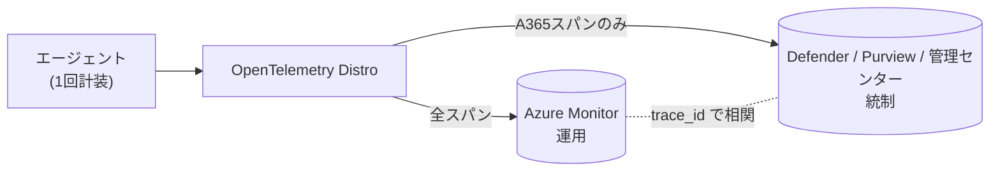

# Lab6-1｜A365 Observability（エージェントの行動を可観測化する）

> 親: [Handson README](../README.md) ／ 前: [lab5-1｜OBO ユーザー委任と Agent ID 二重統制](../lab5/lab5-1_OBOユーザー委任とAgentID二重統制.md) ／ 次: [lab7｜Teams から呼べるようにする](../lab7/Lab1-3_m365.md)
> 一次情報まとめ: [Observability_DirectOTel_と格納先.md](../Observability_DirectOTel_と格納先.md)

## このステップの狙い

**Microsoft OpenTelemetry Distro（Agent 365・Foundry・Azure Monitor 共通の統一 observability SDK）を使って、カスタムエージェントに Agent 365 向けの計装を入れる。** これだけで、そのエージェントの行動（`invoke_agent` / `chat` / `execute_tool`）が **Defender / 管理センター / Purview** の管理面に per-span で見えるようになる。

> Distro は A365 専用品ではなく、内部に A365 向けコンポーネント（`microsoft.opentelemetry.a365.*` / `A365SpanProcessor`）を同梱し `enable_a365` で点火する。旧来の単体「Agent 365 Observability SDK」は別経路（現在は非推奨）。新規は Distro が推奨。

Lab2〜Lab5 はアクセス制御（CA / OBO / キルスイッチ）を効かせた。本ラボは統制を上げるのではなく、**「何をしたか」のテレメトリ**を足す。

> **要点**: Identity・ガバナンスは **コード非依存**で全エージェントに効く（Lab2 以降）。**コードに計装が要るのは「深い per-span トレース」だけ**で、本ラボがそれを有効化する。

---

## 0. 前提

| 前提 | 内容 |
|---|---|
| 実行体 | Lab5 までで動く OBO 版（`custom-maf-agent-a365-obo`）。**新規には作らない** |
| Agent ID | Lab2 で発行済み。スパンの `{agentId}` は **Agent Identity（インスタンス）の appId**（Blueprint ではない） |
| ライセンス | テナントに **E7 / Agent 365 が「割当済み」**（最低 1 ユーザー） |
| 監査 | Purview で **監査（Auditing）有効化**済み |

---

## 1. テレメトリの格納先

受理されたスパンは **Agent 365 Observability バックエンド（実体は Microsoft Defender の基盤）** に入り、次の 3 面に出る。Azure Monitor は「Distro が追加でファンアウトする別宛先」であって A365 標準の格納先ではない。

| 面 | 何が見えるか |
|---|---|
| **Microsoft Defender** | エージェント活動。Advanced Hunting の `CloudAppEvents` を KQL 照会 |
| **Microsoft 365 管理センター** | エージェント インベントリ（`invoke_agent` 行を取り込み） |
| **Microsoft Purview** | 監査・コンプライアンス |



> 計装は Distro で 1 回、宛先だけ 2 つ（運用＝Azure Monitor／統制＝Defender）。A365 イングレスは非 A365 スパンを破棄するので、Defender 側は「セキュリティ上意味のある部分集合」になる。

---

## 2. このエージェントは「自社コード（種別 A）」

| 種別 | 実装 |
|---|---|
| **A. 自社コード**（MAF 等）← 本ラボ | **in-process で Microsoft OpenTelemetry Distro を初期化**（正道） |
| B. Microsoft ランタイム（Copilot Studio / Foundry） | ランタイムが計装済み・**コード不要** |
| C. コード不可の SaaS | Direct OTel（§5 参照、本ラボでは使わない） |

---

## 3. 手順 A｜A365 Observability を組み込む（Lab5 からの変化点）

> 実装フォルダ: [agent-custom-MAF-ACA-A365-obo-obs](./agent-custom-MAF-ACA-A365-obo-obs/)（Lab5 OBO のコピー）。差分は `# lab6 A365 Observability` コメントで追える。

Lab5 のエージェントは **MAF + 自前 FastAPI ホスト**で動いている。ここに Distro の A365 向け計装を足すための変化点は **3 つだけ**。**Agent 365 のホスティング SDK を使わない**（自前ホスト）ぶん、本来ランタイムが自動でやる 2・3 を手配線する。

### 変化点① Distro を A365 有効で初期化する

`app/main.py` の `_configure_observability()` で、SDK の `use_microsoft_opentelemetry()` を A365 有効で呼ぶ（依存 `microsoft-opentelemetry` を `requirements.txt` に追加）。env による ON/OFF 分岐は設けず **常時計装**する。

```python
from microsoft.opentelemetry import use_microsoft_opentelemetry

use_microsoft_opentelemetry(
    enable_a365=True,                          # A365 export を有効化
    a365_enable_observability_exporter=True,   # A365 exporter を有効化
    a365_token_resolver=_build_a365_token_resolver(),  # ← 変化点②
    enable_azure_monitor=bool(conn),           # App Insights も同じ呼び出しで集約
    azure_monitor_connection_string=conn,
)
```

### 変化点② トークン resolver を渡す

ホスティング SDK が無いので FIC 用の env が注入されず、既定の `DefaultAzureCredential`（＝ACA マネージド ID）になり **403**。そこで出口化（Step 2a）と同じ **fmi_path（Blueprint + `fmi_path=AgentIdentity` → `client_credentials`）** を msal で同期実行する `_build_a365_token_resolver()` を `main.py` に実装し、観測リソース `api://9b975845-…/.default`（`Agent365.Observability.OtelWrite` ロール）のトークンを返す。

```python
# 同期 callable (agent_id, tenant_id) -> str | None
a365_token_resolver=_build_a365_token_resolver()
```

### 変化点③ tenant_id / agent_id を静的スタンプ

ホスティング SDK の BaggageMiddleware が無いので、スパンに `gen_ai.agent.id` / `microsoft.tenant.id` が付かず exporter が **skip** する。`A365SpanProcessor` で両 ID を全スパンに静的付与する。

```python
from opentelemetry.trace import get_tracer_provider
from microsoft.opentelemetry.a365.core.exporters.span_processor import A365SpanProcessor

get_tracer_provider().add_span_processor(
    A365SpanProcessor(
        tenant_id=config.observability_tenant_id(),
        agent_id=config.observability_agent_id(),  # ★ インスタンス（Agent Identity）の appId
    )
)
```

> ⚠️ `agent_id` は **Agent Identity（インスタンス）の appId**。Blueprint を入れると **403 Agent ID mismatch**。`config.observability_agent_id()` は env `AGENT365OBSERVABILITY__AGENTID`→無ければ出口化と同じインスタンス appId にフォールバックする。

### デプロイ（Lab5 稼働アプリへの差分更新）

lab6 は **lab5 の変化点**なので、Agent ID 等の発行（`scripts\01〜03`）はやり直さない。ただし **obs フォルダ（`agent-custom-MAF-ACA-A365-obo-obs`）は lab5 とは別フォルダ**で、ここの `.env` は `.gitignore` 済み。新規 clone では存在しないので、**このフォルダ用の `.env` を先に用意する**。lab5 と同じ接続情報・Agent ID・受講者ごとの ACA 命名を共有するので、lab5 の `.env` をコピーするのが最速。

```powershell
# このフォルダ（agent-custom-MAF-ACA-A365-obo-obs）で実行。
# (1) lab5 の .env をコピー（lab5 を同マシンで実施済みなら最速）
Copy-Item ..\..\lab5\agent-custom-MAF-ACA-A365-obo\.env .env

# (2) 計装入りイメージを再ビルドして稼働アプリへ差し替える
pwsh .\deploy-aca.ps1
```

`deploy-aca.ps1` は `.env` を読んで、(a) 計装入りの新イメージを `az acr build` で焼き直し、(b) 受講者ごとの `rg-<userNN>` / `custom-maf-a365-obo-<userNN>` / ACR を解決し、(c) 既に在るアプリなら `az containerapp update --image …` で差し替える。

> **スパン用 ID の env は追加不要**。`config.observability_agent_id()` / `observability_tenant_id()` は `AGENT365OBSERVABILITY__AGENTID` / `__TENANTID` が無ければ、`deploy-aca.ps1` が既に投入する **`AGENT_IDENTITY_APP_ID`（インスタンス appId）/ `AZURE_TENANT_ID`** にフォールバックする。別テナント/別 ID をスパンに刻みたい場合だけ、明示の上書きとして次を足す:
>
> ```powershell
> # .env から rg / アプリ名 / インスタンス appId / テナント GUID をすべて自動取得（プレースホルダ・$Me 不要）
> $envMap = @{}; Get-Content .\.env | Where-Object { $_ -match '=' -and $_ -notmatch '^\s*#' } | ForEach-Object { $k,$v = $_ -split '=',2; $envMap[$k.Trim()] = $v.Trim() }
> az containerapp update -g $envMap['ACA_RESOURCE_GROUP'] -n $envMap['ACA_APP_NAME'] `
>   --set-env-vars `
>     "AGENT365OBSERVABILITY__AGENTID=$($envMap['AGENT_IDENTITY_APP_ID'])" `
>     "AGENT365OBSERVABILITY__TENANTID=$($envMap['AZURE_TENANT_ID'])"
> ```
>
> ⚠️ ここに **Blueprint appId** を入れると **403 Agent ID mismatch**。必ず**インスタンス（Agent Identity）の appId**（`.env` の `AGENT_IDENTITY_APP_ID` と同値）を使う。

その後、[chat-ui-obo](../lab5/chat-ui-obo/)（lab5 と同じ OBO 用 UI）で **1〜2 往復**会話し、`invoke_agent`（ルート）/ `chat` / `execute_tool` のスパン ツリーを発生させる。lab6 は OBO 版なので会話の入口は `/obo-chat`（`Authorization: Bearer <user_token>` 必須）。`local-chat-app` はユーザートークンを載せないため OBO の往復にはならない。

---

## 4. 検証｜3 面で見える

### 4.1 Defender（Advanced Hunting）

[security.microsoft.com](https://security.microsoft.com) → 高度な追求:

```kusto
CloudAppEvents
| where Timestamp > ago(1h)
| where AccountObjectId == "<Agent Identity appId>"
| project Timestamp, ActionType, RawEventData
```

`ActionType`＝`InvokeAgent`/`InferenceCall`/`ExecuteTool*`、`AgentId`＝`gen_ai.agent.id`。

### 4.2 Microsoft 365 管理センター

[admin.microsoft.com](https://admin.microsoft.com) → Agents → 当該エージェントの **インベントリ行**に、活動から数分で利用が反映される（`invoke_agent` 行を取り込み）。

### 4.3 Azure Monitor（運用側・任意）

App Insights の End-to-end トランザクションで **同一 `trace_id`** のフルトレースが見え、Defender 側と相関する＝**2 プレーンが 1 本のランになる**。

---

## 5. よくある失敗

| 症状 | 原因 | 対処 |
|---|---|---|
| `200 OK` だが何も出ない | E7 / Agent 365 ライセンス未割当 | 最低 1 ユーザーに割当 |
| 何も送らない（黙殺） | `use_microsoft_opentelemetry` の引数名ミス | `enable_a365` / `a365_enable_observability_exporter` / `a365_token_resolver` |
| export が skip | スパンに tenant/agent ID 無し | 変化点③の `A365SpanProcessor` |
| **403 Agent ID mismatch** | Blueprint と Instance の取り違え | `AGENTID` を **インスタンス appId** に |
| 403（一般） | トークンが ACA マネージド ID | 変化点②の resolver で fmi_path トークンを返す |
| 活動 / インベントリに出ない | ルートの `invoke_agent` span が無い | ルート span を出す |

> コードを触れない SaaS（種別 C）向けの **Direct OTel** は本ラボでは使わない。詳細は [Observability_DirectOTel_と格納先.md](../Observability_DirectOTel_と格納先.md)。

---

## 6. このラボの結論

- **Microsoft OpenTelemetry Distro で A365 計装＝1 点、宛先は 2 つ**（運用＝Azure Monitor／統制＝Defender）。
- 自前ホストゆえの変化点は **3 つ**（① Distro 初期化 ② token resolver ③ 静的スタンプ）。②③ はホスティング SDK が居れば自動。
- **`{agentId}` はインスタンス（Agent Identity）appId が唯一の正**。Blueprint と取り違えると 403。

> 次の [Lab7](../lab7/Lab1-3_m365.md) で **M365 インタラクション**を出すと、Purview / Defender への自動収録がさらに分かりやすくなる。

---

## 7. 出典（Microsoft Learn）

- Microsoft OpenTelemetry Distro（推奨パス）: <https://learn.microsoft.com/microsoft-agent-365/developer/microsoft-opentelemetry>
- Observability concepts（データモデル / drop 条件 / 格納先）: <https://learn.microsoft.com/microsoft-agent-365/developer/observability-concepts>
- 属性リファレンス: <https://learn.microsoft.com/microsoft-agent-365/developer/observability-attribute-reference>
- 認証セットアップ（S2S / OBO）: <https://learn.microsoft.com/microsoft-agent-365/developer/observability-authentication-setup>
- Direct OTel 統合: <https://learn.microsoft.com/microsoft-agent-365/developer/direct-open-telemetry-integration>
- Defender as part of Agent 365: <https://learn.microsoft.com/defender-xdr/security-for-ai/privacy-defender-agent-365>
