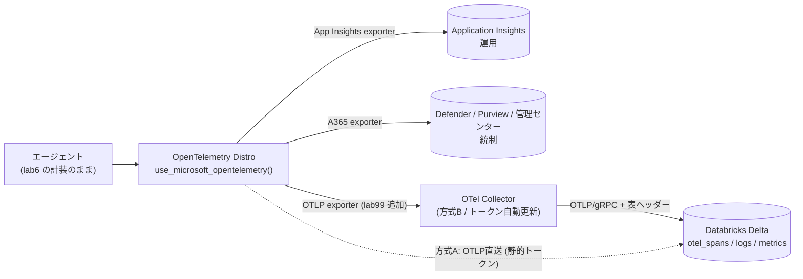

# Lab99-1｜OTel テレメトリを Azure Databricks の OTLP エンドポイント（Zerobus Ingest）へ送る

> 親: [Handson README](../README.md) ／ 土台: [lab6-1｜A365 Observability](../lab6/lab6-1_A365Observability.md)
> 一次情報: [Configure OpenTelemetry (OTLP) clients to send data to Unity Catalog — Azure Databricks](https://learn.microsoft.com/en-us/azure/databricks/ingestion/opentelemetry/configure)（**現在 Beta**）

## このステップの狙い

lab6 で入れた **`use_microsoft_opentelemetry()` の計装はそのまま**に、同じ traces / logs / metrics を **Azure Databricks の Unity Catalog Delta テーブル**へ **Zerobus Ingest の OTLP エンドポイント** で**追加の宛先**として流す。

- lab6 までの宛先（**Agent 365 Observability ＝ Defender / Purview / 管理センター** と **Application Insights**）は**そのまま残す**。
- Databricks は「**生テレメトリを長期保管・任意の SQL / ノートブックで分析**する分析プレーン」として足す。

> **重要（前提の訂正）**: Zerobus Ingest は **OTLP（OpenTelemetry Protocol）エンドポイントを持つ**ようになった（2026 / Beta）。**標準 OpenTelemetry SDK / Collector からカスタム ライブラリ無しで直接** Unity Catalog の Delta テーブルへ書ける。よって**カスタム `SpanExporter` は不要**で、**OTLP の口へそのまま送る**のが正道。送り方は 2 つ:
> - **方式 A（クイック/ローカル検証）**: アプリの **OTLP 環境変数**を Zerobus エンドポイントに向ける。静的 OAuth トークン使用（**1 時間で失効**）。
> - **方式 B（本番 / 長時間稼働・推奨）**: **OpenTelemetry Collector** をサイドカーに置き、`oauth2clientauthextension` で**トークンを自動更新**。アプリは Collector に素の OTLP を送るだけ。



---

## 0. 前提

| 前提 | 内容 |
|---|---|
| 実行体 | lab6 で動く obs 版（`agent-custom-MAF-ACA-A365-obo-obs`）。**新規には作らない**、env 変数（と方式 B なら Collector サイドカー）を足すだけ |
| Databricks | **Azure Databricks ワークスペース**（Unity Catalog 有効、Zerobus OTLP エンドポイント有効＝**Beta**）。`VARIANT` 型クエリに **DBR 15.3+**、variant shredding 最適化に **DBR 17.2+**（任意）|
| 権限 | Unity Catalog でテーブルを作れる権限、サービス プリンシパル（SP）を作れる権限 |
| 追加コード | **アプリ コードの変更は不要**（OTLP は env 変数で構成）。`span_processors` もカスタム exporter も使わない |

---

## 1. Databricks 側の準備

### 1.1 ワークスペース URL と Workspace ID / Region を控える

| 値 | 例 |
|---|---|
| **Workspace URL** | `https://adb-1234567890123456.12.azuredatabricks.net` |
| **Workspace ID** | `1234567890123456`（URL の `adb-<id>.<n>` の `<id>`、または `?o=<id>`）|
| **Region** | `eastus` など |
| **OTLP/gRPC エンドポイント** | `<workspace-id>.zerobus.<region>.azuredatabricks.net:443` |

### 1.2 シグナル別の Delta テーブルを作る（traces / logs / metrics）

OTLP は **シグナルごとに 1 テーブル**。スキーマは Databricks が規定（`VARIANT` 型・`otel.schemaVersion=v2`）。`<catalog>.<schema>.<prefix>` を自分の値に置換して Databricks SQL で実行。

> 完全なスキーマは一次情報の [Create target tables in Unity Catalog](https://learn.microsoft.com/en-us/azure/databricks/ingestion/opentelemetry/configure#create-target-tables-in-unity-catalog) を参照。ここでは **traces（spans）** の最小例を抜粋。

```sql
-- traces（最小抜粋。実際は一次情報の CREATE TABLE をそのまま使う）
CREATE TABLE main.observability.agent_otel_spans (
  record_id STRING,
  time TIMESTAMP,
  date DATE,
  service_name STRING,
  trace_id STRING,
  span_id STRING,
  parent_span_id STRING,
  name STRING,
  kind STRING,
  start_time_unix_nano LONG,
  end_time_unix_nano LONG,
  attributes VARIANT,
  status STRUCT<message: STRING, code: STRING>,
  resource STRUCT<attributes: VARIANT, dropped_attributes_count: INT>,
  instrumentation_scope STRUCT<name: STRING, version: STRING, attributes: VARIANT, dropped_attributes_count: INT>
  -- ... events / links / dropped_* など一次情報のフル定義を含めること
) USING DELTA
CLUSTER BY (time, service_name, trace_id)
TBLPROPERTIES ('otel.schemaVersion' = 'v2', 'delta.checkpointPolicy' = 'classic');
```

> logs は `<prefix>_otel_logs`、metrics は `<prefix>_otel_metrics` を同様に作る（一次情報の各 CREATE TABLE を使用）。**lab6 のスパンだけ流すなら spans テーブルだけでも可。**

### 1.3 サービス プリンシパル（SP）を作って権限付与

1. SP を作成し **OAuth シークレット**を発行（`client_id` = SP の App ID / `client_secret`）
2. テーブルごとに **明示的に `MODIFY, SELECT`** を付与（`ALL PRIVILEGES` では不足）:

```sql
GRANT USE CATALOG ON CATALOG main TO `<service-principal-uuid>`;
GRANT USE SCHEMA  ON SCHEMA  main.observability TO `<service-principal-uuid>`;
GRANT MODIFY, SELECT ON TABLE main.observability.agent_otel_spans   TO `<service-principal-uuid>`;
GRANT MODIFY, SELECT ON TABLE main.observability.agent_otel_logs    TO `<service-principal-uuid>`;
GRANT MODIFY, SELECT ON TABLE main.observability.agent_otel_metrics TO `<service-principal-uuid>`;
```

---

## 2. 方式 A｜OTLP 直送（クイック / ローカル検証）

**コード変更なし。** SP 資格情報から OAuth トークンを取り、OTLP env 変数で Zerobus に向けるだけ。`use_microsoft_opentelemetry()` は OTLP env 変数を読んで OTLP exporter を**追加宛先**として足す（A365 / App Insights はそのまま）。

### 2.1 シグナルごとに OAuth トークンを取得

トークンは **テーブル単位**（`authorization_details` にテーブル FQN を埋める）。`$TABLE_NAME` を `agent_otel_spans` など各シグナルに置換して 3 回取得し、`TOKEN_SPANS` / `TOKEN_LOGS` / `TOKEN_METRICS` に保存。

```bash
authorization_details=$(cat <<EOF
[{"type":"unity_catalog_privileges","privileges":["USE CATALOG"],"object_type":"CATALOG","object_full_path":"$CATALOG"},
 {"type":"unity_catalog_privileges","privileges":["USE SCHEMA"],"object_type":"SCHEMA","object_full_path":"$CATALOG.$SCHEMA"},
 {"type":"unity_catalog_privileges","privileges":["SELECT","MODIFY"],"object_type":"TABLE","object_full_path":"$CATALOG.$SCHEMA.$TABLE_NAME"}]
EOF
)

curl -X POST \
  -u "$DATABRICKS_CLIENT_ID:$DATABRICKS_CLIENT_SECRET" \
  -d "grant_type=client_credentials" \
  -d "scope=all-apis" \
  -d "resource=api://databricks/workspaces/$WORKSPACE_ID/zerobusDirectWriteApi" \
  --data-urlencode "authorization_details=$authorization_details" \
  "https://$WORKSPACE_URL/oidc/v1/token"
```

> **静的トークンは 1 時間で失効**。ローカルでスパンを数件流して確認する用途向け。長時間稼働には方式 B を使う。

### 2.2 エージェントを OTLP env 変数付きで起動

`use_microsoft_opentelemetry()` の OTLP 経路を使うので、起動前に env を設定するだけ（PowerShell 例）:

```powershell
$ep = "https://$($WORKSPACE_ID).zerobus.$($REGION).azuredatabricks.net:443"
$tbl = "$CATALOG.$SCHEMA.agent_otel_spans"

$env:OTEL_EXPORTER_OTLP_PROTOCOL        = "grpc"
$env:OTEL_EXPORTER_OTLP_TRACES_ENDPOINT = $ep
$env:OTEL_EXPORTER_OTLP_TRACES_HEADERS  = "authorization=Bearer $TOKEN_SPANS,x-databricks-zerobus-table-name=$tbl"

# Handson/lab6/agent-custom-MAF-ACA-A365-obo-obs で実行
..\..\..\.venv\Scripts\python.exe -m uvicorn app.main:app --port 8080
```

> traces だけ送る最小構成。logs / metrics も送るなら `OTEL_EXPORTER_OTLP_LOGS_ENDPOINT` / `..._METRICS_ENDPOINT` と各 `..._HEADERS`（テーブルは `_otel_logs` / `_otel_metrics`、トークンも各シグナル用）を併せて設定する。

---

## 3. 方式 B｜OTel Collector サイドカー（本番 / 推奨）

OAuth トークンは 1 時間で失効するため、**アプリ側でトークン更新を持たず Collector に任せる**のが本番の定石。アプリは `localhost:4317` に素の OTLP を送り、Collector が `oauth2clientauthextension` でトークンを自動取得・更新し、表ヘッダーを付けて Zerobus へ転送する。

### 3.1 `collector.yaml`

```yaml
extensions:
  oauth2client/spans:
    client_id: ${env:DATABRICKS_CLIENT_ID}
    client_secret: ${env:DATABRICKS_CLIENT_SECRET}
    token_url: https://${env:WORKSPACE_URL}/oidc/v1/token
    scopes: ['all-apis']
    endpoint_params:
      resource: 'api://databricks/workspaces/${env:WORKSPACE_ID}/zerobusDirectWriteApi'
      authorization_details:
        - '[{"type":"unity_catalog_privileges","privileges":["USE CATALOG"],"object_type":"CATALOG","object_full_path":"${env:CATALOG}"},{"type":"unity_catalog_privileges","privileges":["USE SCHEMA"],"object_type":"SCHEMA","object_full_path":"${env:CATALOG}.${env:SCHEMA}"},{"type":"unity_catalog_privileges","privileges":["SELECT","MODIFY"],"object_type":"TABLE","object_full_path":"${env:CATALOG}.${env:SCHEMA}.${env:TABLE_PREFIX}_otel_spans"}]'

exporters:
  otlp/spans:
    endpoint: ${env:WORKSPACE_ID}.zerobus.${env:REGION}.azuredatabricks.net:443
    auth:
      authenticator: oauth2client/spans
    headers:
      x-databricks-zerobus-table-name: '${env:CATALOG}.${env:SCHEMA}.${env:TABLE_PREFIX}_otel_spans'

receivers:
  otlp:
    protocols:
      grpc:
        endpoint: 0.0.0.0:4317

processors:
  batch:
    timeout: 5s
    send_batch_size: 10

service:
  extensions: [oauth2client/spans]
  pipelines:
    traces:
      receivers: [otlp]
      processors: [batch]
      exporters: [otlp/spans]
```

> logs / metrics も送るなら `oauth2client/logs` `oauth2client/metrics` と `otlp/logs` `otlp/metrics` を増やし、`service.pipelines` に `logs:` / `metrics:` を足す（一次情報のフル `collector.yaml` 参照）。Collector は `otelcol-contrib`（contrib ディストリ。`oauth2clientauthextension` を含む）を使う。

### 3.2 エージェント側は Collector に向けるだけ

```powershell
$env:OTEL_EXPORTER_OTLP_ENDPOINT = "http://localhost:4317"
$env:OTEL_EXPORTER_OTLP_PROTOCOL = "grpc"
# A365 / App Insights は Distro 内の専用 exporter なので OTLP 設定の影響を受けない
```

> Zerobus は唯一の OTLP 宛先なので `OTEL_EXPORTER_OTLP_ENDPOINT` を Collector に固定して問題ない。A365 と Application Insights は OTLP ではなく Distro 内の専用 exporter で送られるため、そのまま生きる。

---

## 4. 動作確認

### 4.1 起動して数リクエスト流す

エージェントへ `/chat`（または OBO の `/obo-chat`）を数回叩いてスパンを発生させる。方式 B なら Collector のログに OAuth トークン取得とエクスポート成功が出る。

### 4.2 Databricks 側で着弾を確認

`attributes` は `VARIANT` 型なので `attributes:gen_ai.agent.id` のようにドット記法で読める:

```sql
SELECT
  time,
  service_name,
  name,
  status.code AS status_code,
  (end_time_unix_nano - start_time_unix_nano) / 1e6 AS duration_ms,
  attributes:`gen_ai.agent.id`   AS agent_id,
  attributes:`microsoft.tenant.id` AS tenant_id
FROM main.observability.agent_otel_spans
ORDER BY time DESC
LIMIT 50;
```

`invoke_agent` / `chat` / `execute_tool` 等のスパンが並べば成功。`gen_ai.agent.id` が Agent Identity（インスタンス）の appId、`microsoft.tenant.id` が顧客テナント GUID（lab6 の A365 と同一値）になっていることを確認。

### 4.3 切り分け

| 症状 | 主因 | 対処 |
|---|---|---|
| 1 時間後に行が止まる（方式 A）| 静的トークン失効 | 本番は**方式 B（Collector 自動更新）**に切替 |
| 認証エラー / PERMISSION_DENIED | テーブル単位の `MODIFY, SELECT` 不足、`authorization_details` のテーブル FQN 不一致 | GRANT とトークンの `object_full_path` を再確認 |
| `x-databricks-zerobus-table-name` 関連エラー | ヘッダーのテーブル名がシグナルと不一致 | traces は `_otel_spans`、logs は `_otel_logs`、metrics は `_otel_metrics` |
| エンドポイント到達不可 | gRPC エンドポイント / ポート誤り | `<workspace-id>.zerobus.<region>.azuredatabricks.net:443` と `OTEL_EXPORTER_OTLP_PROTOCOL=grpc` を確認 |
| `VARIANT` がクエリできない | DBR 15.3 未満 | クラスタ ランタイムを 15.3+ に |

---

## 5. ACA へのデプロイ（本番 = 方式 B）

ACA は**サイドカー コンテナ**を持てるので、`otelcol-contrib` をサイドカーとして同居させ、エージェント コンテナは `OTEL_EXPORTER_OTLP_ENDPOINT=http://localhost:4317` を向ける。

- エージェント コンテナ env: `OTEL_EXPORTER_OTLP_ENDPOINT=http://localhost:4317`, `OTEL_EXPORTER_OTLP_PROTOCOL=grpc`
- Collector サイドカー env: `DATABRICKS_CLIENT_ID` / `DATABRICKS_CLIENT_SECRET`（**secret 参照**）/ `WORKSPACE_URL` / `WORKSPACE_ID` / `REGION` / `CATALOG` / `SCHEMA` / `TABLE_PREFIX`、設定ファイル `collector.yaml` をマウント
- `DATABRICKS_CLIENT_SECRET` は `az containerapp secret set` で登録し `secretref:` で参照

> マルチコンテナ ACA を `az containerapp create --yaml` で作ると `400 ... System.Boolean` バグに当たることがある。最小構成で `create` → フル YAML で `update --yaml` の 2 段階が安全（lab2 / lab6 と同じ運用）。

---

## 6. まとめ（lab6 との差分・前提の訂正）

| 項目 | lab6 | lab99（本ラボ）|
|---|---|---|
| 計装 | `use_microsoft_opentelemetry()` 1 回 | **変更なし** |
| 宛先 | A365（Defender/Purview/管理センター）+ App Insights | **+ Databricks Delta（otel_spans/logs/metrics）** |
| 追加方法 | — | **OTLP エンドポイントへ直送**（方式 A: env 変数 / 方式 B: Collector サイドカー）|
| 追加コード | — | **なし**（カスタム exporter 不要。env 変数と Collector 設定のみ）|
| 認証 | — | OAuth 2.0 Client Credentials（SP）。静的トークンは 1h 失効 → 本番は Collector 自動更新 |
| identity | A365SpanProcessor で tenant/agent スタンプ | **同じスタンプ結果**が `attributes` VARIANT に乗り、`attributes:gen_ai.agent.id` で読める |

> **訂正メモ**: 当初「Zerobus は OTLP ではないからカスタム `SpanExporter` が必須」と書いていたが**誤り**。Zerobus Ingest は **OTLP エンドポイント（Beta）** を持ち、標準 OTel SDK / Collector から直接 Delta テーブルへ書ける。よって `span_processors` + カスタム exporter は不要で、**OTLP の口へ素直に送る**のが正道。
