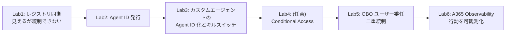

# Agent 365 Onboarding ハンズオン

> Microsoft Entra **Agent ID** を中核に、1 つのカスタムエージェント（MAF + Azure Container Apps）を **少しずつ強化しながら**、「ID の強さで効くガバナンスがどう変わるか」を Lab0〜Lab6 で体験するハンズオン。

> Copilot Studio や Microsoft Foundry であれば自動的、また Microsoft 365 Agents SDK であれば実装を簡素化できますが、このハンズオンではカスタムエージェントを用いて Agent 365 の機能を実習します。

---

## 全体像：統制レベルを段階的に上げる

| 段 | 統制の効き方 | ID 実体 |
|---|---|---|
| Lab1 | **可視化のみ**（CA は効かない） | Agent ID を持たない（外部基盤からの同期） |
| Lab2 | **Agent ID を発行**（統制主体を作成。まだエージェントとは未接続でブロックは不可） | Entra Agent ID |
| Lab3 | SAMI から Agent ID へ差し替え | SAMI → Agent ID |
| Lab4 | (任意) Conditional Access | Agent ID |
| Lab5 | **OBO でユーザー側 CA / MFA / 同意も効く二重統制** | Agent ID＋ ユーザー トークン |
| Lab6 | **行動を可観測化**（統制は上げずテレメトリを足す） | Lab2 と同一の Agent ID |

---

## 目次（Lab0〜Lab6）

| # | モジュール | ねらい | 目安 |
|---|---|---|---|
| Lab0 | [オリエン & 環境確認](Handson/lab0/Lab0_README.md) | 全体像・用語・前提リソース疎通 | 20 分 |
| Lab1 | [レジストリ同期だけでは統制できない](Handson/lab1/Lab1-1_レジストリ同期.md) | 「見えるだけ」の弱い段を体感 | 30 分 |
| Lab2 | [Agent ID を発行して統制主体にする](Handson/lab2/lab2-1_全体概要.md) | `a365 setup all` で発行し CA でブロック | 50 分 |
| Lab3 | [出口を 1 点に集約](Handson/lab3/lab3-1_出口1点集約とAgentID差し替え.md) | `_egress_token()` 集約、Agent ID 差し替え配線 | 30 分 |
| Lab4 | [出口を Agent ID 化（キルスイッチ）](Handson/lab4/extLab2-4_AgentID出口化_配線と検証.md) | 止めると LLM/MCP が遮断 | 50 分 |
| Lab5 | [OBO で二重統制](Handson/lab5/lab5-1_OBOユーザー委任とAgentID二重統制.md) | ユーザー本人の権限で Graph、二重統制 | 40 分 |
| Lab6 | [A365 Observability](Handson/lab6/lab6-1_A365Observability.md) | per-span な行動を管理センターへ可観測化 | 40 分 |

---

## 前提リソース（構築済み）

| 区分 | 既存資産 | 実体 |
|---|---|---|
| 基本カスタムエージェント | `custom-maf-agent-a365`（MAF + ACA） | Container Apps |
| MCP（社内 API 見立て） | `contoso-policy-mcp`（ACA） | Container Apps |
| 推論モデル | `gpt-5.4`（Foundry） | モデルデプロイ |
| AI Gateway | `apim-aigateway-eastus2` | API Management |

> **MCP と推論モデルは APIM（AI Gateway）経由が必須**。認証・レート制御・コンテンツ安全性・監査を 1 箇所に集約する。

主要環境値（テナント / サブスク等は実環境の値を使用）:

| 項目 | 値 |
|---|---|
| テナント ID | `<TENANT_ID>` |
| サブスクリプション ID | `<SUBSCRIPTION_ID>` |
| リージョン | `eastus2` |
| リソースグループ | `rg-foundryobs-eastus2` |

---

## ハンズオン準備（lab準備/）

実習前に、講師がテナント / Azure 環境を整え、受講者端末にツールを導入する。

| 手順 | 内容 | ドキュメント |
|---|---|---|
| Azure / Entra 環境構築 | 受講者ユーザー（user01〜12）・リソースグループ（rg-user01〜12）・RBAC・`Agent ID Developer`・`Cloud Application Administrator`（lab5 用）を一括付与 | [lab準備/Azure_Entra_Prepare.md](lab準備/Azure_Entra_Prepare.md) |
| Blueprint 管理者同意 | `a365 setup all` 後の「Permission Grants: PENDING」を Graph で受講者全員分一括付与 | [lab準備/Grant-README.md](lab準備/Grant-README.md) / [lab準備/Grant-A365BlueprintConsent.ps1](lab準備/Grant-A365BlueprintConsent.ps1) |
| 受講者端末セットアップ | PowerShell 7+ / Azure CLI / azd / .NET 8 / Python 3.11+ / Git / VS Code / a365 CLI / containerapp 拡張 を winget で一括導入 | [lab準備/Client_setup.md](lab準備/Client_setup.md) |

---

## 進め方の原則

- **1 段ずつ確認してから次へ**。各段で目的の統制が効くことを検証する。
- **素体は作り直さない**。Lab2 以降は同じ `custom-maf-agent-a365` を強化する。
- **Agent ID と実行体は別物**。CA で止まるのは「ID としてのアクセス」、プロセス停止は ACA 操作。
- **Frontier 依存の段（Lab1 の Registry sync）** は未契約環境ではデモ提示に切り替える。

---

## 参照

| 内容 | 参照 |
|---|---|
| ハンズオン全体構成・タイムテーブル | [Handson/README.md](Handson/README.md) |
| Observability の格納先（Lab6 設計根拠） | [Handson/Observability_DirectOTel_と格納先.md](Handson/Observability_DirectOTel_と格納先.md) |
| Agent 365 SDK 概要 | https://learn.microsoft.com/microsoft-agent-365/developer/agent-365-sdk |
| Registry sync（preview） | https://learn.microsoft.com/microsoft-agent-365/admin/agent-registry |
